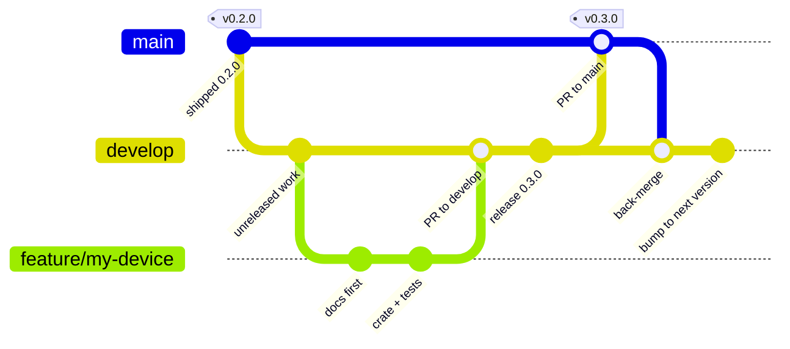

# Contributing

simbus uses a **simplified GitFlow**. The GitHub default branch should be
`develop` (Settings → General) so new pull requests target integration, not
the last release. Protect `main` (required PR, CI green). Those settings are
not in git.

## Branches

| Branch | Role |
| --- | --- |
| `develop` | Integration. All feature work lands here. |
| `main` | Last published tree. Only from `develop` (or a hotfix). |
| `feature/<slug>` | One change. Open a PR **to `develop`**. |
| `hotfix/<slug>` | Production patch from `main`. PR to `main`, then merge `main` back into `develop`. |

There are no `release/*` branches. Cutting a version is a PR `develop` → `main`,
then an annotated tag `vX.Y.Z` on that `main` commit. Do not tag `develop` or
a feature branch.

One change, from branch to published tag:



Only the commit on `main` carries a tag, and the tag is what publishes: it
triggers the GHCR image and the GitHub Release with the `simbus` archives.
That is why a tag on `develop` or on a feature branch is not just untidy —
those workflows refuse it.

The last two steps are easy to forget. After the tag, merge `main` back into
`develop` and bump `develop` to the **next** version, so `develop` never
claims a version that is already published ([AGENTS.md](AGENTS.md) §
Release).

A `hotfix/<slug>` is the same picture rotated: branch from `main`, PR to
`main`, tag there, then merge `main` back into `develop`.

## Pull requests

1. Open an issue first for significant changes.
2. Branch from `develop`: `git checkout -b feature/my-device`.
3. Spec-first: YAML language in `docs/spec.md` + `crates/spec`. Process in
   `docs/runtime.md`. Community maps: YAML + `simbus check` only.
4. Local gate (same as CI):

   ```bash
   cargo fmt --all -- --check
   cargo clippy --workspace --all-targets --locked -- -D warnings
   cargo test --workspace --locked
   cargo deny check
   cargo run -p simbus -- check devices/community/your-device.yaml
   ```

5. Open the PR against **`develop`**, not `main`. GitHub Actions on that
   PR is the **CI** workflow only (same five commands). Release (`dist`)
   and GHCR do not run on feature PRs. `dist plan` and a Docker build-only
   check run on the `develop` → `main` release PR; a `v*` tag on `main`
   publishes.

User-visible work goes under `CHANGELOG.md` `## [Unreleased]`. English for new
code, comments, and docs.

How agents should behave: [AGENTS.md](AGENTS.md). How to write a device YAML:
[`.agents/skills/simbus-device/SKILL.md`](.agents/skills/simbus-device/SKILL.md).
How to cut a release (version bump, tag, what CI publishes): [AGENTS.md](AGENTS.md)
§ Release.
