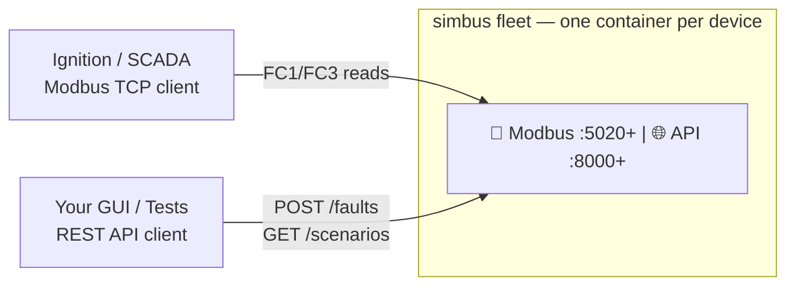
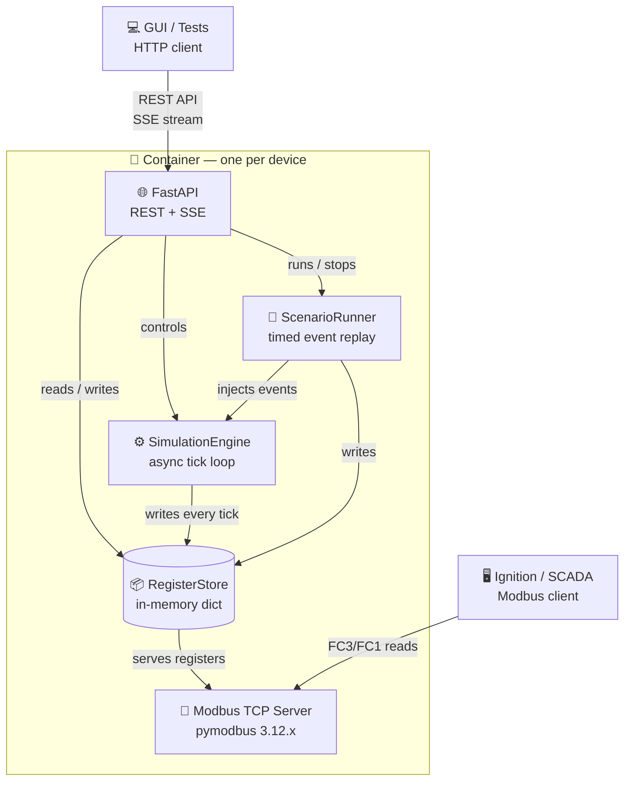
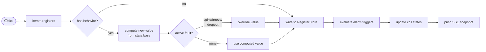
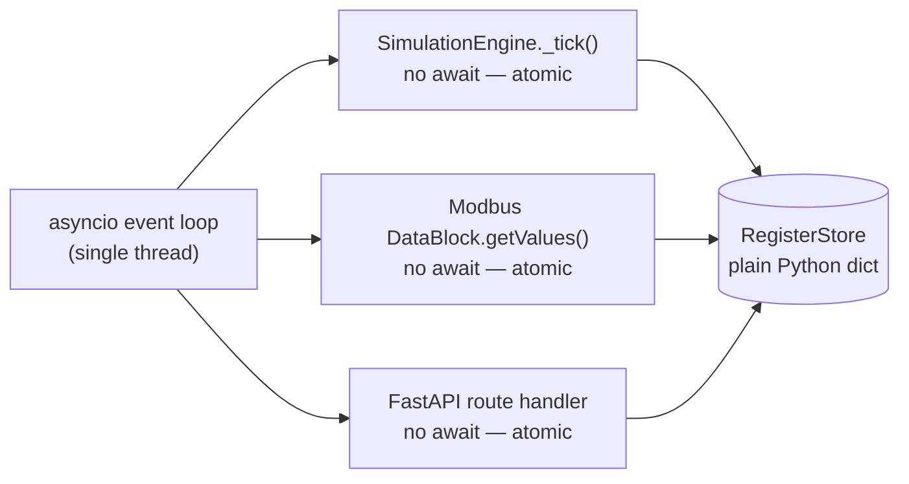
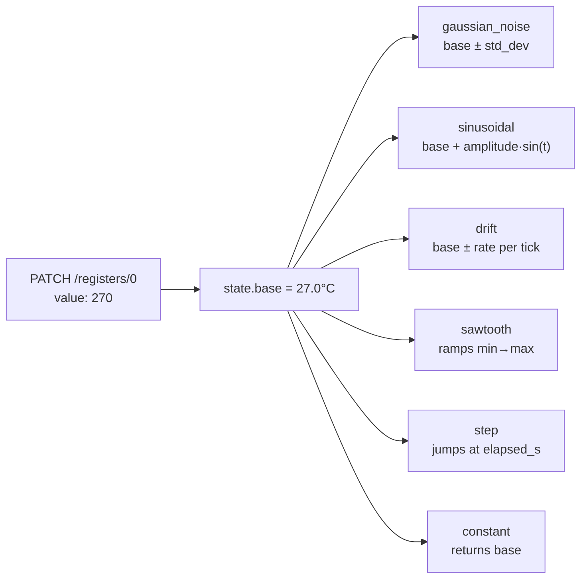
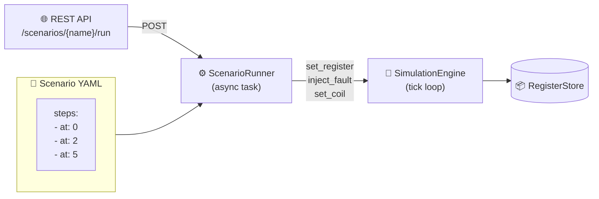
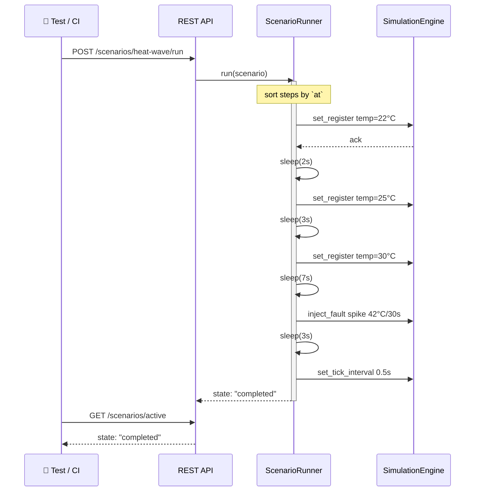
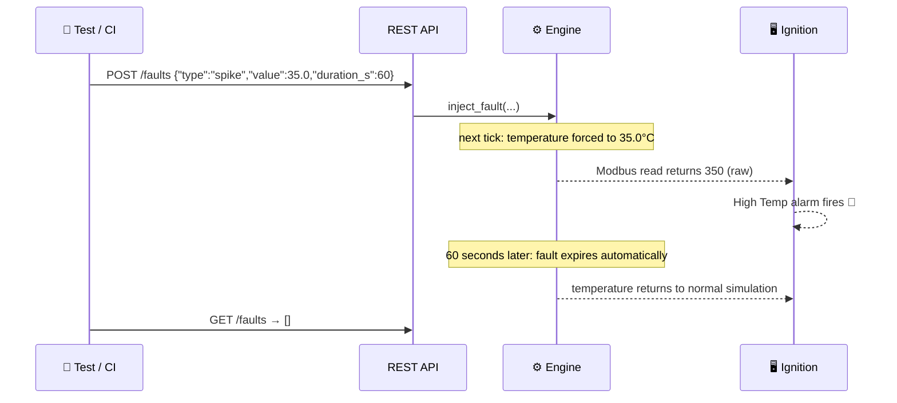
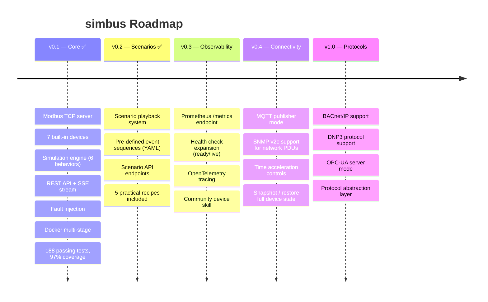

# 🏭 simbus

## Industrial Field Device Simulator

Simulate realistic Modbus TCP field devices for SCADA labs, integration testing,
and operator training — **no hardware required**.

[](https://www.python.org/)
[](LICENSE)
[](#development)
[](#development)
[](#docker)
[](#architecture)
[](https://github.com/pymodbus-dev/pymodbus)
[](https://fastapi.tiangolo.com/)
[](https://docs.astral.sh/uv/)

> **Each container = one device.** Modbus TCP server + simulation engine + REST control API.
> Stack as many as you need. Works with Ignition, Wonderware, FactoryTalk, and any Modbus client.



---

## Why simbus?

Building a SCADA lab without physical hardware is painful. Existing Modbus simulators are either
static, hard to script, or impossible to containerize. **simbus** was built to fix that.

| Without simbus | With simbus |
| --- | --- |
| Buy a UPS, PDU, and sensors just to test a tag config | `docker compose up ups pdu tnh-sensor` |
| Static registers that never change | Gaussian noise, drift, sinusoidal cycles, sawtooth |
| Can't test alarm pipelines without breaking real hardware | Inject spikes, freezes, dropouts via REST — on demand |
| Rebuilding state after every test run | `POST /simulation/reset` rewinds everything instantly |
| Hardcoded tag addresses in every test | `GET /config` returns the full register map dynamically |
| Share lab config with the team via Word docs | One YAML file per device — version controlled, reviewable |

---

## Table of Contents

- [Quick Start](#quick-start)
- [Built-in Devices](#built-in-devices)
- [Architecture](#architecture)
- [Simulation Behaviors](#simulation-behaviors)
- [Scenarios](#scenarios)
- [REST API Reference](#rest-api-reference)
- [Fault Injection](#fault-injection)
- [Connecting to Ignition](#connecting-to-ignition)
- [Device YAML Schema](#device-yaml-schema)
- [Configuration](#configuration)
- [Logging](#logging)
- [Docker](#docker)
- [Development](#development)
- [Roadmap](#roadmap)
- [License](#license)

---

## Quick Start

### With Docker (recommended)

```bash
# Start a single T&H sensor
docker compose up tnh-sensor

# Or the full 7-device lab
docker compose --profile all up
```

```bash
# Verify it's alive
curl http://localhost:8000/status
```

```json
{
  "name": "Generic T&H Sensor",
  "type": "tnh_sensor",
  "modbus_port": 502,
  "tick_interval": 1.0,
  "simulation": "running",
  "modbus_server": "listening"
}
```

### With uv

```bash
git clone https://github.com/your-org/simbus.git
cd simbus
uv sync
simbus --type generic-tnh-sensor --port 502 --api-port 8000
```

> **Requirements:** Python 3.14+, Docker (optional)

---

## Built-in Devices

Seven devices ship ready to use. Each has a realistic register map, trigger-based alarms,
and physics-appropriate simulation.

| Device | Type key | Device Modbus | Device API | Example host map | Holding | Coils |
| --- | --- | --- | --- | --- | --- | --- |
| 🌡️ T&H Sensor | `generic-tnh-sensor` | 502 | 8000 | `5020:502`, `8000:8000` | 2 | 2 |
| 🔋 UPS | `generic-ups` | 502 | 8000 | `5021:502`, `8001:8000` | 6 | 4 |
| ⚡ PDU | `generic-pdu` | 502 | 8000 | `5022:502`, `8002:8000` | 6 | 3 |
| ❄️ CRAC Unit | `generic-crac` | 502 | 8000 | `5023:502`, `8003:8000` | 6 | 4 + 1 discrete |
| 📊 Power Meter | `generic-power-meter` | 502 | 8000 | `5024:502`, `8004:8000` | 12 | 3 |
| 💧 Leak Sensor | `generic-leak-sensor` | 502 | 8000 | `5025:502`, `8005:8000` | 4 | 3 + 1 discrete |
| 🚪 Door Contact | `generic-door-contact` | 502 | 8000 | `5026:502`, `8006:8000` | 3 | 4 + 2 discrete |

Inspect any running device's full register map:

```bash
curl http://localhost:8000/config
```

```json
{
  "name": "Generic T&H Sensor",
  "registers": {
    "holding": [
      {"address": 0, "name": "temperature", "unit": "°C", "scale": 10,
       "default": 22.5, "behavior": "gaussian_noise"},
      {"address": 1, "name": "humidity",    "unit": "%RH", "scale": 10,
       "default": 45.0, "behavior": "sinusoidal"}
    ],
    "coils": [
      {"address": 0, "name": "high_temp_alarm",   "default": false},
      {"address": 1, "name": "low_humidity_alarm", "default": false}
    ]
  }
}
```

---

## Architecture



### Data flow on each tick



### No locks, no database



> Because asyncio is cooperative, all reads and writes to `RegisterStore` are atomic —
> no `asyncio.Lock` needed.
>
> **ScenarioRunner** (v0.2+) runs as an independent asyncio task inside the container.
> It replays timed event sequences from YAML scenario files, injecting faults and
> register overrides at scheduled wall-clock times without blocking the main tick loop.
> This makes it possible to script full event chains (power outage, thermal runaway,
> sensor failure) and replay them on demand via `POST /scenarios/{name}/run`.

---

## Simulation Behaviors

Every register declares an independent behavior. All behaviors use `state.base` as their operating
point, which means a `PATCH /registers/{address}` call shifts the center and the simulation
**adapts immediately** without a restart.



| Behavior | Description | Key parameters |
| --- | --- | --- |
| `constant` | Fixed value | — |
| `gaussian_noise` | Random noise around center | `std_dev` |
| `sinusoidal` | Sine wave oscillation | `period_hours`, `amplitude` |
| `drift` | Slow linear movement with bounds | `rate`, `bounds` |
| `sawtooth` | Ramps from min to max, then resets | `period_seconds`, `min`, `max` |
| `step` | Jumps to defined values at specific elapsed times | `steps: [{at, value}]` |

`gaussian_noise` and `sinusoidal` also support a `drift` sub-modifier that slowly shifts their
center over time.

**Example — temperature with noise and a slow upward drift:**

```yaml
simulation:
  behavior: gaussian_noise
  std_dev: 0.3
  drift:
    enabled: true
    rate: 0.01        # +0.01°C per tick
    bounds: [18.0, 35.0]
```

> **Time acceleration:** Set `SIMBUS_TICK_INTERVAL=60.0` — each real second simulates one minute
> of device time. Great for long-period sinusoidal tests.

---

## Scenarios

A **scenario** is a timed sequence of events stored in a YAML file. Instead of manually
calling the REST API at the right moment, you define the entire event sequence once
and replay it on demand.



### Built-in example: Heat Wave

```yaml
# scenarios/heat-wave.yaml (one of 5 built-in examples)
name: "Heat Wave Event"
description: >
  Gradual temperature rise triggering high-temp alarm after 10 seconds.
steps:
  - at: 0
    action: set_register
    register_name: temperature
    value: 22.0

  - at: 2
    action: set_register
    register_name: temperature
    value: 25.0

  - at: 5
    action: set_register
    register_name: temperature
    value: 30.0

  - at: 12
    action: inject_fault
    fault_type: spike
    register_name: temperature
    value: 42.0
    duration_s: 30

  - at: 15
    action: set_tick_interval
    tick_interval: 0.5
```

> **5 built-in scenarios:** `heat-wave`, `thermal-runaway`, `power-outage`, `fast-alarm-test`, `stuck-sensor`.

### Scenario step types

| Step `action` | What happens | Parameters |
|---|---|---|
| `set_register` | Writes a real-world value to a holding or input register | `register_name`, `value`, `register_type` |
| `inject_fault` | Injects a fault with auto-expiry | `fault_type`, `register_name`, `value`, `duration_s` |
| `set_coil` | Forces a coil or discrete input to `true`/`false` | `coil`, `value` |
| `set_tick_interval` | Changes simulation speed mid-scenario | `tick_interval` |

> Steps are sorted by `at` (seconds) before execution. The runner runs in a
> separate asyncio task — the main tick loop is never blocked.

### Scenario execution timeline



### Using scenarios from the API

```bash
# List available scenarios
 curl http://localhost:8000/scenarios
# [{"name": "heat-wave", "description": "..."}]

# Start replay
 curl -X POST http://localhost:8000/scenarios/heat-wave/run
# {"status": "started", "scenario": "heat-wave", "steps": 7}

# Check progress
 curl http://localhost:8000/scenarios/active
# {"state": "running", "scenario_name": "heat-wave", "step_index": 3, "total_steps": 7, "elapsed_s": 5.2}

# Cancel early
 curl -X POST http://localhost:8000/scenarios/stop
```

---

## REST API Reference

Interactive docs at **`http://localhost:8000/docs`** (Swagger UI).

### Status and Discovery

| Method | Endpoint | Description |
| --- | --- | --- |
| `GET` | `/status` | Simulation state, Modbus health, tick interval |
| `GET` | `/config` | Full register map — names, units, scales, behaviors |

### Registers

| Method | Endpoint | Description |
| --- | --- | --- |
| `GET` | `/registers` | Snapshot of all current raw register values |
| `PATCH` | `/registers/{address}` | Holding — shift operating point, simulation continues from new value |
| `PATCH` | `/registers/input/{address}` | Input — same as above (read-only for Modbus clients, writable via API) |
| `PATCH` | `/registers/coils/{address}` | Coil — set boolean state |
| `PATCH` | `/registers/discrete/{address}` | Discrete input — set boolean state |
| `GET` | `/registers/stream` | **SSE** — one JSON frame per tick, forever |

Numeric PATCH endpoints accept either a **raw** integer or a **real-world** float — the API applies the register's scale automatically:

```bash
# Real-world value — most ergonomic
curl -X PATCH http://localhost:8000/registers/0 \
  -d '{"real_value": 27.0}'
# → {"address": 0, "raw_value": 270, "real_value": 27.0}

# Raw uint16 — matches Modbus wire format (scale must be known)
curl -X PATCH http://localhost:8000/registers/0 \
  -d '{"value": 270}'
# → {"address": 0, "raw_value": 270, "real_value": 27.0}
```

**Subscribe to the live stream:**

```bash
curl -N http://localhost:8000/registers/stream
# data: {"holding": {"0": 271, "1": 463}, "coils": {"0": false, "1": false}, ...}
# data: {"holding": {"0": 268, "1": 467}, ...}
```

### Simulation Control

| Method | Endpoint | Description |
| --- | --- | --- |
| `PATCH` | `/simulation` | Update tick interval live — takes effect next tick |
| `POST` | `/simulation/reset` | Reset all registers to YAML defaults, clear all faults |

### Scenarios

| Method | Endpoint | Description |
| --- | --- | --- |
| `GET` | `/scenarios` | List available scenario YAML files |
| `POST` | `/scenarios/{name}/run` | Start replaying a scenario |
| `GET` | `/scenarios/active` | Active scenario status (step, elapsed, total) |
| `POST` | `/scenarios/stop` | Cancel any running scenario |

---

## Fault Injection

Faults are **temporary overrides** that expire automatically. Inject them to test alarm pipelines,
edge cases, and failure scenarios without touching real hardware.



| Fault type | What happens |
| --- | --- |
| `spike` | Forces a register to an extreme value for the duration |
| `freeze` | Holds a register at its current value — stuck sensor |
| `dropout` | Sets a register to `0` — loss of signal |
| `noise_amplify` | Multiplies noise `std_dev` by `value` |
| `alarm` | Forces a register to a value to trigger a specific alarm |

```bash
# Spike temperature to trigger high-temp alarm for 60 seconds
curl -X POST http://localhost:8000/faults \
  -H "Content-Type: application/json" \
  -d '{
    "fault_type": "spike",
    "register_name": "temperature",
    "value": 35.0,
    "duration_s": 60
  }'

# Check what's active
curl http://localhost:8000/faults
# [{"fault_type":"spike","register_name":"temperature","value":35.0,
#   "duration_s":60.0,"remaining_s":42.7}]

# Clear everything immediately
curl -X DELETE http://localhost:8000/faults
```

---

## Connecting to Ignition

In **Gateway → Config → OPC-UA → Device Connections → Add → Modbus TCP**:

| Field | Value |
| --- | --- |
| Hostname | `localhost` (or container service name if both are in Docker) |
| Port | Host port (`5020` for tnh-sensor, `5021` for ups…). Device port is typically `502` internally |
| Unit ID | `1` |

**Ignition uses 1-based addressing:**

| YAML address | Ignition tag | Register type |
| --- | --- | --- |
| Holding `0` | `HR1` | Read / Write |
| Holding `N` | `HR{N+1}` | Read / Write |
| Coil `0` | `C1` | Read / Write |
| Input reg `0` | `IR1` | Read only |
| Discrete `0` | `D1` | Read only |

**Apply the scale factor in an Expression Tag:**

```text
{[simbus-tnh-sensor]HR1} / 10.0   →  temperature in °C
{[simbus-tnh-sensor]HR2} / 10.0   →  humidity in %RH
```

**End-to-end alarm test from Ignition:**

```bash
# 1. Inject a spike — Ignition tag HR1 jumps to 35.0°C
curl -X POST http://localhost:8000/faults \
  -d '{"fault_type":"spike","register_name":"temperature","value":35.0,"duration_s":60}'

# 2. Watch the alarm fire in Ignition Alarm Journal

# 3. After 60 seconds fault expires, alarm auto-clears
```

---

## Device YAML Schema

Define custom devices with `SIMBUS_YAML_PATH` or `--file`.

```yaml
name: "My Custom Sensor"
version: "1.0"
type: custom_sensor

modbus:
  default_port: 5030
  unit_id: 1
  endianness: big         # big | little | big_swap | little_swap

registers:
  holding:
    - address: 0
      name: pressure
      description: "Line pressure"
      unit: "PSI"
      default: 100.0
      scale: 10            # raw = real_value × scale  →  100 PSI stored as 1000
      data_type: uint16    # uint16 | int16 | uint32 | float32
      simulation:
        behavior: gaussian_noise
        std_dev: 0.5
        drift:
          enabled: true
          rate: 0.02
          bounds: [50.0, 150.0]

  coils:
    - address: 0
      name: overpressure_alarm
      default: false
      trigger:
        source_register: pressure
        condition: gt       # gt | lt | eq | gte | lte
        threshold: 130.0

alarms:
  - name: "Overpressure"
    severity: critical      # info | warning | critical
    trigger: overpressure_alarm
```

> Cross-references are validated at load time — if a coil trigger points to a non-existent
> register, or an alarm references an unknown coil, simbus refuses to start with a clear error.

---

## Configuration

All settings use the `SIMBUS_` prefix and can be set via environment variables or a `.env` file.

| Variable | Default | Description |
| --- | --- | --- |
| `SIMBUS_DEVICE_TYPE` | `generic-tnh-sensor` | Built-in device type to simulate |
| `SIMBUS_YAML_PATH` | — | Path to a custom YAML (overrides `DEVICE_TYPE`) |
| `SIMBUS_MODBUS_PORT` | device YAML default | Override Modbus TCP listen port |
| `SIMBUS_API_PORT` | `8000` | REST API listen port |
| `SIMBUS_TICK_INTERVAL` | `1.0` | Simulation tick in seconds |
| `SIMBUS_TICK_HEALTH_LOG_INTERVAL` | `60.0` | Periodic simulation loop health log interval in seconds |
| `SIMBUS_SEED` | — | RNG seed for reproducible output |
| `SIMBUS_DEVICE_NAME` | — | Override the device name from YAML |
| `SIMBUS_CORS_ORIGINS` | `["*"]` | Allowed CORS origins for the REST API |

**`.env` example:**

```env
SIMBUS_DEVICE_TYPE=generic-ups
SIMBUS_API_PORT=8001
SIMBUS_TICK_INTERVAL=1.0
SIMBUS_TICK_HEALTH_LOG_INTERVAL=60.0
SIMBUS_CORS_ORIGINS=["http://localhost:5173"]
```

---

## Logging

simbus prioritizes **functional logs** over generic access logs. The goal is to show
what changed in the simulation and why, not just that a request happened.

Typical events include:

- `simbus started`
- `api listening`
- `modbus server listening`
- `register changed`
- `simulation base changed`
- `fault injected`
- `fault expired`
- `faults cleared`
- `simulation reset`
- `alarm activated` / `alarm cleared`
- `simulation tick health`

`simulation tick health` is emitted periodically and includes:

- `tick_interval`
- `tick_duration_ms`
- `loop_drift_ms`
- `sse_subscribers`
- `active_faults`
- `uptime_s`

Tune its frequency with:

```bash
SIMBUS_TICK_HEALTH_LOG_INTERVAL=10
```

The runtime suppresses default Uvicorn access logs and noisy `pymodbus` protocol
dumps so container output stays focused on simulation activity and control events.

---

## Docker

### Single device

```bash
docker build -t simbus:latest .

docker run -d \
  --cap-add NET_BIND_SERVICE \
  -e SIMBUS_DEVICE_TYPE=generic-tnh-sensor \
  -p 5020:502 -p 8000:8000 \
  --name simbus-tnh \
  simbus:latest
```

### Full lab with docker compose

```bash
docker compose --profile all up          # all 7 devices
docker compose --profile power up        # UPS + PDU + Power Meter
docker compose --profile env up          # T&H Sensor + Leak + Door Contact
docker compose --profile cooling up      # CRAC
docker compose up tnh-sensor ups crac    # handpick devices
```

The image is a two-stage build (`python:3.14-slim` + uv), runs as a non-root user, and includes
a healthcheck that polls `GET /status` every 15 seconds. Containers start through the
`simbus` CLI so Docker behavior matches local runs and uses the same logging setup.

Generic built-in devices listen on Modbus TCP port `502` inside the container and
on API port `8000`. `docker-compose.yml` maps them to unique host ports (`5020`,
`5021`, `8000`, `8001`, etc.). Custom or real devices use the port declared in
their YAML by default. For example, the Papouch TH2E keeps its real device port
`512` internally and is mapped to a high host port such as `5512`.

---

## Development

### Setup

```bash
git clone https://github.com/your-org/simbus.git
cd simbus
uv sync
```

### Run tests

```bash
uv run pytest                                 # 188 tests, 97% coverage
uv run pytest -v tests/test_api.py            # single module
uv run pytest --cov=simbus --cov-report=html  # coverage report
```

### Run locally

```bash
fastapi dev simbus/api/main.py                      # default device, hot-reload
simbus --type generic-ups --port 502 --api-port 8000
simbus --file ./my-device.yaml --port 512 --api-port 8000
```

### Project structure

```text
simbus/
├── simbus/
│   ├── api/
│   │   ├── main.py            # FastAPI app factory + lifespan
│   │   ├── schemas.py         # Pydantic request/response models
│   │   └── routers/
│   │       ├── status.py      # GET /status, GET /config
│   │       ├── registers.py   # GET|PATCH /registers, SSE stream
│   │       ├── simulation.py  # /faults, PATCH|POST /simulation
│   │       └── scenarios.py   # /scenarios list, run, stop
│   ├── builtin/               # 7 built-in device YAML files
│   ├── config/
│   │   ├── schema.py          # Pydantic v2 models for device YAML
│   │   └── loader.py          # YAML loader (file path or built-in name)
│   ├── core/
│   │   ├── store.py           # In-memory register bank (no locks needed)
│   │   └── modbus_server.py   # pymodbus 3.12.x async TCP server
│   ├── scenarios/
│   │   ├── schema.py          # Pydantic v2 models for scenario YAML
│   │   ├── loader.py          # Scenario YAML loader
│   │   └── engine.py          # ScenarioRunner (async replay)
│   ├── simulation/
│   │   ├── engine.py          # Async tick loop, behavior dispatch, alarms
│   │   ├── behaviors.py       # Pure behavior functions
│   │   └── faults.py          # Fault types and ActiveFault dataclass
│   ├── logging_config.py      # structlog + stdlib logging configuration
│   ├── settings.py            # pydantic-settings with SIMBUS_ prefix
│   └── cli.py                 # Typer CLI — `simbus`
├── scenarios/                 # Built-in scenario YAML files
│   ├── heat-wave.yaml         # Gradual temperature rise with spike
│   ├── thermal-runaway.yaml   # Alarm threshold crossing + recovery
│   ├── power-outage.yaml      # UPS battery drain sequence
│   ├── fast-alarm-test.yaml   # CI-friendly 3-second alarm test
│   └── stuck-sensor.yaml      # Frozen sensor vs rising heat
└── tests/
    ├── test_cli.py                # CLI entrypoint (3 tests)
    ├── test_config.py             # Schema validation + YAML loader
    ├── test_behaviors.py          # Pure behavior functions
    ├── test_modbus_server.py      # Modbus integration via TCP client
    ├── test_scenarios.py          # Scenario engine + API (17 tests)
    ├── test_simulation_engine.py  # Engine tick, alarms, faults
    ├── test_store.py              # RegisterStore (3 tests)
    └── test_api.py                # Full API integration
```

### Documentation

- [docs/simulation.md](docs/simulation.md) — Full simulation engine reference: every behavior,
  the drift modifier, alarm triggers, all fault types, and practical recipes.
- [docs/scenarios.md](docs/scenarios.md) — Scenario engine reference: step types, schema,
  runner behavior, and practical recipes for alarm pipeline testing.

### Contributing

Contributions are welcome. Open an issue first to discuss significant changes.

1. Fork the repository
2. Create a feature branch (`git checkout -b feature/my-device`)
3. Add tests for any new behavior
4. Run `uv run pytest` — all tests must pass
5. Open a pull request

---

## Roadmap



---

## License

simbus is licensed under the **[MIT License](LICENSE)** — use it freely, modify it, ship it,
contribute back.

---

Built with love for industrial automation engineers, SCADA developers, and BMS integrators.
If simbus saves you from buying a UPS just to test a tag config, consider giving it a star.
