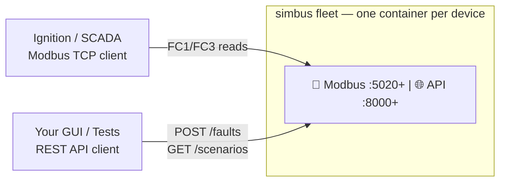
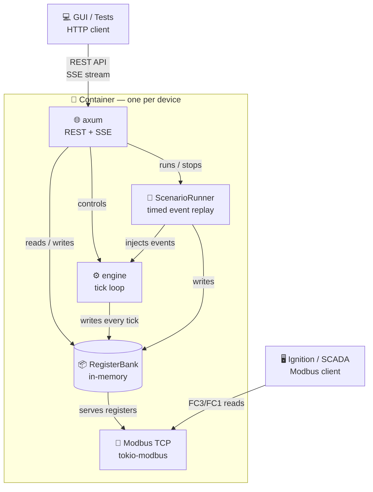
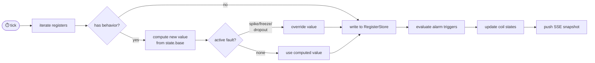
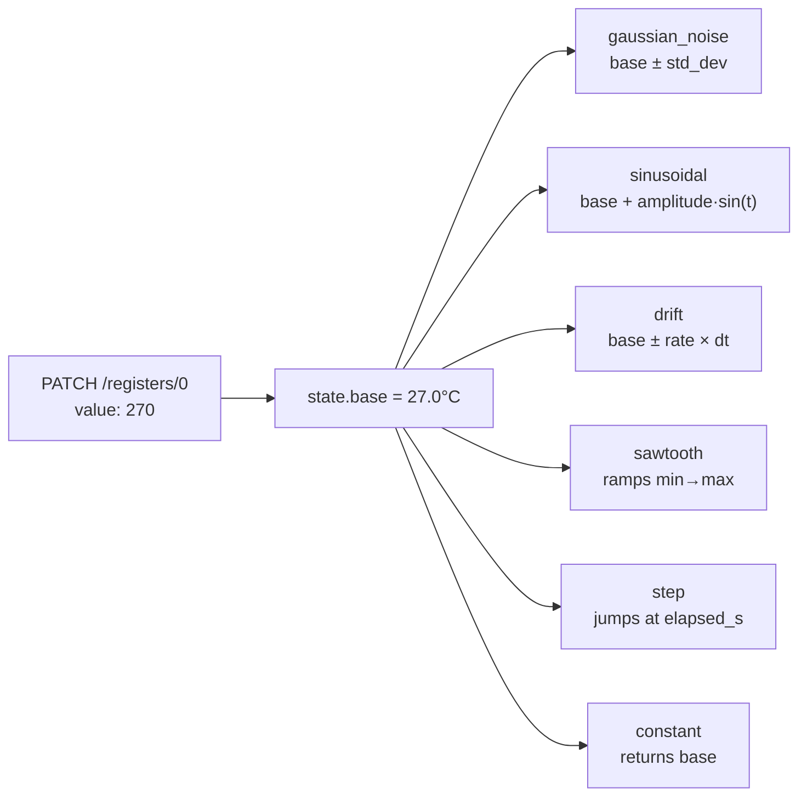
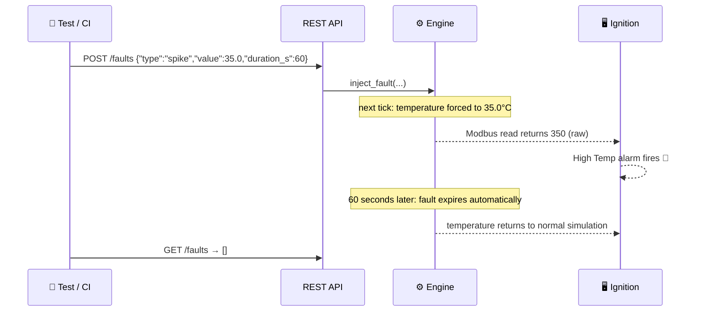
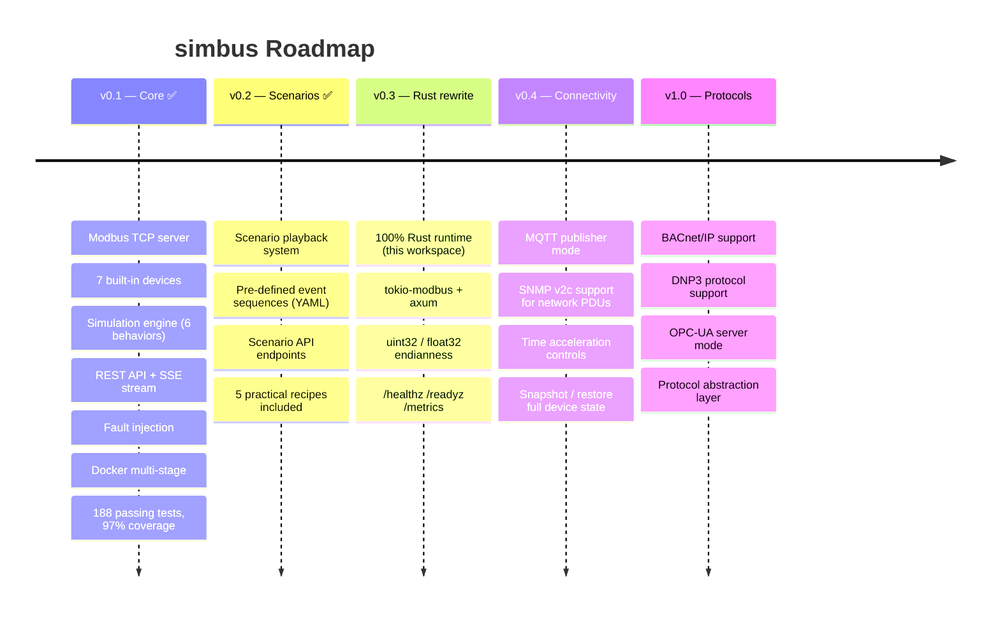

# 🏭 simbus

## Industrial Field Device Simulator

Simulate realistic Modbus TCP field devices for SCADA labs, integration testing,
and operator training — **no hardware required**.

[](https://www.rust-lang.org/)
[](LICENSE)
[](#docker)
[](#architecture)
[](https://github.com/slowtec/tokio-modbus)
[](https://github.com/tokio-rs/axum)

> **Each container = one device.** Modbus TCP server + simulation engine + REST control API.
> Stack as many as you need. Works with Ignition, Wonderware, FactoryTalk, and any Modbus client.


```mermaid
flowchart LR
    subgraph fleet["simbus fleet — one container per device"]
        device["🔌 Modbus :5020+ | 🌐 API :8000+"]
    end

    scada["Ignition / SCADA<br/>Modbus TCP client"]
    gui["Your GUI / Tests<br/>REST API client"]

    scada -->|FC1/FC3 reads| device
    gui -->|POST /faults<br/>GET /scenarios| device
```

---

## Why simbus?

Building a SCADA lab without physical hardware is painful. Existing Modbus simulators are either
static, hard to script, or impossible to containerize. **simbus** was built to fix that.

| Without simbus | With simbus |
| --- | --- |
| Buy a UPS, PDU, and sensors just to test a tag config | `docker compose up ups pdu tnh-sensor` |
| Static registers that never change | Gaussian noise, drift, sinusoidal cycles, sawtooth |
| Can't test alarm pipelines without breaking real hardware | Inject spikes, freezes, dropouts via REST — on demand |
| Rebuilding state after every test run | `POST /simulation/reset` rewinds everything instantly |
| Hardcoded tag addresses in every test | `GET /config` returns the full register map dynamically |
| Share lab config with the team via Word docs | One YAML file per device — version controlled, reviewable |

---

## Table of Contents

- [Quick Start](#quick-start)
- [Built-in Devices](#built-in-devices)
- [Community devices](#community-devices)
- [Architecture](#architecture)
- [Simulation Behaviors](#simulation-behaviors)
- [Scenarios](#scenarios)
- [REST API Reference](#rest-api-reference)
- [Fault Injection](#fault-injection)
- [Connecting to Ignition](#connecting-to-ignition)
- [Device YAML Schema](#device-yaml-schema)
- [Validating a device YAML](#validating-a-device-yaml)
- [Configuration](#configuration)
- [Logging](#logging)
- [Docker](#docker)
- [Development](#development)
- [Roadmap](#roadmap)
- [License](#license)

---

## Quick Start

### With Docker (recommended)

```bash
# Start a single T&H sensor
docker compose up tnh-sensor

# Or the full 7-device lab
docker compose --profile all up
```

```bash
# Verify it's alive
curl http://localhost:8000/status
```

```json
{
  "name": "Generic T&H Sensor",
  "type": "tnh_sensor",
  "modbus_port": 502,
  "tick_interval": 1.0,
  "simulation": "running",
  "modbus_server": "listening"
}
```

### From source (Rust)

```bash
git clone https://github.com/obsidia-systems/simbus.git
cd simbus
cargo run -p runtime -- --file devices/builtin/generic-tnh-sensor.yaml --port 502 --api-port 8000
```

> **Requirements:** Rust 1.85+ (edition 2024), Docker (optional)

---

## Built-in Devices

simbus is a generic measurement engine. Official maps under `devices/builtin/`
are **templates**: point `--file` at one of them. With no file, simbus boots
`devices/builtin/default.yaml` (an example device, not a product). Vendor or
site-specific maps belong in `devices/community/` — see
[Community devices](#community-devices).

```bash
simbus
simbus --file devices/builtin/generic-ups.yaml
simbus --file devices/community/papouch-th2e.yaml
```

Seven product-shaped templates ship ready to use. Each has a realistic register map, trigger-based alarms,
and physics-appropriate simulation.

| Device | YAML | Device Modbus | Device API | Example host map | Holding | Coils |
| --- | --- | --- | --- | --- | --- | --- |
| 🌡️ T&H Sensor | `devices/builtin/generic-tnh-sensor.yaml` | 502 | 8000 | `5020:502`, `8000:8000` | 2 | 2 |
| 🔋 UPS | `devices/builtin/generic-ups.yaml` | 502 | 8000 | `5021:502`, `8001:8000` | 6 | 4 |
| ⚡ PDU | `devices/builtin/generic-pdu.yaml` | 502 | 8000 | `5022:502`, `8002:8000` | 6 | 3 |
| ❄️ CRAC Unit | `devices/builtin/generic-crac.yaml` | 502 | 8000 | `5023:502`, `8003:8000` | 6 | 4 + 1 discrete |
| 📊 Power Meter | `devices/builtin/generic-power-meter.yaml` | 502 | 8000 | `5024:502`, `8004:8000` | 12 | 3 |
| 💧 Leak Sensor | `devices/builtin/generic-leak-sensor.yaml` | 502 | 8000 | `5025:502`, `8005:8000` | 4 | 3 + 1 discrete |
| 🚪 Door Contact | `devices/builtin/generic-door-contact.yaml` | 502 | 8000 | `5026:502`, `8006:8000` | 3 | 4 + 2 discrete |

Inspect any running device's full register map:

```bash
curl http://localhost:8000/config
```

```json
{
  "name": "Generic T&H Sensor",
  "registers": {
    "holding": [
      {"address": 0, "name": "temperature", "unit": "°C", "scale": 10,
       "default": 22.5, "behavior": "gaussian_noise"},
      {"address": 1, "name": "humidity",    "unit": "%RH", "scale": 10,
       "default": 45.0, "behavior": "sinusoidal"}
    ],
    "coils": [
      {"address": 0, "name": "high_temp_alarm",   "default": false},
      {"address": 1, "name": "low_humidity_alarm", "default": false}
    ]
  }
}
```

---

## Community devices

Named products and lab-specific maps live in [`devices/community/`](devices/community/).
Contribute them with a pull request. There is no Rust test per YAML file — validate
locally with `simbus check`, and CI runs the same command on every file under `devices/`.

```bash
cargo run -p runtime -- check devices/community/papouch-th2e.yaml
```

Then run it like any other map:

```bash
cargo run -p runtime -- --file ./devices/community/papouch-th2e.yaml --port 512 --api-port 8000
```

---

## Architecture


```mermaid
flowchart TB
    subgraph container["🐳 Container — one per device"]
        direction TB
        engine["⚙️ engine\ntick loop"]
        store[("📦 RegisterBank\nin-memory")]
        modbus["🔌 Modbus TCP\ntokio-modbus"]
        api["🌐 axum\nREST + SSE"]
        scenario["📜 ScenarioRunner\ntimed event replay"]

        engine -- "writes every tick" --> store
        store -- "serves registers" --> modbus
        api -- "reads / writes" --> store
        api -- "controls" --> engine
        api -- "runs / stops" --> scenario
        scenario -- "injects events" --> engine
        scenario -- "writes" --> store
    end

    scada["🖥️ Ignition / SCADA\nModbus client"]
    gui["💻 GUI / Tests\nHTTP client"]

    scada -- "FC3/FC1 reads" --> modbus
    gui -- "REST API\nSSE stream" --> api
```

### Data flow on each tick


```mermaid
flowchart LR
    T([⏱️ tick]) --> A[iterate registers]
    A --> B{has behavior?}
    B -- yes --> C[compute new value\nfrom state.base]
    B -- no --> G
    C --> D{active fault?}
    D -- spike/freeze/\ndropout --> E[override value]
    D -- none --> F[use computed value]
    E --> G[write to RegisterStore]
    F --> G
    G --> H[evaluate alarm triggers]
    H --> I[update coil states]
    I --> J[push SSE snapshot]
```

### Shared bank, no second store

The tick loop, Modbus TCP slave, and HTTP control plane share one in-memory
register bank (`crates/engine`). Scenario playback applies steps onto that
device; it does not load files from a global `scenarios/` folder. Bundled
sequences live in the device YAML — see [docs/spec.md](docs/spec.md).

> **ScenarioRunner** replays timed event sequences from the loaded contract,
> injecting faults and register overrides at scheduled wall-clock times without
> blocking the tick loop. Start them with `POST /scenarios/{id}/run`. They do
> not run at boot.

---

## Simulation Behaviors

Every register declares an independent behavior. All behaviors use `state.base` as their operating
point, which means a `PATCH /registers/{address}` call shifts the center and the simulation
**adapts immediately** without a restart.


```mermaid
flowchart LR
    PATCH["PATCH /registers/0\nvalue: 270"] --> BASE["state.base = 27.0°C"]

    BASE --> GN["gaussian_noise\nbase ± std_dev"]
    BASE --> SIN["sinusoidal\nbase + amplitude·sin(t)"]
    BASE --> DR["drift\nbase ± rate × dt"]
    BASE --> SAW["sawtooth\nramps min→max"]
    BASE --> STEP["step\njumps at elapsed_s"]
    BASE --> CONST["constant\nreturns base"]
```

| Behavior | Description | Key parameters |
| --- | --- | --- |
| `constant` | Fixed value | — |
| `gaussian_noise` | Random noise around center | `std_dev` |
| `sinusoidal` | Sine wave oscillation | `period_hours`, `amplitude` |
| `drift` | Slow linear movement with bounds | `rate`, `bounds` |
| `sawtooth` | Ramps from min to max, then resets | `period_seconds`, `min`, `max` |
| `step` | Jumps to defined values at specific elapsed times | `steps: [{at, value}]` |

`gaussian_noise` and `sinusoidal` also support a `drift` sub-modifier that slowly shifts their
center over time.

**Example — temperature with noise and a slow upward drift:**

```yaml
simulation:
  behavior: gaussian_noise
  std_dev: 0.3
  drift:
    enabled: true
    rate: 0.01        # +0.01°C per simulation second
    bounds: [18.0, 35.0]
```

> **Tick interval** is the sample period. Wall clock and simulation time are 1:1
> (`SIMBUS_TICK_INTERVAL=60` ticks once per minute). See [docs/simulation.md](docs/simulation.md).

---

## Scenarios

A **scenario** is a timed sequence **bundled in the device YAML**. The process
loads it at boot and leaves it idle until you start it.

Full syntax: [docs/spec.md](docs/spec.md) §7. How to run it:
[docs/control.md](docs/control.md). Operator notes: [docs/scenarios.md](docs/scenarios.md).

Generic T&H ships `heat-wave`, `thermal-runaway`, `fast-alarm-test`, `stuck-sensor`.
Generic UPS ships `power-outage`.

```bash
curl http://localhost:8000/scenarios
curl -X POST http://localhost:8000/scenarios/heat-wave/run
curl http://localhost:8000/scenarios/active
curl -X POST http://localhost:8000/scenarios/stop
```

---

## REST API Reference

Interactive docs at **`http://localhost:8000/docs`** (Swagger UI).

### Status and Discovery

| Method | Endpoint | Description |
| --- | --- | --- |
| `GET` | `/status` | Simulation state, Modbus health, tick interval |
| `GET` | `/config` | Contract snapshot — map, `spec_version`, bundled scenarios |

### Registers

| Method | Endpoint | Description |
| --- | --- | --- |
| `GET` | `/registers` | Snapshot of all current raw register values |
| `PATCH` | `/registers/{address}` | Holding — shift operating point, simulation continues from new value |
| `PATCH` | `/registers/input/{address}` | Input — same as above (read-only for Modbus clients, writable via API) |
| `PATCH` | `/registers/coils/{address}` | Coil — set boolean state |
| `PATCH` | `/registers/discrete/{address}` | Discrete input — set boolean state |
| `GET` | `/registers/stream` | **SSE** — JSON snapshots of the bank (sampled from `tick_interval`) |

Numeric PATCH endpoints accept either a **raw** integer or a **real-world** float — the API applies the register's scale automatically:

```bash
# Real-world value — most ergonomic
curl -X PATCH http://localhost:8000/registers/0 \
  -d '{"real_value": 27.0}'
# → {"address": 0, "raw_value": 270, "real_value": 27.0}

# Raw uint16 — matches Modbus wire format (scale must be known)
curl -X PATCH http://localhost:8000/registers/0 \
  -d '{"value": 270}'
# → {"address": 0, "raw_value": 270, "real_value": 27.0}
```

**Subscribe to the live stream:**

```bash
curl -N http://localhost:8000/registers/stream
# data: {"holding": {"0": 271, "1": 463}, "coils": {"0": false, "1": false}, ...}
# data: {"holding": {"0": 268, "1": 467}, ...}
```

### Simulation Control

| Method | Endpoint | Description |
| --- | --- | --- |
| `PATCH` | `/simulation` | Update tick interval live — takes effect next tick |
| `POST` | `/simulation/reset` | Reset all registers to YAML defaults, clear all faults |

### Scenarios

| Method | Endpoint | Description |
| --- | --- | --- |
| `GET` | `/scenarios` | List scenarios bundled in the loaded device YAML |
| `POST` | `/scenarios/{name}/run` | Start replay (`{name}` is the scenario `id`) |
| `GET` | `/scenarios/active` | Active scenario status (step, elapsed, total) |
| `POST` | `/scenarios/stop` | Cancel any running scenario |

---

## Fault Injection

Faults are **temporary overrides** that expire automatically. Inject them to test alarm pipelines,
edge cases, and failure scenarios without touching real hardware.


```mermaid
sequenceDiagram
    participant Test as 🧪 Test / CI
    participant API as REST API
    participant Engine as ⚙️ Engine
    participant SCADA as 🖥️ Ignition

    Test->>API: POST /faults {"type":"spike","value":35.0,"duration_s":60}
    API->>Engine: inject_fault(...)
    Note over Engine: next tick: temperature forced to 35.0°C
    Engine-->>SCADA: Modbus read returns 350 (raw)
    SCADA-->>SCADA: High Temp alarm fires 🚨
    Note over Engine: 60 seconds later: fault expires automatically
    Engine-->>SCADA: temperature returns to normal simulation
    Test->>API: GET /faults → []
```

| Fault type | What happens |
| --- | --- |
| `spike` | Forces a register to an extreme value for the duration |
| `freeze` | Holds a register at its current value — stuck sensor |
| `dropout` | Sets a register to `0` — loss of signal |
| `noise_amplify` | Multiplies noise `std_dev` by `value` |
| `alarm` | Forces a register to a value to trigger a specific alarm |

```bash
# Spike temperature to trigger high-temp alarm for 60 seconds
curl -X POST http://localhost:8000/faults \
  -H "Content-Type: application/json" \
  -d '{
    "fault_type": "spike",
    "register_name": "temperature",
    "value": 35.0,
    "duration_s": 60
  }'

# Check what's active
curl http://localhost:8000/faults
# [{"fault_type":"spike","register_name":"temperature","value":35.0,
#   "duration_s":60.0,"remaining_s":42.7}]

# Clear everything immediately
curl -X DELETE http://localhost:8000/faults
```

---

## Connecting to Ignition

In **Gateway → Config → OPC-UA → Device Connections → Add → Modbus TCP**:

| Field | Value |
| --- | --- |
| Hostname | `localhost` (or container service name if both are in Docker) |
| Port | Host port (`5020` for tnh-sensor, `5021` for ups…). Device port is typically `502` internally |
| Unit ID | `1` |

**Ignition uses 1-based addressing:**

| YAML address | Ignition tag | Register type |
| --- | --- | --- |
| Holding `0` | `HR1` | Read / Write |
| Holding `N` | `HR{N+1}` | Read / Write |
| Coil `0` | `C1` | Read / Write |
| Input reg `0` | `IR1` | Read only |
| Discrete `0` | `D1` | Read only |

**Apply the scale factor in an Expression Tag:**

```text
{[simbus-tnh-sensor]HR1} / 10.0   →  temperature in °C
{[simbus-tnh-sensor]HR2} / 10.0   →  humidity in %RH
```

**End-to-end alarm test from Ignition:**

```bash
# 1. Inject a spike — Ignition tag HR1 jumps to 35.0°C
curl -X POST http://localhost:8000/faults \
  -d '{"fault_type":"spike","register_name":"temperature","value":35.0,"duration_s":60}'

# 2. Watch the alarm fire in Ignition Alarm Journal

# 3. After 60 seconds fault expires, alarm auto-clears
```

---

## Device YAML Schema

The device YAML is the **boot contract**. Language version, fields, validation,
bindings, and bundled scenarios are defined in **[docs/spec.md](docs/spec.md)**.
Session mutations (PATCH, faults, run scenario) are **[docs/control.md](docs/control.md)**.

Minimal example (see spec.md for the full language):

```yaml
name: "My Custom Sensor"
spec_version: 1
version: "1.0"
type: custom_sensor

modbus:
  default_port: 5030
  unit_id: 1
  endianness: big         # big | little | big_swap | little_swap

registers:
  holding:
    - address: 0
      name: pressure
      description: "Line pressure"
      unit: "PSI"
      default: 100.0
      scale: 10            # raw = real_value × scale  →  100 PSI stored as 1000
      data_type: uint16    # uint16 | int16 | uint32 | float32
      simulation:
        behavior: gaussian_noise
        std_dev: 0.5
        drift:
          enabled: true
          rate: 0.02
          bounds: [50.0, 150.0]

  coils:
    - address: 0
      name: overpressure_alarm
      default: false
      trigger:
        source_register: pressure
        condition: gt       # gt | lt | eq | gte | lte
        threshold: 130.0

alarms:
  - name: "Overpressure"
    severity: critical      # info | warning | critical
    trigger: overpressure_alarm
```

> Cross-references are validated at load time — if a coil trigger points to a non-existent
> register, or an alarm references an unknown coil, simbus refuses to start with a clear error.

```yaml
name: "My Custom Sensor"
version: "1.0"
type: custom_sensor

modbus:
  default_port: 5030
  unit_id: 1
  endianness: big         # big | little | big_swap | little_swap

registers:
  holding:
    - address: 0
      name: pressure
      description: "Line pressure"
      unit: "PSI"
      default: 100.0
      scale: 10            # raw = real_value × scale  →  100 PSI stored as 1000
      data_type: uint16    # uint16 | int16 | uint32 | float32
      simulation:
        behavior: gaussian_noise
        std_dev: 0.5
        drift:
          enabled: true
          rate: 0.02
          bounds: [50.0, 150.0]

  coils:
    - address: 0
      name: overpressure_alarm
      default: false
      trigger:
        source_register: pressure
        condition: gt       # gt | lt | eq | gte | lte
        threshold: 130.0

alarms:
  - name: "Overpressure"
    severity: critical      # info | warning | critical
    trigger: overpressure_alarm
```

> Cross-references are validated at load time — if a coil trigger points to a non-existent
> register, or an alarm references an unknown coil, simbus refuses to start with a clear error.

---

## Validating a device YAML

`simbus check` loads the file through the same parser the runtime uses at boot, then
prints a summary of what would be configured. It does not start Modbus or the API.

```bash
cargo run -p runtime -- check devices/community/papouch-th2e.yaml
```

```text
OK  devices/community/papouch-th2e.yaml

  name         Papouch TH2E
  type         papouch_th2e
  ...
  counts       holding 0  input …  coils …  discrete …
```

Exit `0` means the map is valid. Exit `1` prints `FAIL` and the reason. Use this
before opening a community PR — there is no per-file Rust test.

---

## Configuration

All settings use the `SIMBUS_` prefix and can be set via environment variables or CLI flags.

| Variable | Default | Description |
| --- | --- | --- |
| `SIMBUS_YAML_PATH` | default template | Path to a device YAML (`--file`). Omitted → `devices/builtin/default.yaml` (cwd, else embedded) |
| `SIMBUS_MODBUS_PORT` | device YAML default | Override Modbus TCP listen port |
| `SIMBUS_API_HOST` | `0.0.0.0` | REST API bind address |
| `SIMBUS_API_PORT` | `8000` | REST API listen port |
| `SIMBUS_TICK_INTERVAL` | `1.0` | Simulation tick in seconds |
| `SIMBUS_SEED` | — | RNG seed for reproducible output |
| `SIMBUS_DEVICE_NAME` | — | Override the device name from YAML |
| `SIMBUS_API_KEY` | — | If set, write endpoints require `x-api-key` or `Bearer` |
| `SIMBUS_CORS_ORIGINS` | `*` | Comma-separated CORS origins (`*` for development) |

**`.env` example:**

```env
SIMBUS_YAML_PATH=devices/builtin/generic-ups.yaml
SIMBUS_API_PORT=8001
SIMBUS_TICK_INTERVAL=1.0
SIMBUS_CORS_ORIGINS=http://localhost:5173
RUST_LOG=info
```

---

## Logging

simbus uses [`tracing`](https://docs.rs/tracing) with `RUST_LOG` / `tracing-subscriber` env filters.
Typical events include:

- `simbus started`
- `api listening`
- `modbus server listening`
- register / fault / scenario control events from the HTTP API

```bash
RUST_LOG=info cargo run -p runtime -- --file devices/builtin/generic-tnh-sensor.yaml
RUST_LOG=engine=debug,modbus=info cargo run -p runtime -- --file devices/builtin/generic-ups.yaml
```

---

## Docker

### Single device

```bash
docker build -t simbus:latest .

docker run -d \
  --cap-add NET_BIND_SERVICE \
  -e SIMBUS_YAML_PATH=/app/devices/builtin/generic-tnh-sensor.yaml \
  -p 5020:502 -p 8000:8000 \
  --name simbus-tnh \
  simbus:latest
```

### Full lab with docker compose

```bash
docker compose --profile all up          # all 7 devices
docker compose --profile power up        # UPS + PDU + Power Meter
docker compose --profile env up          # T&H Sensor + Leak + Door Contact
docker compose --profile cooling up      # CRAC
docker compose up tnh-sensor ups crac    # handpick devices
```

The image is a two-stage build (`rust:1-bookworm` compile + `debian:bookworm-slim` runtime),
runs as a non-root user, and health-checks `GET /healthz`. The entrypoint is the `simbus`
binary so Docker behavior matches local runs.

Generic built-in devices listen on Modbus TCP port `502` inside the container and
on API port `8000`. `docker-compose.yml` maps them to unique host ports (`5020`,
`5021`, `8000`, `8001`, etc.). Custom or real devices use the port declared in
their YAML by default. For example, the Papouch TH2E keeps its real device port
`512` internally and is mapped to a high host port such as `5512`.

---

## Development

### Setup

```bash
git clone https://github.com/obsidia-systems/simbus.git
cd simbus
cargo build -p runtime
```

### Run tests

```bash
cargo test --workspace
cargo test -p spec -p engine -p control -p modbus -p runtime
cargo fmt --all -- --check
cargo clippy --workspace --all-targets --locked -- -D warnings
```

### Run locally

```bash
cargo run -p runtime --                                          # default template
cargo run -p runtime -- --file devices/builtin/generic-ups.yaml --port 502 --api-port 8000
cargo run -p runtime -- --file devices/community/papouch-th2e.yaml --port 512 --api-port 8000
cargo run -p runtime -- check devices/community/papouch-th2e.yaml
```

OpenAPI UI: [http://localhost:8000/docs](http://localhost:8000/docs)

### Project structure

```text
simbus/
├── crates/
│   ├── spec/        YAML parse + validation
│   ├── engine/      RegisterBank, tick, faults, scenarios
│   ├── control/     axum REST / SSE / metrics / healthz
│   ├── modbus/      tokio-modbus TCP slave
│   └── runtime/     `simbus` binary — one process, one device
├── devices/
│   ├── builtin/     templates (default.yaml + product-shaped maps, bundled scenarios)
│   └── community/   contributor maps (PR)
├── scenarios/       Legacy Python catalog only — Rust ignores this folder
│   ├── heat-wave.yaml
│   ├── thermal-runaway.yaml
│   ├── power-outage.yaml
│   ├── fast-alarm-test.yaml
│   └── stuck-sensor.yaml
└── simbus/          Python 0.2.x (legacy, kept until golden parity)
```

Each crate documents its tests in its own `README.md`. Run them with `cargo test -p spec` (or `engine`, `control`, `modbus`, `runtime`).

### Documentation

- [docs/spec.md](docs/spec.md) — **Normative device language** (the contract).
- [docs/runtime.md](docs/runtime.md) — Process: boot, CLI/env, tasks, signals, Docker.
- [docs/control.md](docs/control.md) — Control plane: session HTTP (not the field protocol).
- [docs/modbus.md](docs/modbus.md) — Field plane: Modbus TCP slave, FC1–FC16, exceptions.
- [docs/simulation.md](docs/simulation.md) — Engine semantics: behaviors, drift, faults.
- [docs/scenarios.md](docs/scenarios.md) — Operator notes for bundled scenarios.
- [docs/debt.md](docs/debt.md) — Deferred work (tick health, time acceleration, pause).

New protocols and new YAML fields start in `docs/spec.md` and `crates/spec`.

### Contributing

Contributions are welcome. Open an issue first to discuss significant changes.

1. Fork the repository
2. Create a feature branch (`git checkout -b feature/my-device`)
3. Spec-first: change `docs/spec.md` and `crates/spec` for language changes. Process/CLI: `docs/runtime.md`. For a community YAML, run `simbus check`
4. Run `cargo test --workspace` and `cargo clippy --workspace --all-targets -- -D warnings`
5. Open a pull request

---

## Roadmap


```mermaid
timeline
    title simbus Roadmap
    v0.1 — Core ✅ : Modbus TCP server
                    : 7 built-in devices
                    : Simulation engine (6 behaviors)
                    : REST API + SSE stream
                    : Fault injection
                    : Docker multi-stage
                    : 188 passing tests, 97% coverage
    v0.2 — Scenarios ✅ : Scenario playback system
                         : Pre-defined event sequences (YAML)
                         : Scenario API endpoints
                         : 5 practical recipes included
    v0.3 — Rust rewrite : 100% Rust runtime (this workspace)
                         : tokio-modbus + axum
                         : uint32 / float32 endianness
                         : /healthz /readyz /metrics
    v0.4 — Connectivity : MQTT publisher mode
                         : SNMP v2c support for network PDUs
                         : Time acceleration controls
                         : Snapshot / restore full device state
    v1.0 — Protocols : BACnet/IP support
                     : DNP3 protocol support
                     : OPC-UA server mode
                     : Protocol abstraction layer
```

---

## License

simbus is licensed under the **[MIT License](LICENSE)** — use it freely, modify it, ship it,
contribute back.

---

Built with love for industrial automation engineers, SCADA developers, and BMS integrators.
If simbus saves you from buying a UPS just to test a tag config, consider giving it a star.
