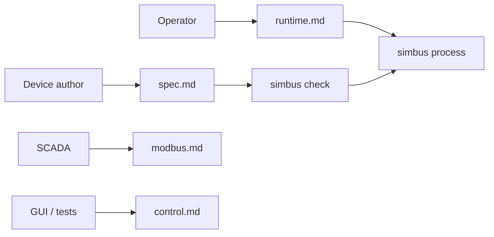

# Documentation

These files live next to the code and are reviewed in the same pull request
(docs-as-code). GitHub renders them as Markdown, including [Mermaid](https://docs.github.com/en/get-started/writing-on-github/working-with-advanced-formatting/creating-diagrams)
fenced blocks. Do not use `%%{init}%%` theme directives: GitHub strips them.

The [README](../README.md) is the **front door** (what it is, 5-minute start,
links here). Normative contracts live in this folder. When a contract and the
Rust types disagree, the contract wins — change them together.

## Map

Classified with [Diátaxis](https://diataxis.fr/) so each page has one job.

| Page | Mode | Job |
| --- | --- | --- |
| [architecture.md](architecture.md) | Explanation | Process shape, crates, repo layout, sequences |
| [spec.md](spec.md) | Reference | Device YAML language (boot contract) |
| [runtime.md](runtime.md) | Reference | Binary, boot, CLI/env, signals, Docker |
| [modbus.md](modbus.md) | Reference | Field plane: Modbus TCP PDU (V1.1b3 / V1.0b) |
| [control.md](control.md) | Reference | Session HTTP (not the field protocol) |
| [simulation.md](simulation.md) | Reference | Tick, `state.base`, behaviors, faults, encode |
| [scenarios.md](scenarios.md) | How-to | Run and author bundled scenarios |
| [debt.md](debt.md) | Explanation | Specified as not this version (extra protocols) |

Interactive HTTP reference: `GET /docs` on a running process (OpenAPI).
That page is generated from `crates/control`; [control.md](control.md) is
still the contract.

The repo-root [`index.html`](../index.html) is a marketing landing page, not
a contract. Repository layout: [architecture.md](architecture.md) §2.

## For agents

| File | Job |
| --- | --- |
| [AGENTS.md](../AGENTS.md) | How to **change this repo** (build, tests, spec-first, **release**) |
| [CONTRIBUTING.md](../CONTRIBUTING.md) | GitFlow: PR to `develop`, tag `main` |
| [llms.txt](../llms.txt) | Map of documentation (what to read) |
| [simbus-device skill](../.agents/skills/simbus-device/SKILL.md) | How to **write a device YAML**. In this clone it is already on disk. Elsewhere: `npx skills add obsidia-systems/simbus@simbus-device` |

## How to change a contract

1. Edit the matching file in this folder first.
2. Change the crate in the same commit.
3. Keep diagrams in **GitHub-safe Mermaid**: `flowchart`, `sequenceDiagram`,
   `stateDiagram-v2`. Prefer `flowchart` over legacy `graph`. Quote labels
   that contain punctuation. Keep diagrams small (one idea each).
4. New YAML fields and protocols start in [spec.md](spec.md).

