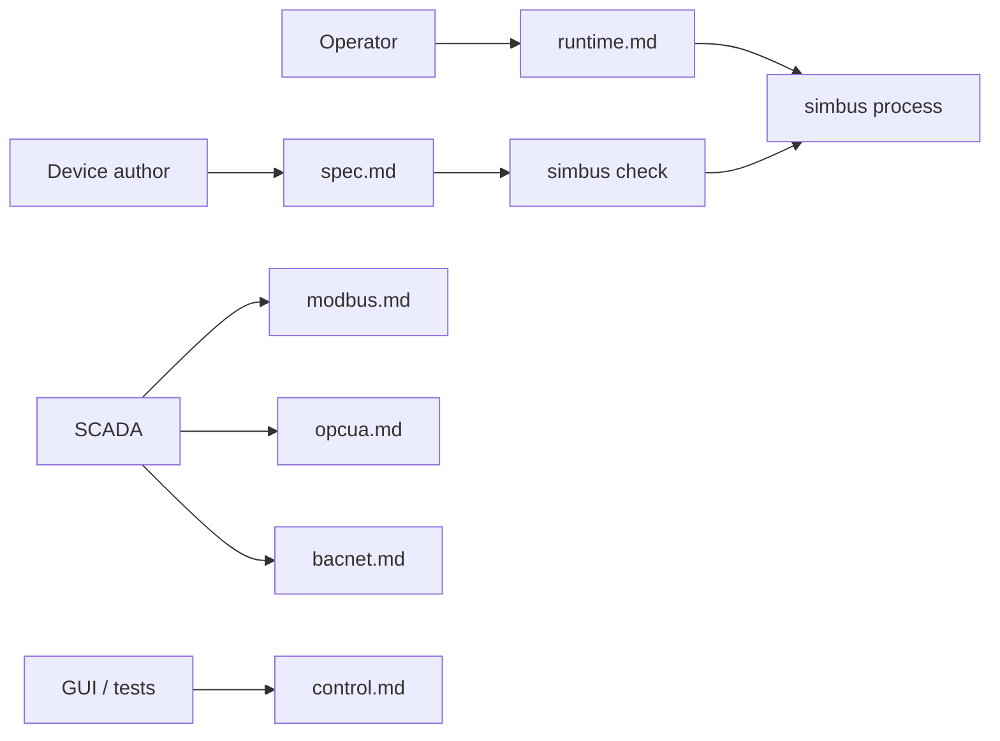

# Documentation

These files live next to the code and are reviewed in the same pull request
(docs-as-code). GitHub renders them as Markdown, including [Mermaid](https://docs.github.com/en/get-started/writing-on-github/working-with-advanced-formatting/creating-diagrams)
fenced blocks. Do not use `%%{init}%%` theme directives: GitHub strips them.

The [README](../README.md) is the **front door** (what it is, 5-minute start,
links here). Normative contracts live in this folder. When a contract and the
Rust types disagree, the contract wins — change them together.

## Map

Classified with [Diátaxis](https://diataxis.fr/) so each page has one job.

| Page | Mode | Job |
| --- | --- | --- |
| [architecture.md](architecture.md) | Explanation | Process shape, crates, repo layout, sequences |
| [spec.md](spec.md) | Reference | Device YAML language (boot contract) |
| [runtime.md](runtime.md) | Reference | Binary, boot, CLI/env, signals, Docker |
| [opcua.md](opcua.md) | Reference | Field plane: OPC UA (IANA 4840), YAML map as variables |
| [bacnet.md](bacnet.md) | Reference | Field plane: BACnet/IP (IANA 47808), export rows as objects |
| [control.md](control.md) | Reference | Session HTTP (not the field protocol) |
| [simulation.md](simulation.md) | Reference | Tick, `state.base`, behaviors, faults, encode |
| [scenarios.md](scenarios.md) | How-to | Run and author bundled scenarios |
| [debt.md](debt.md) | Explanation | Specified as not this version (extra protocols) |

Interactive HTTP reference: `GET /docs` on a running process (OpenAPI).
That page is generated from `crates/control`; [control.md](control.md) is
still the contract.

The repo-root [`index.html`](../index.html) is a marketing landing page, not
a contract. Repository layout: [architecture.md](architecture.md) §2.

## For agents

| File | Job |
| --- | --- |
| [AGENTS.md](../AGENTS.md) | How to **change this repo** (build, tests, spec-first, **release**) |
| [CONTRIBUTING.md](../CONTRIBUTING.md) | GitFlow: PR to `develop`, tag `main` |
| [llms.txt](../llms.txt) | Map of documentation (what to read) |
| [simbus-device skill](../.agents/skills/simbus-device/SKILL.md) | How to **write a device YAML**. In this clone it is already on disk. Elsewhere: `npx skills add obsidia-systems/simbus@simbus-device` |

## How to change a contract

1. Edit the matching file in this folder first.
2. Change the crate in the same commit.
3. If the change moves a number, a frame, or a timeline that a diagram
   below shows, redraw it in the same commit. Diagram rules follow.
4. New YAML fields and protocols start in [spec.md](spec.md).

## Diagrams

Keep them in **GitHub-safe Mermaid**. Prefer `flowchart` over legacy `graph`.
Keep one idea per diagram, and never let a diagram be the only place a rule
is written: the table or formula next to it is the normative text.

| Type | Used for | Where |
| --- | --- | --- |
| `flowchart` | Components, decision paths | most pages |
| `sequenceDiagram` | One exchange over time | control, modbus, runtime |
| `stateDiagram-v2` | Lifecycles with named states | simulation, scenarios |
| `erDiagram` | Cardinality between document parts | spec §2 |
| `xychart-beta` | A value over simulation time | simulation §5, §6, §8 |
| `packet-beta` | Byte and bit layout of a frame | modbus, bacnet |
| `gantt` | `at:` / `duration_s` on the simulation clock | spec §7, scenarios |
| `mindmap` | A surface too wide for one flowchart | control §3 |
| `gitGraph` | Branch and tag model | CONTRIBUTING.md |

Two rules that come from how GitHub renders this:

- Write `xychart-beta` and `packet-beta`, not `xychart` / `packet`. The
  `-beta` aliases parse on Mermaid 10 **and** 11; GitHub does not publish
  which version it bundles (render a block containing only `info` to see).
  Keep these two out of the root README, which must degrade gracefully.
- In a `mindmap`, a label containing `{`, `}`, `(`, or `[` MUST be written
  as `["GET /points/{id}"]`. Unquoted braces are a lexical error, and a
  mindmap is the one diagram type where that is easy to miss.

- An `xychart-beta` with **two** series needs a palette, because the default
  one draws the first series so pale it is nearly invisible on white. Set it
  with `%%{init: {"themeVariables": {"xyChart": {"plotColorPalette": "…"}}}}%%`
  above the diagram — but treat that as decoration only: whether a given
  renderer honors the directive is not something this repository can test, so
  a chart MUST still be readable in the default palette. Name each series by
  its **shape** (“the ramp that snaps back”, “the flat line at 35”) in the
  title or the text, never by its color.

Paste a new diagram into [mermaid.live](https://mermaid.live) before pushing;
a block that fails to parse renders as raw text on GitHub, not as an error.

Charts of engine behavior MUST be computed from the formula in
[simulation.md](simulation.md) §5, not sketched, so the plot and the crate
cannot drift apart. Say so in the surrounding text when a series is a sample
of a random distribution rather than an exact trace.

