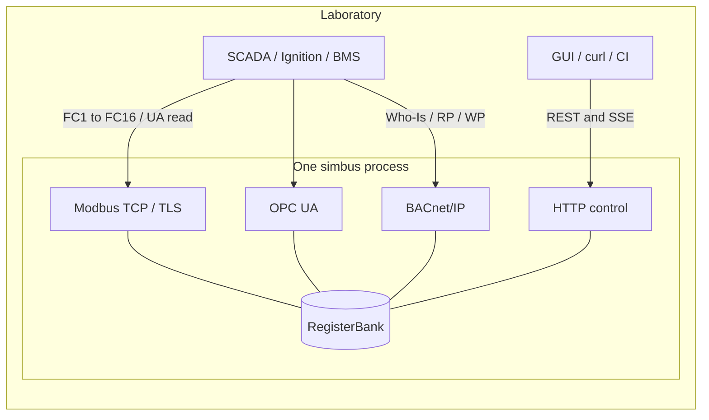
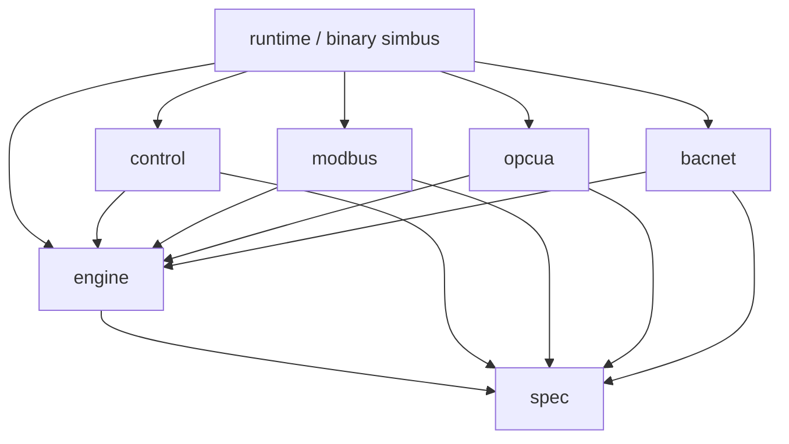
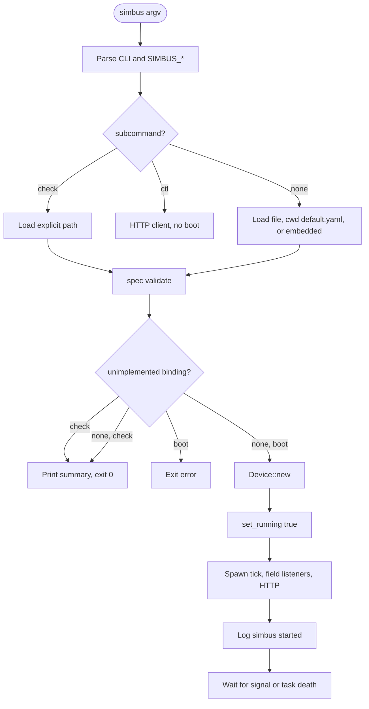
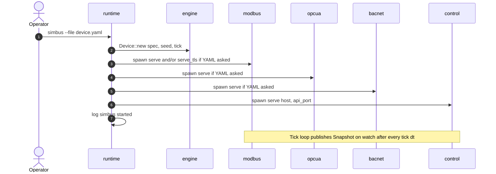
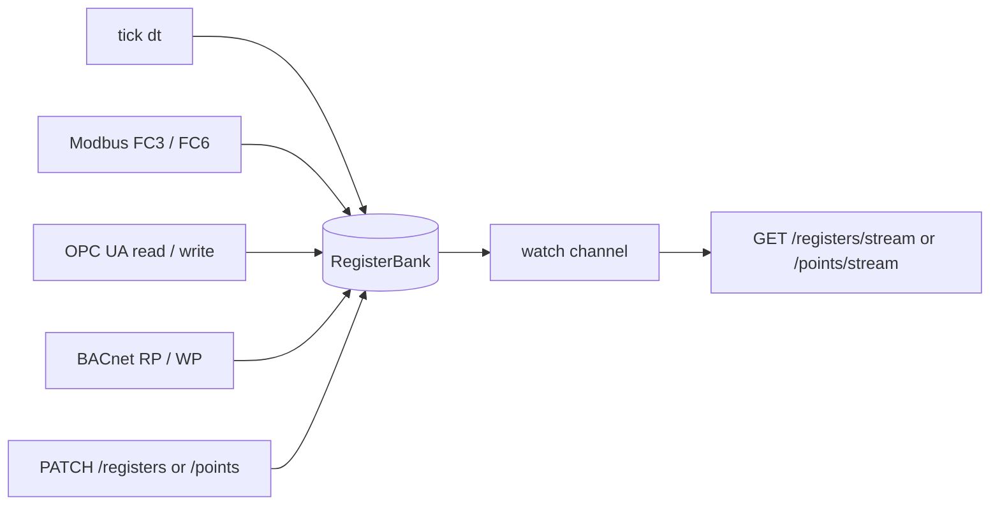
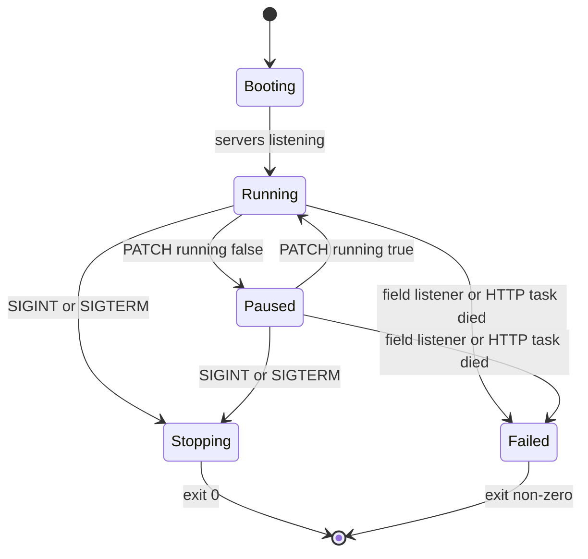
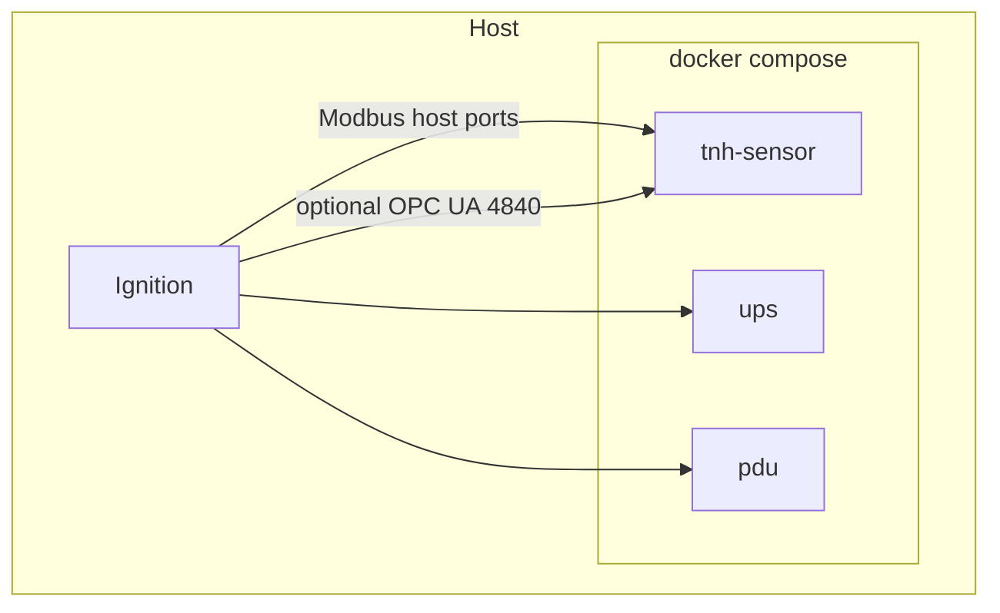

# Architecture

**Mode:** explanation (not a second copy of the YAML or HTTP tables)  
**Contracts:** [spec.md](spec.md) · [runtime.md](runtime.md) · [modbus.md](modbus.md) · [opcua.md](opcua.md) · [bacnet.md](bacnet.md) · [control.md](control.md) · [simulation.md](simulation.md)

simbus is one **process** that pretends to be one **field device**. A lab
is many processes (Compose services), not one process with many maps.

GitHub renders the Mermaid below. Syntax follows current
[Mermaid flowcharts](https://mermaid.js.org/syntax/flowchart.html),
[sequence diagrams](https://mermaid.js.org/syntax/sequenceDiagram.html), and
[state diagrams](https://mermaid.js.org/syntax/stateDiagram.html), without
`%%{init}%%` (GitHub does not apply those directives).

---

## 1. Context

Operators boot a YAML file. SCADA talks Modbus TCP (and optionally TLS on
IANA 802, OPC UA on IANA 4840, and/or BACnet/IP on IANA 47808) to the listen
ports. Tests and GUIs talk HTTP to the control port. The planes share one
in-memory bank; they are not several devices.



YAML `type:` is identity inside the document. It is not a CLI selector.
The operator always points `--file` (or `SIMBUS_YAML_PATH`) at a path, or
accepts the default template.

---

## 2. Crates and repository

Compile-time dependencies. `spec` has no tokio. `engine` has no sockets.
`runtime` is the binary `simbus`.



| Crate | Owns | Must not |
| --- | --- | --- |
| `spec` | YAML parse and `simbus check` | Open ports, tick |
| `engine` | Bank, `tick(dt)`, faults, steps | Sockets, SSE, health logs |
| `modbus` | TCP / TLS slave, V1.1b3 PDU | HTTP, tick |
| `opcua` | OPC UA server, YAML map as variables | HTTP, tick |
| `bacnet` | BACnet/IP server, objects from `export` | HTTP, tick |
| `control` | Session HTTP + SSE | Field listen |
| `runtime` | CLI, boot, tick / field listeners / HTTP, signals | A second YAML dialect |

CI is `cargo test --workspace --locked`. Per crate (no Markdown next to the
crate; contracts are in this folder):

| Crate | Command | Tests |
| --- | --- | --- |
| `spec` | `cargo test -p spec` | `src/types.rs`; `tests/catalog.rs` (schema fixtures, not every YAML) |
| `engine` | `cargo test -p engine` | `src/behaviors.rs`, `src/encode.rs`; `tests/engine.rs` |
| `control` | `cargo test -p control` | `tests/http.rs` (probes, PATCH, faults, scenarios, API key, SSE) |
| `modbus` | `cargo test -p modbus --locked` | FC1–FC4 / 5 / 6 / 15 / 16, exceptions 02 / 03, FC3 over TLS |
| `opcua` | `cargo test -p opcua --locked` | T&H `holding/temperature` over Anonymous/None |
| `bacnet` | `cargo test -p bacnet --locked` | Language-2 fixture: Who-Is, ReadProperty on an Analog Input, WriteProperty on an Analog Value |
| `runtime` (`-p simbus`) | `cargo test -p simbus --locked` | clap (`--file`, `--tick`, `--time-scale`, `--seed`, TLS/UA flags, `check`, `ctl`); default template |

Device YAML is validated with `simbus check`, not a Rust test per file.

On disk this is the whole product (no Python package, no `scenarios/` folder):

```text
simbus/
├── crates/{spec,engine,control,modbus,opcua,bacnet,runtime}
├── devices/{builtin,community}
├── docs/
├── Dockerfile
├── docker-compose.yml
└── Cargo.toml
```

---

## 3. Boot

File-only load. `simbus check` stops after validation. Boot refuses
unimplemented protocol bindings that `check` still accepts as syntax.



Sequence of tick, field listeners, and HTTP after `Device::new`:



---

## 4. Shared bank

There is one `RegisterBank`. Tick writes it. Modbus, OPC UA, BACnet/IP, and
HTTP read and write it. SSE is a `watch` of snapshots; the engine never opens
the SSE socket.



---

## 5. Field plane vs session plane

| Plane | Port | Client | Contract |
| --- | --- | --- | --- |
| Field | Modbus TCP / TLS | Ignition, PLC, protocol tester | [modbus.md](modbus.md) |
| Field | OPC UA (IANA 4840) | Ignition, UA Expert | [opcua.md](opcua.md) |
| Field | BACnet/IP (IANA 47808) | BMS, YABE, protocol tester | [bacnet.md](bacnet.md) |
| Session | HTTP | Operator, GUI, pytest | [control.md](control.md) |

A FC6, an OPC UA write, a BACnet WriteProperty, and an HTTP PATCH are wires to the same
`state.base` ([simulation.md](simulation.md) §3). SSE publishes immediately
on session writes and on the **next tick** after a field-plane write.

---

## 6. Process lifecycle

`is_running` is the pause flag (`PATCH /simulation` `running`). Tick is a
no-op while paused. `/readyz` is 503 while paused. Field listeners still
serve the last bank.



Shutdown **drains** then aborts leftover after `--shutdown-timeout`
([runtime.md](runtime.md) §6).

---

## 7. Docker lab

Each Compose service is one process, one YAML, one pair of published
ports (Modbus + HTTP). Official maps do not bind OPC UA or BACnet/IP; a lab
that wants IANA 4840 adds `protocol: opcua` and publishes `4840`, and one that
wants IANA 47808 adds `protocol: bacnet-ip` and publishes `47808/udp`. Inside the
container Modbus is usually `502` (Papouch `512`). Compose **must** set
`SIMBUS_YAML_PATH`.

Every service has a profile (`env`, `cooling`, `power`, `custom`, `all`).
`docker compose up` with no names and no `--profile` starts nothing.
`--profile all` starts 7 builtin templates plus 4 Papouch TH2E instances.
Naming a service (`docker compose up tnh-sensor`) starts it without
enabling a profile.



---

## 8. What this page is not

- YAML field tables → [spec.md](spec.md)
- Function codes and exception 02 → [modbus.md](modbus.md)
- OPC UA NodeIds and None/Anonymous → [opcua.md](opcua.md)
- BACnet object types and Present_Value → [bacnet.md](bacnet.md)
- Route list → [control.md](control.md) and `GET /docs`
- Behavior formulas → [simulation.md](simulation.md)
