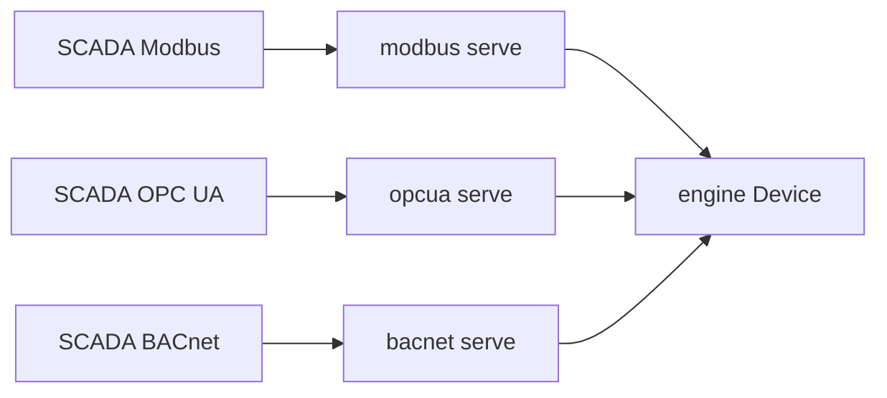
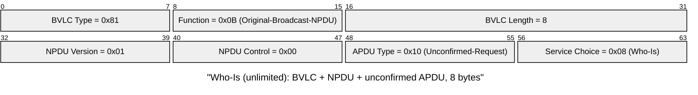
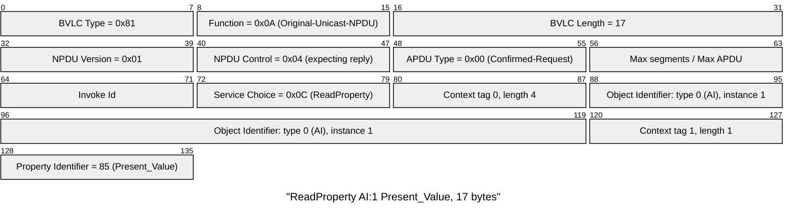

# simbus BACnet/IP

**Status:** normative for `crates/bacnet`  
**Device language:** [spec.md](spec.md)  
**Tick / `state.base`:** [simulation.md](simulation.md)  
**Session HTTP:** [control.md](control.md)  
**Process:** [runtime.md](runtime.md)  
**Sibling field planes:** [modbus.md](modbus.md) · [opcua.md](opcua.md)  
**Shape of the process:** [architecture.md](architecture.md)

This crate is a **field plane** on the same process and the same engine
bank. It MUST NOT invent a second point list. It MUST NOT open the control
HTTP port. It MUST NOT tick the engine.

| Document | Role |
| --- | --- |
| [ASHRAE 135](https://www.ashrae.org/technical-resources/bookstore/bacnet) | Objects, services, BACnet/IP |
| [IANA `bacnet` 47808](https://www.iana.org/assignments/service-names-port-numbers/service-names-port-numbers.xhtml?search=bacnet) | Well-known BACnet/IP UDP port |

The stack is [`bacnet-server`](https://crates.io/crates/bacnet-server) **0.11**
(MIT) plus `bacnet-objects` / `bacnet-types`. **Do not enable** the crate
feature `sc-tls` (BACnet/SC is out of this version). That stack’s own
compiler floor is **1.93**; CI uses current stable. simbus workspace
`rust-version` stays **1.85** for edition 2024; a contributor on 1.85 cannot
build the `bacnet` crate until that floor is raised.

---

## 1. Role

The binding MUST:

1. Listen **UDP** on the resolved port (`47808` / `--bacnet-port`) when
   `protocol: bacnet-ip` is listed. An empty `bindings` list does **not**
   infer BACnet.
2. Share one engine bank with Modbus, OPC UA, the tick loop, and HTTP.
3. Publish **only** ids in that binding’s `export` (required and non-empty
   in language 2). Object type and instance come from the row. They are
   **never** inferred from `kind` × `class`.
4. After a successful WriteProperty to a writable object, update
   `state.base` the same way HTTP PATCH / Modbus FC6 do
   ([simulation.md](simulation.md) §3).

Bind address is `0.0.0.0` (`bacnet::serve`). Log: `bacnet listening` with
`port`. `bacnet::serve_on` takes an explicit interface and broadcast address
so tests can stay on loopback; the runtime never calls it with anything else.

Official maps under `devices/builtin/` MUST NOT declare this binding
(Compose does not publish 47808). Dual-bind with `modbus-tcp` and/or
`opcua` in a lab YAML or a test fixture.

---

## 2. Endpoint (this version)

| Rule | Value |
| --- | --- |
| Data link | BACnet/IP (UDP/IPv4) |
| Port | `47808` unless overridden |
| Who-Is / I-Am | served |
| ReadProperty / ReadPropertyMultiple | served |
| WriteProperty / WritePropertyMultiple | served; AI/BI Present_Value not writable |
| COV, BBMD, MS/TP, BACnet/SC | **not** this version |
| Priority_Array | last-write-wins (no 16-level commandability) |

`--bacnet-port` / `SIMBUS_BACNET_PORT` MAY override the port. It MUST NOT
enable BACnet unless the document already has `bacnet-ip`. 47808 is `0xBAC0`,
and the convention is that additional networks take 47809, 47810, … — so a
port override moves this device to another BACnet **network**, not just to
another socket.

### 2.1 On the wire

Every frame is BVLC over UDP, then an NPDU, then the APDU. Discovery is one
8-byte broadcast — an unlimited Who-Is carries no parameters at all, which is
why any device on the subnet must answer it:

A ReadProperty of `Present_Value` on Analog Input 1 is 17 bytes. The object
is named by a single 32-bit identifier — 10 bits of object type, 22 bits of
instance — so `analog-input` instance 1 is `0x00000001`, and the `export`
row in the device YAML is what decides those 32 bits:

The `Invoke Id` is what pairs the ComplexACK with this request; nothing in
the frame carries the device instance, because unicast already identified the
device. That is also why a wrong `device_instance` in the YAML is invisible
on a read and only shows up in discovery.

---

## 3. Objects

Device object instance is YAML `device_instance`. Object_Name is the device
`name`. Vendor / model / revision come from `identity` when set.

Each export row is one object. Present_Value is engineering **REAL** (analog)
or BinaryPV Inactive/Active (binary), never the Modbus raw integer.

| `export.object` | ASHRAE | Writable Present_Value |
| --- | --- | --- |
| `analog-input` | AI | no |
| `analog-value` | AV | yes |
| `analog-output` | AO | yes |
| `binary-input` | BI | no |
| `binary-value` | BV | yes |
| `binary-output` | BO | yes |

`simbus check` MUST fail on unknown point ids, empty export (language 2),
or duplicate `(object, instance)`. It MAY warn when `object` does not match
`kind` × `class`.

Live analog/binary values MUST be read from the engine on a short poll
(100 ms in this version; there is no custom `BACnetObject` that calls the
engine on every RP). Writes to AV/AO/BV/BO MUST call
`Device::override_point` with source `"bacnet"`.

The engine bank is still address-backed in this version. A language-2
document **without** a Modbus binding gives every point a private cell, so a
BACnet-only map publishes engineering values with no Modbus surface. When the
same document **also** binds Modbus, only ids in that Modbus `export` have a
cell: `simbus check` warns (`no engine cell`) for a BACnet row that is not
also exported to Modbus, and that object reads as unavailable.

---

## 4. Gaps (not this version)

- BACnet/SC, COV, BBMD, Foreign Device, MS/TP
- Priority array / commandable outputs
- Intrinsic reporting, trend logs, schedules
- A point-keyed engine bank (a BACnet row on a Modbus-bound document needs a
  Modbus `export` row to have a value — see §3)
- Raising workspace `rust-version` to match `bacnet-server` (1.93)

---

## 5. Change process

1. If the **object set, services, or endpoint** change, update this file,
   then `crates/bacnet`.
2. If only the **vendor map** changes, change [spec.md](spec.md).
3. Tests: `crates/bacnet/tests/round_trip.rs` boots a language-2 fixture with
   a `bacnet-ip` export, serves Who-Is, reads an Analog Input Present_Value,
   and writes an Analog Value to see `state.base` move. The I-Am answer is a
   broadcast to the device's **own** UDP port, so a single-socket loopback
   test cannot assert its payload. Do not add `bacnet-ip` to official
   builtins in the same change.
4. Do not enable `sc-tls` until this file says so.
