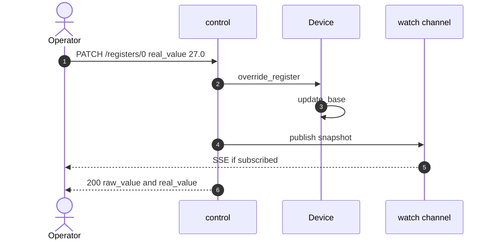
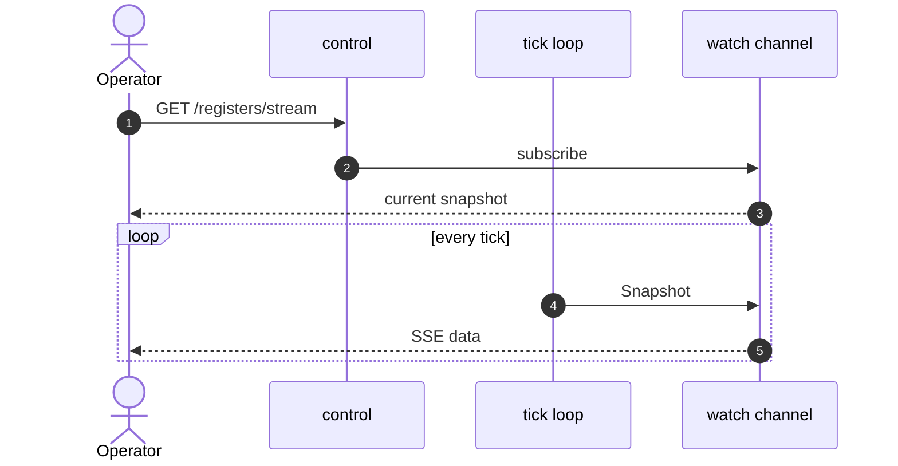

# simbus Control Plane

**Status:** normative for `crates/control` (language version 1)  
**Device language:** [spec.md](spec.md)  
**Process:** [runtime.md](runtime.md)  
**Tick:** [simulation.md](simulation.md)  
**Field plane:** [modbus.md](modbus.md)  
**Shape of the process:** [architecture.md](architecture.md)  
**Interactive HTTP:** `GET /docs` (OpenAPI)

The crate is named **control**, not `api`, because HTTP is only the
transport. This process already has two wire faces:

| Plane | Crate | Role |
| --- | --- | --- |
| Field / data | `modbus` | SCADA reads and writes registers (FC1–FC16) |
| Control / session | `control` | Operator, tests, and GUIs mutate the live device |

`api` would name the socket. **Control** names the job: session state on
one already-booted device (values, faults, tick, bundled scenarios). It
MUST NOT replace the YAML. It MUST NOT enlarge the register map.

---

## 1. Role

The control plane MUST:

1. Expose discovery (`/status`, `/config`, probes, `/metrics`, `/docs`).
2. Read and override registers/coils that **exist in the loaded document**.
3. Inject and clear faults; change `tick_interval`; reset to boot
   ([simulation.md](simulation.md) §6).
4. List and run scenarios **bundled in that document**. Unknown ids MUST
   404.
5. Stream bank snapshots on each engine tick **and** after session writes
   (PATCH, faults, reset).

It MUST NOT load a second YAML dialect. It MUST NOT install a scenario
that was not in the document (`POST /scenarios` upload is not in this
version; specify it here before implementing). It MUST NOT pause the
tick (`is_running` is status only).

Session state is RAM. It is discarded when the process exits.



---

## 2. Bind, limits, auth

Runtime binds `SIMBUS_API_HOST`:`SIMBUS_API_PORT` (defaults `0.0.0.0:8000`).

| Rule | Value |
| --- | --- |
| JSON body limit | 64 KiB |
| Request timeout | 30 s on all routes **except** `GET /registers/stream` |
| CORS | `SIMBUS_CORS_ORIGINS` (`*` = permissive) |
| Writes | If `SIMBUS_API_KEY` is set: `x-api-key` or `Authorization: Bearer`. Else open. |

GET (including SSE) is not keyed. Missing/wrong key on a write MUST 401.

---

## 3. Endpoints

### Discovery

| Method | Path | Notes |
| --- | --- | --- |
| `GET` | `/status` | Live: name, type, **listen** Modbus port, tick, `running`/`stopped`, Modbus `listening`/`stopped` |
| `GET` | `/config` | Document snapshot: map, `spec_version`, endianness, YAML `modbus.default_port`, bundled scenarios |
| `GET` | `/healthz` | Liveness (always 200 if the task is up) |
| `GET` | `/readyz` | 200 when Modbus is listening **and** `is_running`; else 503 |
| `GET` | `/metrics` | Prometheus text |
| `GET` | `/docs` | Swagger UI |
| `GET` | `/api-docs/openapi.json` | OpenAPI 3. The document MUST list every route in this section |

`/status.modbus_port` is what the process is listening on (`--port`).
`/config.modbus_port` is the YAML default. They differ when CLI overrides.

### Registers

| Method | Path | Notes |
| --- | --- | --- |
| `GET` | `/registers` | Raw snapshot (immediate) |
| `PATCH` | `/registers/{address}` | Holding: shift `state.base` |
| `PATCH` | `/registers/input/{address}` | Input: same; not writable over Modbus |
| `PATCH` | `/registers/coils/{address}` | Coil; trigger coils are overwritten next tick |
| `PATCH` | `/registers/discrete/{address}` | Discrete |
| `GET` | `/registers/stream` | SSE: current snapshot on subscribe, then each **tick** and each session write |

PATCH body is either `{"real_value": 27.0}` or `{"value": 270}` (raw).
Not both. Neither MUST 422. Unknown address MUST 404.

SSE frames match `GET /registers`. Keep-alive comments every 15 s. This
route MUST NOT be killed by the 30 s timeout.



### Simulation and faults

| Method | Path | Notes |
| --- | --- | --- |
| `PATCH` | `/simulation` | `{"tick_interval": 0.5}`; MUST be > 0 |
| `POST` | `/simulation/reset` | Boot `RegState` + YAML defaults; same seeded trace |
| `GET` | `/faults` | Active faults (TTL remaining is simulation seconds) |
| `POST` | `/faults` | Inject; see [simulation.md](simulation.md) §8 |
| `DELETE` | `/faults` | Clear all |

`POST /faults` with `duration_s <= 0` MUST 422. `spike` MUST include `value`.
`register_name: null` is valid only for `dropout` (device-wide). Other types
MUST name a holding/input register; `alarm` MUST name a coil. Unknown names
MUST 404 (not a silent no-op).

### Scenarios

Catalog = `scenarios:` in the loaded document. Playback uses **wall clock**
from `POST /run`. In this version wall clock and simulation time are 1:1
([simulation.md](simulation.md) §2), so `at:` matches tick time.

| Method | Path | Notes |
| --- | --- | --- |
| `GET` | `/scenarios` | `{id, name, description, steps}` |
| `POST` | `/scenarios/{name}/run` | `{name}` is the scenario `id`. 202 or 404 |
| `GET` | `/scenarios/active` | Runner status |
| `POST` | `/scenarios/stop` | Cancel (204) |

Boot leaves scenarios **idle**. Starting a second scenario aborts the first.

```bash
curl http://localhost:8000/scenarios
curl -X POST http://localhost:8000/scenarios/heat-wave/run
```

`heat-wave` exists on generic T&H. `power-outage` exists on generic UPS.
An id from another device MUST 404 on this process.

---

## 4. CLI of the device

The `simbus` binary **is** the device. Flags (`--file`, `--port`, `--tick`,
`--seed`, …) apply at boot. Session control is this HTTP API (or OpenAPI).
A future `simbus` client subcommand MUST call these same routes.

---

## 5. Change process

1. Update this document.
2. Change `crates/control` (routes, DTOs, OpenAPI path list, tests).
3. If SSE wiring needs the tick loop, change `crates/runtime` in the same
   commit — do not put sockets in `crates/engine`.
4. `cargo test -p control` covers probes, `/config` wire format, auth, 404
   scenario, OpenAPI path set, first SSE frame.
