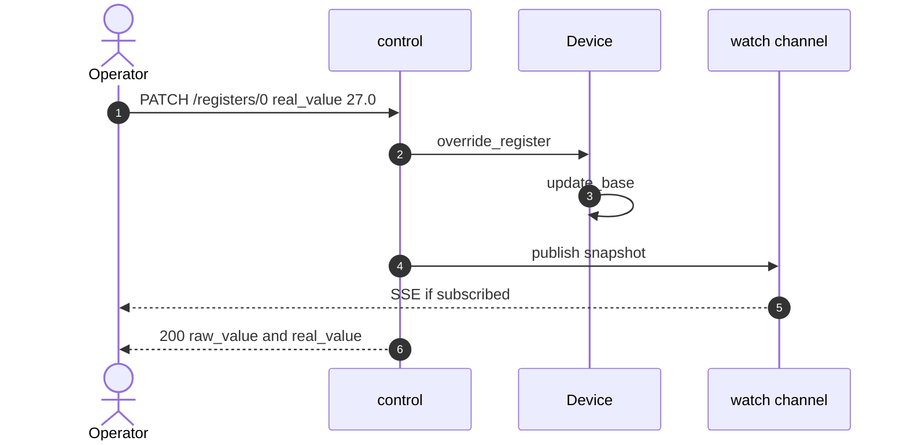
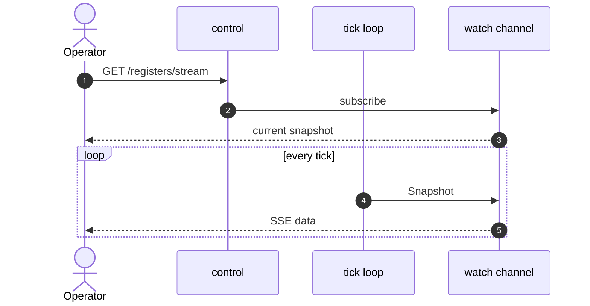

# simbus Control Plane

**Status:** normative for `crates/control` (language version 1)  
**Device language:** [spec.md](spec.md)  
**Process:** [runtime.md](runtime.md)  
**Tick:** [simulation.md](simulation.md)  
**Field plane:** [modbus.md](modbus.md) · [opcua.md](opcua.md) · [bacnet.md](bacnet.md)  
**Shape of the process:** [architecture.md](architecture.md)  
**Interactive HTTP:** `GET /docs` (OpenAPI)

The crate is named **control**, not `api`, because HTTP is only the
transport. This process already has three wire faces:

| Plane | Crate | Role |
| --- | --- | --- |
| Field / data | `modbus` | SCADA reads and writes registers (FC1–FC16) |
| Field / data | `opcua` | Same bank as OPC UA variables (IANA 4840) |
| Control / session | `control` | Operator, tests, and GUIs mutate the live device |

`api` would name the socket. **Control** names the job: session state on
one already-booted device (values, faults, tick, bundled scenarios). It
MUST NOT replace the YAML. It MUST NOT enlarge the register map.

---

## 1. Role

The control plane MUST:

1. Expose discovery (`/status`, `/config`, probes, `/metrics`, `/docs`).
2. Read and override registers/coils that **exist in the loaded document**.
3. Inject and clear faults; change `tick_interval`; reset to boot
   ([simulation.md](simulation.md) §6).
4. List and run scenarios **bundled in that document**, and session-installed
   copies (`POST /scenarios`). Unknown ids MUST 404.
5. Pause and resume the tick (`PATCH /simulation` `running`).
6. Stream bank snapshots on each engine tick **and** after session writes
   (PATCH, faults, reset). Not on a skipped wait while paused.

It MUST NOT load a second YAML dialect (upload body is JSON, same schema as
[spec.md](spec.md) §7). It MUST NOT write the device file. It MUST NOT
enlarge the register map. Session scenarios live in RAM and die with the
process.

Session state is RAM. It is discarded when the process exits.



---

## 2. Bind, limits, auth

Runtime binds `SIMBUS_API_HOST`:`SIMBUS_API_PORT` (defaults `0.0.0.0:8000`).

| Rule | Value |
| --- | --- |
| JSON body limit | 64 KiB |
| Request timeout | 30 s on all routes **except** `GET /registers/stream` and `GET /points/stream` |
| CORS | `SIMBUS_CORS_ORIGINS` (`*` = permissive) |
| Writes | If `SIMBUS_API_KEY` is set: `x-api-key` or `Authorization: Bearer`. Else open. |

GET (including SSE) is not keyed. Missing/wrong key on a write MUST 401.

---

## 3. Endpoints

### Discovery

| Method | Path | Notes |
| --- | --- | --- |
| `GET` | `/status` | Live: name, type, Modbus TCP port, `modbus_tls_port` / `opcua_port` / `bacnet_port` (`null` if that binding is absent), tick, `time_scale`, `running`/`stopped`, field plane `listening`/`stopped` |
| `GET` | `/config` | Document snapshot: map, `spec_version`, endianness, YAML `modbus.default_port`, declared `bindings`, bundled scenarios |
| `GET` | `/healthz` | Liveness (always 200 if the task is up) |
| `GET` | `/readyz` | 200 when **every** requested field listener is up **and** the simulation is running; else 503 (paused → 503). TLS-only, OPC UA-only, or BACnet-only: TCP is not required. Dual-bind: every listed plane |
| `GET` | `/metrics` | Prometheus text |
| `GET` | `/docs` | Swagger UI |
| `GET` | `/api-docs/openapi.json` | OpenAPI 3. The document MUST list every route in this section |

`/status.modbus_port` is the cleartext TCP listen port (`--port`).
`/status.modbus_tls_port` is the TLS listen port, or JSON `null` when the
document has no `modbus-tls` binding.
`/status.opcua_port` is the OPC UA listen port, or JSON `null` when the
document has no `opcua` binding.
`/status.bacnet_port` is the BACnet/IP UDP port, or JSON `null` when the
document has no `bacnet-ip` binding.
`/config.modbus_port` is the YAML `modbus.default_port`. TCP listen and YAML
default differ when CLI overrides `--port`.

`/config.bindings` is the **document** view of the field plane: one row per
resolved binding, in declaration order (language 1 with an empty `bindings`
list shows the one inferred `modbus-tcp` row). It MUST NOT apply CLI or env
port overrides — `/status` is the live view. Each row:

| Field | Type | Meaning |
| --- | --- | --- |
| `protocol` | string | `modbus-tcp` · `modbus-tls` · `opcua` · `bacnet-ip` · `modbus-rtu` · `snmp-v2c` · `mqtt-sparkplug` |
| `port` | uint16 or null | YAML / default port. `null` for a protocol with no IP port (`modbus-rtu`, `mqtt-sparkplug`) |
| `unit_id` | uint8 or null | `modbus-tcp` only |
| `endianness` | string or null | `modbus-tcp` only |
| `device_instance` | uint32 or null | `bacnet-ip` only |
| `points` | integer or null | Rows in that binding's `export`. `null` for a protocol with no export map |
| `implemented` | bool | Whether this runtime serves the protocol ([spec.md](spec.md) §4.1) |

A declared-but-unimplemented protocol is still listed, with
`implemented: false`. The process refuses to boot such a document
([runtime.md](runtime.md) §2), so on a running process every row is `true`.

### Registers and points

Language 1 address routes stay. Language 2 (and lifted language 1) also
expose canonical points. Prefer points when talking to a language-2 device.

| Method | Path | Notes |
| --- | --- | --- |
| `GET` | `/registers` | Raw snapshot (immediate) |
| `PATCH` | `/registers/{address}` | Holding: shift `state.base` |
| `PATCH` | `/registers/input/{address}` | Input: same; not writable over Modbus |
| `PATCH` | `/registers/coils/{address}` | Coil; trigger coils are overwritten next tick |
| `PATCH` | `/registers/discrete/{address}` | Discrete |
| `GET` | `/registers/stream` | SSE: current snapshot on subscribe, then each **tick** and each session write |
| `GET` | `/points` | Canonical points (id, kind, class, live value) |
| `GET` | `/points/{id}` | One point |
| `PATCH` | `/points/{id}` | Body `{"value": 27.0}` or `{"value": true}`. Shifts `state.base` for analog |
| `GET` | `/points/stream` | SSE: same cadence as `/registers/stream`; payload is the `/points` list |

PATCH `/registers/…` body is either `{"real_value": 27.0}` or `{"value": 270}` (raw).
Not both. Neither MUST 422. Unknown address MUST 404.

SSE frames for `/registers/stream` match `GET /registers`. Keep-alive comments
every 15 s. `/registers/stream` and `/points/stream` MUST NOT be killed by the
30 s timeout.



### Simulation and faults

| Method | Path | Notes |
| --- | --- | --- |
| `PATCH` | `/simulation` | `tick_interval` (> 0) and/or `running` (bool). Omitted fields unchanged. Response: `{tick_interval, running}` |
| `POST` | `/simulation/reset` | Boot `RegState` + YAML defaults; same seeded trace. Does **not** change `running` or the session scenario catalog |
| `GET` | `/faults` | Active faults (TTL remaining is simulation seconds) |
| `POST` | `/faults` | Inject; see [simulation.md](simulation.md) §8 |
| `DELETE` | `/faults` | Clear all |

`POST /faults` with `duration_s <= 0` MUST 422. `spike` MUST include `value`.
`register_name: null` is valid only for `dropout` (device-wide). Other types
MUST name a holding/input register; `alarm` MUST name a coil. Unknown names
MUST 404 (not a silent no-op).

`running: false` pauses the simulation clock: `tick(dt)` is a no-op, fault
TTLs freeze, SSE does not get a tick frame. Modbus still serves the last
bank. Session writes (PATCH, faults, reset) still apply and still publish
SSE. Scenario playback MUST NOT apply steps and MUST NOT count wall time
toward `at:` while paused. `running: true` resumes from the frozen
`elapsed_s`. Empty body is a no-op that returns the current pair.

### Scenarios

Catalog = `scenarios:` in the loaded document **plus** session-installed
ids. `GET /config.scenarios` is the document only. `at:` is **simulation
seconds** from `POST /run`. The HTTP layer sleeps `wall = at / time_scale`
([runtime.md](runtime.md) §4). Default scale `1` keeps wall and `at:` 1:1.
`elapsed_s` on `/scenarios/active` is simulation seconds
(`unpaused_wall_elapsed × time_scale`).

| Method | Path | Notes |
| --- | --- | --- |
| `GET` | `/scenarios` | `{id, name, description, steps, source}` — `source` is `bundled` or `session` |
| `POST` | `/scenarios` | Install a session copy (JSON body, spec.md §7). 201, 409 if the id is bundled, 422 if invalid |
| `DELETE` | `/scenarios/{name}` | Drop a session copy. 204. 404 unknown. 409 if bundled |
| `POST` | `/scenarios/{name}/run` | `{name}` is the scenario `id` (bundled or session). 202 or 404 |
| `GET` | `/scenarios/active` | Runner status |
| `POST` | `/scenarios/stop` | Cancel (204) |

Boot leaves scenarios **idle**. Starting a second scenario aborts the first.
Installing the same session `id` again replaces the copy (201). DELETE of
the active id MUST stop playback first.

`POST /scenarios` body is JSON, not YAML. `id` MUST be kebab-case and MUST
not match a bundled id. Steps are validated against the **loaded map**
(unknown point, register, or coil → 422). The file on disk does not change.

```bash
curl http://localhost:8000/scenarios
curl -X POST http://localhost:8000/scenarios/heat-wave/run
curl -X POST http://localhost:8000/scenarios \
  -H 'content-type: application/json' \
  -d '{"id":"lab-spike","name":"Lab spike","steps":[{"action":"set_point","at":0,"point":"temperature","value":30.0}]}'
```

`heat-wave` exists on generic T&H. `power-outage` exists on generic UPS.
An id from another device MUST 404 on this process.

---

## 4. CLI of the device

The `simbus` binary **is** the device when invoked without a subcommand.
Flags (`--file`, `--port`, `--tick`, `--time-scale`, `--seed`, …) apply at
boot.

`simbus ctl` is an HTTP **client** of a process that is already listening.
It MUST call the routes in §3. It MUST NOT boot a device, start Modbus, or
start the tick loop. `install` MAY parse a local JSON or YAML scenario file
and POST it as JSON.

| Flag | Env | Default |
| --- | --- | --- |
| `--url` | `SIMBUS_CTL_URL` | `http://127.0.0.1:8000` |
| `--api-key` | `SIMBUS_API_KEY` | — |

Writes send `x-api-key` when `--api-key` is set (same header as a GUI).
Stdout is the response body (pretty JSON when the body is JSON). Exit `0`
on 2xx, `1` otherwise.

| Command | Route |
| --- | --- |
| `simbus ctl status` | `GET /status` |
| `simbus ctl config` | `GET /config` |
| `simbus ctl healthz` | `GET /healthz` |
| `simbus ctl readyz` | `GET /readyz` |
| `simbus ctl metrics` | `GET /metrics` |
| `simbus ctl registers` | `GET /registers` |
| `simbus ctl points` | `GET /points` |
| `simbus ctl point <id>` | `GET /points/{id}` |
| `simbus ctl set-point <id> --value` | `PATCH /points/{id}` (`--value` is a number or `true`/`false`) |
| `simbus ctl set <addr> --real-value` / `--value` [`--input`] | `PATCH /registers/{addr}` or `/registers/input/{addr}` |
| `simbus ctl coil <addr> --value` [`--discrete`] | `PATCH /registers/coils/{addr}` or `/registers/discrete/{addr}` |
| `simbus ctl faults` | `GET /faults` |
| `simbus ctl fault --type …` | `POST /faults` |
| `simbus ctl clear-faults` | `DELETE /faults` |
| `simbus ctl tick --interval 0.5` | `PATCH /simulation` `{tick_interval}` |
| `simbus ctl pause` | `PATCH /simulation` `{"running": false}` |
| `simbus ctl resume` | `PATCH /simulation` `{"running": true}` |
| `simbus ctl reset` | `POST /simulation/reset` |
| `simbus ctl scenarios` | `GET /scenarios` |
| `simbus ctl install <file>` | `POST /scenarios` (JSON or YAML file parsed locally, sent as JSON) |
| `simbus ctl uninstall <id>` | `DELETE /scenarios/{id}` |
| `simbus ctl run <id>` | `POST /scenarios/{id}/run` |
| `simbus ctl active` | `GET /scenarios/active` |
| `simbus ctl stop` | `POST /scenarios/stop` |

There is no `simbus ctl` for `GET /registers/stream` or `GET /points/stream`. Use curl `-N` or a GUI.

---

## 5. Change process

1. Update this document.
2. Change `crates/control` (routes, DTOs, OpenAPI path list, tests).
3. If SSE wiring needs the tick loop, change `crates/runtime` in the same
   commit — do not put sockets in `crates/engine`.
4. `cargo test -p control` covers probes, `/config` wire format, auth, 404
   scenario, OpenAPI path set, first SSE frame.
