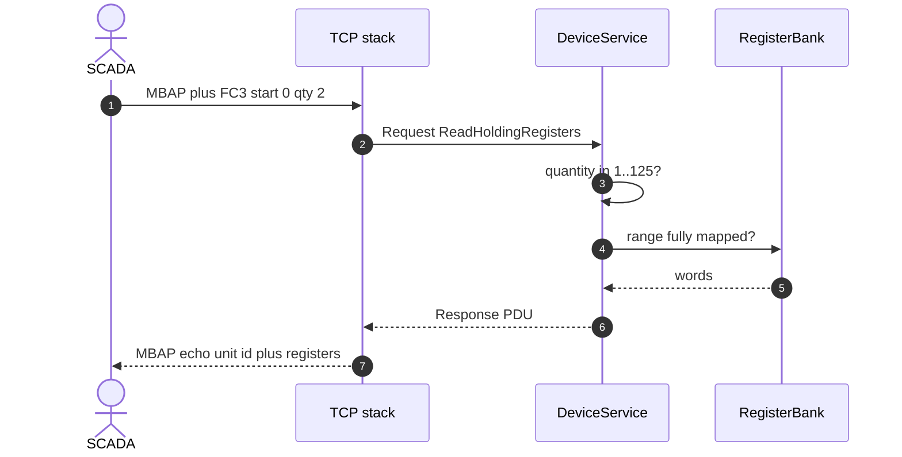
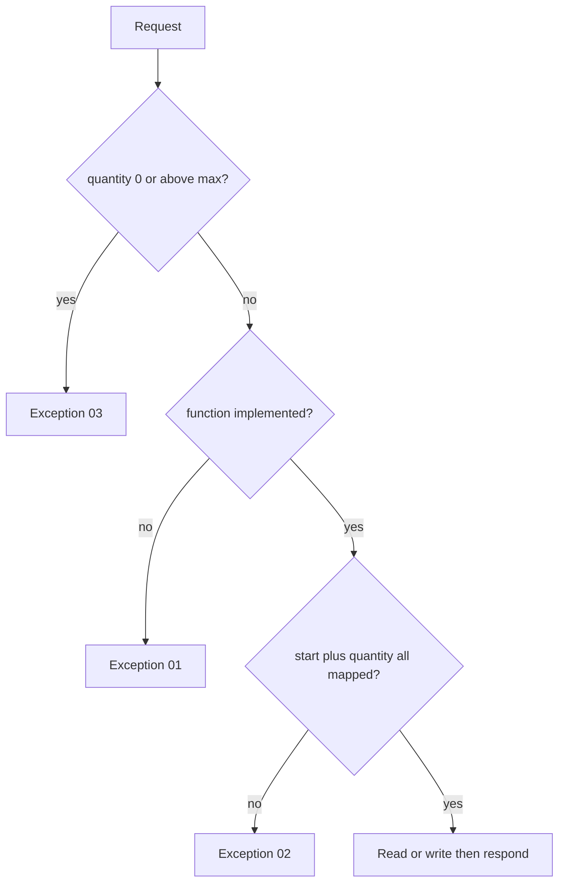

# simbus Modbus TCP / TLS

**Status:** normative for `crates/modbus` (language version 1)  
**Device language:** [spec.md](spec.md)  
**Tick / `state.base`:** [simulation.md](simulation.md)  
**Session HTTP:** [control.md](control.md)  
**Sibling field planes:** [opcua.md](opcua.md) · [bacnet.md](bacnet.md)  
**Process:** [runtime.md](runtime.md)  
**Shape of the process:** [architecture.md](architecture.md)

This crate is **one field plane** (Modbus TCP/TLS). OPC UA is the other
([opcua.md](opcua.md)). It MUST implement the industry documents
below. It MUST NOT invent quantity limits, exception codes, or addressing
rules. It MUST NOT open the control HTTP port. It MUST NOT tick the engine.

The PDU does not change between cleartext TCP and TLS. TLS is a wrapping of
that PDU (MBAP + function codes) on a second listener.

| Document | Role |
| --- | --- |
| [MODBUS Application Protocol Specification V1.1b3](https://www.modbus.org/file/secure/modbusprotocolspecification.pdf) (26 Apr 2012) | PDU: function codes, four tables, 0-based addresses, quantities, exceptions |
| [MODBUS Messaging on TCP/IP Implementation Guide V1.0b](https://www.modbus.org/file/secure/messagingimplementationguide.pdf) (24 Oct 2006) | MBAP header, TCP port 502, unit identifier on native TCP |
| [MODBUS/TCP Security Protocol Specification](https://modbus.org) | TLS ≥ 1.2 around the same MBAP/PDU (RFC 5246 / 8446) |
| [IANA `mbap` 502](https://www.iana.org/assignments/service-names-port-numbers/service-names-port-numbers.xhtml?search=mbap) | Cleartext TCP. Not an IETF protocol RFC |
| [IANA `mbaps` 802](https://www.iana.org/assignments/service-names-port-numbers/service-names-port-numbers.xhtml?search=mbaps) | Modbus TCP over TLS |

There is no IETF RFC that defines the PDU. IEC 61158 Type 15 / CPF 15 is
the same family (paid). Serial line is V1.02 and is **not served** until
[spec.md](spec.md) §4 flips `modbus-rtu`.

---

## 1. Role

The binding MUST:

1. Listen TCP on the resolved port (`modbus.default_port` / `--port`) when
   `protocol: modbus-tcp` is resolved (including an empty `bindings` list).
2. Listen TLS on the resolved port (`802` / `--modbus-tls-port`) when
   `protocol: modbus-tls` is listed. Dual-bind when the document lists both.
3. Share one engine register bank (and one `DeviceService`) with the tick
   loop and the control plane.
4. After a successful FC6/FC16, update `state.base` for every **cell** whose
   words changed ([simulation.md](simulation.md) §3).

Bind address is `0.0.0.0`. MBAP framing, transaction id echo, and protocol
id `0x0000` are tokio-modbus’s job (V1.0b §3.1). TLS handshake is rustls
(§7); the framed PDU after the handshake is the same as cleartext TCP.

---

## 2. Unit identifier (native TCP)

This process is a Modbus TCP **server addressed by IP:port**, not a serial
gateway.

V1.0b §4.4.1.2: on TCP the unit identifier is **not significant**; `0xFF` is
the recommended value; `0` is also accepted. The server copies the received
unit id into the response (V1.0b §3.1.3). The crate MUST answer every well
formed request regardless of unit id.

YAML `unit_id` (1–247) remains device identity and the future RTU slave
address ([spec.md](spec.md) §3.3). It MUST NOT be used to drop TCP PDUs.

---

## 3. Data model (V1.1b3 §4.3–4.4)

Four tables. A coil/discrete is one bit. A holding/input register is a
**16-bit word**. PDU addresses are 0…65535. Datasheet element numbered X is
PDU address X−1.

A YAML `float32`/`uint32` occupies two consecutive PDU addresses. On the
wire those are two independent registers. FC6 of either word is legal.
`endianness` in the document is how the engine **interprets** the pair
([spec.md](spec.md) §3.3); V1.1b3 §4.2 only fixes big-endian **inside** one
u16 (`0x1234` → `0x12 0x34`).

| YAML | Access on this plane | Functions |
| --- | --- | --- |
| `registers.holding` | read-write | FC3 / FC6 / FC16 |
| `registers.input` | read-only | FC4 |
| `registers.coils` | read-write | FC1 / FC5 / FC15 |
| `registers.discrete` | read-only | FC2 |

Any other function MUST exception **01** ILLEGAL FUNCTION (V1.1b3 §7).

### 3.1 Quantity (V1.1b3 §§6.1–6.12)

| Functions | Quantity |
| --- | --- |
| FC1 / FC2 | 1 … 2000 (`0x7D0`) |
| FC3 / FC4 | 1 … 125 (`0x7D`) |
| FC5 / FC6 | one |
| FC15 | 1 … 1968 (`0x07B0`) |
| FC16 | 1 … 123 (`0x7B`) |

Quantity `0` or above the max MUST exception **03** ILLEGAL DATA VALUE.

FC5 coil ON = `0xFF00`, OFF = `0x0000` (handled by tokio-modbus as `bool`).

### 3.2 Address validation (V1.1b3 §7, exception 02)

> The combination of reference number and transfer length is invalid. For a
> controller with 100 registers, … start 96 quantity 5 fails because there
> is no register with address 100.

Reads **and** writes:

- The range `[start, start+quantity)` MUST be entirely implemented.
- A `float32`/`uint32` at `N` implements `N` and `N+1`.
- Otherwise exception **02** ILLEGAL DATA ADDRESS. Nothing is changed
  (validate, then execute — V1.1b3 Figure 9).

Unimplemented function is 01, not silence.

After a successful numeric write, each affected cell’s `state.base` MUST
update from the reconstituted raw (`raw / scale`). A one-word FC6 into a
two-word cell splices that word, then updates the cell.

Triggered coils MAY be written; the next tick overwrites them
([spec.md](spec.md) §5.2).

---

## 4. Exceptions

| Code | Name | When |
| --- | --- | --- |
| 01 | ILLEGAL FUNCTION | Function not implemented |
| 02 | ILLEGAL DATA ADDRESS | Start+length not fully mapped |
| 03 | ILLEGAL DATA VALUE | Quantity 0 or above the V1.1b3 max |
| 04 | SERVER DEVICE FAILURE | Not used in this version |

Exception PDU: request function + `0x80`, plus the code (V1.1b3 §4.1).

---

## 5. SSE

SCADA is not an SSE client. `GET /registers/stream` updates on engine ticks
and on **control** writes. A field-plane write appears on SSE on the next
tick unless the control plane also published.

---

## 6. Change process

1. If the **PDU** changes, cite V1.1b3 / V1.0b in this file, then change
   `crates/modbus` (and `write_words` / range checks in `crates/engine`).
2. If only the **vendor map** changes (types, scale, endianness of pairs),
   change [spec.md](spec.md). Do not re-specify the PDU there.
3. Tests: FC3 exact map, FC3 past last address → 02, FC6 `update_base`,
   FC16 adjacent u16, FC6 splice into a float32 pair, quantity 0 → 03.
4. Do not add RTU until [spec.md](spec.md) §4 flips `modbus-rtu`. TLS is §7.

---

## 7. TLS (Modbus Security, port 802)

`modbus::serve_tls` MUST wrap the same `DeviceService` as `serve`. The PDU,
quantity limits, and exceptions in §§3–4 do not change.

| Rule | This version |
| --- | --- |
| Listen | `0.0.0.0` on YAML `port` (default **802**) or `--modbus-tls-port` |
| Stack | rustls + tokio-rustls, TLS 1.2 and 1.3 |
| Server cert | PEM `certfile` + `keyfile` (required at boot) |
| Client cert | optional: `cafile` PEM CA → require a client certificate (mTLS). Omitted → server authenticates only |
| Roles / RBAC | not served (Modbus Security X.509 role extensions) |
| Cipher suites | rustls 0.23 defaults (RC4 / 3DES / SHA-1 already excluded). Not pinned to the exact Modbus.org list |
| Certificates | not generated by the binary. Lab recipe is in [README.md](../README.md) |

A failed handshake MUST drop that connection and keep listening. Missing PEM
at boot MUST fail the process ([runtime.md](runtime.md)).

Log: `modbus tls listening` with `port` (distinct from `modbus server listening`).
