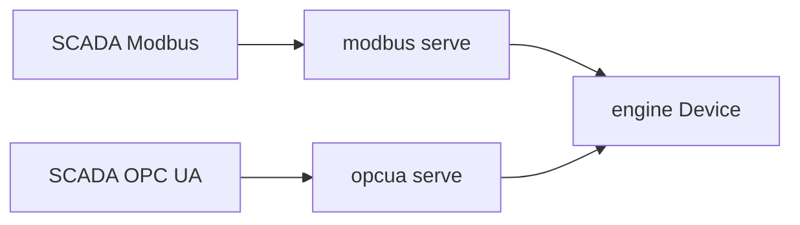

# simbus OPC UA

**Status:** normative for `crates/opcua` (language versions 1 and 2)  
**Device language:** [spec.md](spec.md)  
**Tick / `state.base`:** [simulation.md](simulation.md)  
**Session HTTP:** [control.md](control.md)  
**Process:** [runtime.md](runtime.md)  
**Modbus field plane:** [modbus.md](modbus.md)  
**Shape of the process:** [architecture.md](architecture.md)

This crate is a **second field plane** on the same process and the same
engine bank. It MUST NOT invent a second register map. It MUST NOT open the
control HTTP port. It MUST NOT tick the engine.

| Document | Role |
| --- | --- |
| [IEC 62541](https://opcfoundation.org/about/opc-technologies/opc-ua/) (OPC UA) | Binary protocol, address space, services |
| [IANA `opcua-tcp` 4840](https://www.iana.org/assignments/service-names-port-numbers/service-names-port-numbers.xhtml?search=opcua) | Well-known OPC UA TCP port |

The stack is [async-opcua](https://github.com/FreeOpcUa/async-opcua) (MPL-2.0).
This version targets the **embedded** profile services that crate already
implements (session, browse, read, write, subscribe). It MUST NOT claim
companion specs (DI, PADIM, FDI) or a NodeSet2 file.

---

## 1. Role

The binding MUST:

1. Listen TCP on the resolved port (`4840` / `--opcua-port`) when
   `protocol: opcua` is listed. An empty `bindings` list does **not** infer
   OPC UA.
2. Share one engine register bank with Modbus TCP/TLS, the tick loop, and
   the control plane.
3. Expose each exported point (language 2) or each YAML register and coil
   (language 1) as **one** OPC UA Variable (a YAML `float32`/`uint32` is one
   node, not two PDU addresses).
4. After a successful write to a writable node, update `state.base` the same
   way HTTP PATCH / Modbus FC6 do ([simulation.md](simulation.md) §3).

Bind address is `0.0.0.0`. Log: `opcua listening` with `port`.

---

## 2. Endpoint (this version)

| Rule | Value |
| --- | --- |
| URL | `opc.tcp://<host>:<port>/` |
| Security policy | `None` |
| Message security | `None` |
| User token | Anonymous |

The process MUST NOT write a PKI directory or call `create_sample_keypair`.
Sign, SignAndEncrypt, usernames, and application certificates are **not**
served. Labs that need encryption use Modbus TLS (IANA 802) in this version,
or a later OPC UA cut.

---

## 3. Address space

Namespace URI: `urn:simbus:{type}` where `{type}` is the YAML `type:` field.
The server application URI is `urn:simbus` (not the same string — OPC UA
reserves namespace index 1 for the application URI).

### 3.1 Language 1 (`spec_version` omitted or 1)

Under the standard `Objects` folder, four folders named `Holding`, `Input`,
`Coils`, and `Discrete`. Empty YAML spaces still get an empty folder.

| YAML | NodeId | UA DataType | Writable |
| --- | --- | --- | --- |
| `registers.holding` | `ns=N;s=holding/{name}` | §3.3 | yes |
| `registers.input` | `ns=N;s=input/{name}` | §3.3 | no |
| `registers.coils` | `ns=N;s=coils/{name}` | Boolean | yes |
| `registers.discrete` | `ns=N;s=discrete/{name}` | Boolean | no |

`N` is the namespace index assigned at boot (not a fixed number). Browse
names equal the YAML `name`. Display names equal the YAML `name`.

### 3.2 Language 2 (`spec_version: 2`)

Folders `Input`, `Value`, and `Output` from point `class`. Only ids listed
in the `opcua` binding `export` are published (required, non-empty).

| Point | NodeId | UA DataType | Writable |
| --- | --- | --- | --- |
| analog | `ns=N;s={id}` | §3.3 | `class` is `value` or `output` |
| binary | `ns=N;s={id}` | Boolean | `class` is `value` or `output` |

Browse names and display names equal the point `id`. Live values still come
from the engine bank (Modbus export materializes the backing cells in this
version).

`identity.vendor` / `product` / `revision` MUST fill OPC UA `BuildInfo`
(`manufacturer_name`, `product_name`, `software_version`). Empty strings are
allowed.

### 3.3 Numeric types

The value on the wire is the **engineering** value (`raw / scale`), not the
Modbus word. Numeric nodes use OPC UA **Float** so a scaled `uint16` (for
example T&H temperature 22.5) is not truncated. YAML `data_type` remains the
Modbus encoding only.

Writes send an engineering Float (Double is accepted and converted).

Reads MUST call the live bank (getter), not a copy taken at boot.
Subscriptions MAY sample that getter; the crate MUST NOT add a second tick
loop to push values.

Writes to language-1 holding MUST call `Device::override_register` with
`source` `"opcua"`. Writes to language-1 coils MUST call `Device::override_coil`.
Writes to language-1 input or discrete MUST fail as not writable. Language-2
writes follow `class` (`value` / `output` writable). Type mismatch on write
MUST fail the UA write (do not coerce a Boolean onto a float node).

---

## 4. Gaps (not this version)

- Sign / SignAndEncrypt, user tokens, generated or mounted certificates
- Historical Access, Alarms & Conditions (YAML `alarms:` remain coils)
- Methods, PubSub, reverse connect, Local Discovery Server
- Companion information models / NodeSet2

---

## 5. Change process

1. If the **address space or endpoint** changes, update this file, then
   `crates/opcua`.
2. If only the **vendor map** changes, change [spec.md](spec.md). Do not
   re-specify NodeIds there beyond §4.
3. Tests: connect Anonymous/None, read `holding/temperature` on the language-1
   T&H template (~22.5), write a holding node and see `state.base` move.
   Language 2 uses `ns=N;s={id}` under Input/Value/Output.
4. Do not add SignAndEncrypt until this file says so.
