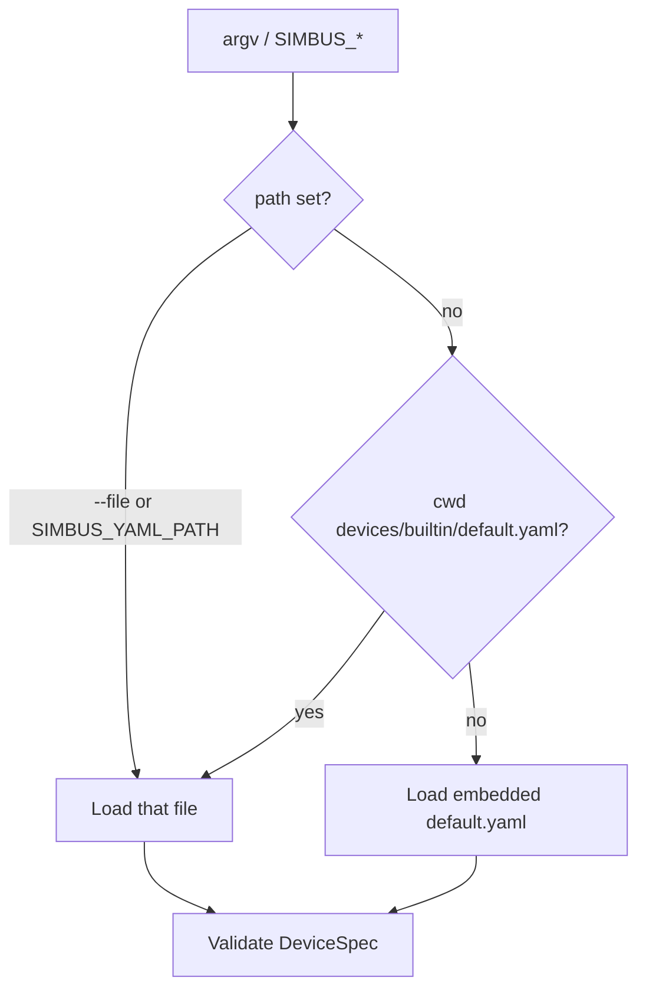
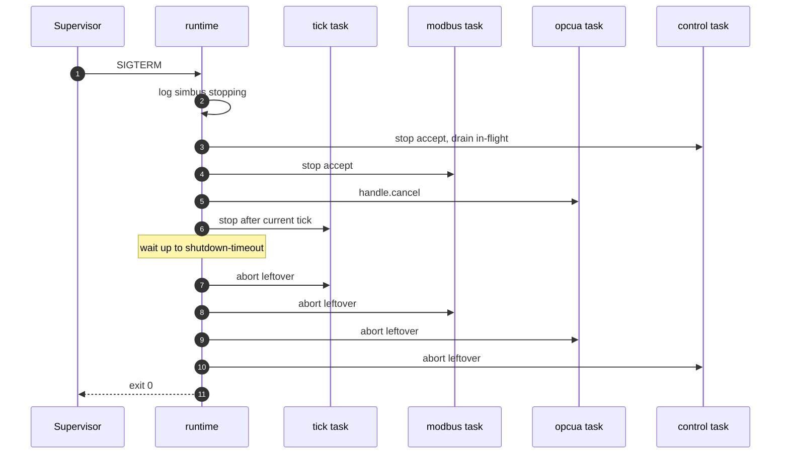

# simbus Runtime

**Status:** normative for the `simbus` process (language version 1)  
**Device language:** [spec.md](spec.md)  
**HTTP session:** [control.md](control.md)  
**Tick semantics:** [simulation.md](simulation.md)  
**Field plane:** [modbus.md](modbus.md) · [opcua.md](opcua.md)  
**Shape of the process:** [architecture.md](architecture.md)

This document is the contract of **the process**: one binary, one device,
boot, tasks, signals, and CLI/env. It does not redefine YAML syntax.

The crate lives in `crates/runtime`. The Cargo package and binary name are
`simbus` (`cargo run -p simbus`).

---

## 1. Role

The runtime MUST:

1. Parse CLI flags and `SIMBUS_*` environment variables.
2. Load exactly one device document from a **file path**, or the official
   default template when no path is given.
3. Refuse to boot if any resolved protocol binding is unimplemented
   ([spec.md](spec.md) §4 and §9).
4. Instantiate the engine from that document.
5. Start the tick loop, each requested field listener (Modbus TCP and/or
   Modbus TLS and/or OPC UA), and the HTTP control plane.
6. Leave bundled scenarios **idle**.
7. Exit on SIGINT or SIGTERM (see §6), or if a server task ends unexpectedly.

It MUST NOT select a map by type key. Official maps under `devices/builtin/`
are **templates**; the operator points `--file` at one of them.

It MUST NOT validate a second YAML dialect. It MUST NOT enlarge the register
map. It MUST NOT auto-run scenarios.

`simbus check` is the same binary without starting those tasks. `check` MUST
take an explicit path (it does not imply the default template).

`simbus ctl` MUST NOT boot a device or start tasks. `install` MAY parse a
local JSON or YAML scenario file and POST JSON. It is an HTTP client
([control.md](control.md) §4).

---

## 2. Boot sequence

1. Parse arguments. `check` short-circuits here (no tracing subscriber, no
   servers).
2. `--tick` MUST be > 0. `--time-scale` MUST be > 0. `--tick-health` and
   `--shutdown-timeout` MUST be ≥ 0.
3. Load the document:
   1. `--file` / `SIMBUS_YAML_PATH` if set.
   2. Else `devices/builtin/default.yaml` relative to the process cwd, if that
      file exists.
   3. Else the copy of that YAML **embedded** in the binary.
4. Apply `--name` after validation (display name only).
5. If `unimplemented_protocols()` is non-empty, exit with an error that names
   the protocols and points at spec.md.
6. Resolve field listeners from `resolved_bindings()`:
   - `modbus-tcp` (including an empty `bindings` list): port from the binding
     then `--port` / `SIMBUS_MODBUS_PORT`.
   - `modbus-tls`: port from the binding (default 802) then
     `--modbus-tls-port` / `SIMBUS_MODBUS_TLS_PORT`; PEM paths from the
     binding then `--modbus-cert` / `--modbus-key` / `--modbus-ca`. If TLS is
     requested and a PEM path is missing or not a file, exit with an error
     (do not start other listeners). `--port` MUST NOT change the TLS port.
   - `opcua`: port from the binding (default 4840) then `--opcua-port` /
     `SIMBUS_OPCUA_PORT`. `--opcua-port` MUST NOT enable OPC UA unless the
     document has that binding.
7. `Device::new(spec, seed, tick)`. `set_running(true)`.
8. Spawn tick, each field listener, API.
9. Log `simbus started`. Block until shutdown (§6) or a task failure (§5).

CLI/env overrides do not rewrite the file. The YAML field `type:` is identity
inside the document, not a CLI selector.



> [!IMPORTANT]
> `simbus check` requires an explicit path. It does not fall back to the
> default template.

---

## 3. Commands

```text
simbus [OPTIONS]
simbus check <FILE>
simbus ctl [CONNECT] <COMMAND>
```

| Invocation | Effect |
| --- | --- |
| `simbus` | Boot the default template (cwd file, else embedded). |
| `simbus --file devices/builtin/generic-ups.yaml` | Boot that template. |
| `simbus check path.yaml` | Parse, validate, print summary, exit 0/1. No servers. |
| `simbus ctl status` | HTTP client of an already-running process ([control.md](control.md) §4). MUST NOT boot a device. |

`check` MUST accept unimplemented protocol bindings (valid syntax). Boot MUST
NOT.

---

## 4. Flags and environment

All settings use the `SIMBUS_` prefix when set via the environment.

| Flag | Env | Default | Meaning |
| --- | --- | --- | --- |
| `--file` / `-f` | `SIMBUS_YAML_PATH` | default template | Device YAML path |
| `--port` / `-p` | `SIMBUS_MODBUS_PORT` | YAML | Override Modbus **TCP** listen port |
| `--modbus-tls-port` | `SIMBUS_MODBUS_TLS_PORT` | YAML (`802` if omitted) | Override Modbus TLS listen port. Ignored unless the document has `modbus-tls` |
| `--modbus-cert` | `SIMBUS_MODBUS_CERT` | YAML `certfile` | Override TLS server certificate PEM path |
| `--modbus-key` | `SIMBUS_MODBUS_KEY` | YAML `keyfile` | Override TLS server private key PEM path |
| `--modbus-ca` | `SIMBUS_MODBUS_CA` | YAML `cafile` | Override optional client-CA PEM (mTLS) |
| `--opcua-port` | `SIMBUS_OPCUA_PORT` | YAML (`4840` if omitted) | Override OPC UA listen port. Ignored unless the document has `opcua` |
| `--name` / `-n` | `SIMBUS_DEVICE_NAME` | YAML `name` | Display name only |
| `--api-port` | `SIMBUS_API_PORT` | `8000` | HTTP listen port |
| `--host` | `SIMBUS_API_HOST` | `0.0.0.0` | HTTP bind address |
| `--tick` | `SIMBUS_TICK_INTERVAL` | `1.0` | Wall sample period (seconds). MUST be > 0. Not a YAML field |
| `--time-scale` | `SIMBUS_TIME_SCALE` | `1.0` | Simulation seconds per wall second. MUST be > 0. Boot-only |
| `--tick-health` | `SIMBUS_TICK_HEALTH_LOG_INTERVAL` | `0` | Seconds between `simulation tick health` logs. `0` disables. MUST be ≥ 0 |
| `--shutdown-timeout` | `SIMBUS_SHUTDOWN_TIMEOUT` | `5.0` | Drain wait (seconds) after SIGINT/SIGTERM. `0` aborts immediately. MUST be ≥ 0 |
| `--seed` | `SIMBUS_SEED` | random | RNG seed; mixed with device identity |
| `--api-key` | `SIMBUS_API_KEY` | — | If set, write endpoints require `x-api-key` or `Bearer` |
| `--cors-origins` | `SIMBUS_CORS_ORIGINS` | `*` | Comma-separated origins |

Modbus TCP, Modbus TLS, and OPC UA bind `0.0.0.0` on their resolved ports
([modbus.md](modbus.md), [opcua.md](opcua.md)). There is no
`SIMBUS_MODBUS_HOST` / `SIMBUS_OPCUA_HOST` in this version.
CLI/env TLS paths and ports do not rewrite the YAML and do not enable TLS
unless the document already has a `modbus-tls` binding. `--opcua-port` does
not enable OPC UA unless the document already has an `opcua` binding.

There is no `--type` / `SIMBUS_DEVICE_TYPE`.

`--tick` is the **wall** wait between samples. Live changes go through
`PATCH /simulation` ([control.md](control.md)), not a second YAML.
`--time-scale` is boot-only in this version; it is not a PATCH field.

`dt` passed to `Device::tick` MUST be `tick_interval × time_scale`.
Default scale `1` is 1:1 (same as before this split). Scale `60` with
`--tick 1` advances one simulation minute per wall second. Changing
`--tick` MUST NOT change the physical trajectory, only how often it is
sampled. Changing `--time-scale` MUST.

When `--tick-health` is > 0 the tick loop MUST emit
`simulation tick health` at that wall period with:
`tick_interval`, `time_scale`, `tick_duration_ms`, `loop_drift_ms`,
`sse_subscribers`, `active_faults`, `uptime_s`. The engine MUST NOT emit
this log.

---

## 5. Tasks

| Task | Crate | Failure |
| --- | --- | --- |
| Tick | `engine` (`Device::tick`) | If the task ends, the process MUST exit non-zero |
| Modbus TCP | `modbus::serve` | Same (spawned only when a TCP binding is resolved) |
| Modbus TLS | `modbus::serve_tls` | Same (spawned only when a TLS binding is resolved) |
| OPC UA | `opcua::serve` | Same (spawned only when an OPC UA binding is resolved) |
| HTTP | `control::serve` | Same |

The tick loop sleeps `tick_interval` (wall seconds) and, when `is_running`
is true, passes `dt = tick_interval × time_scale` to the engine. It MUST
re-read `tick_interval` every iteration so a PATCH takes effect on the next
wait. Missed ticks use tokio `Delay` (catch up without bursting a backlog of
ticks). After each `tick(dt)` that actually ran, the runtime MUST publish
the snapshot on the control plane `watch` channel (`GET /registers/stream`).
While paused the loop MUST still wait `tick_interval` but MUST NOT call
`tick` and MUST NOT publish a tick snapshot.

---

## 6. Signals and shutdown

On Unix the process MUST treat **SIGINT** and **SIGTERM** as shutdown. Docker
`stop` sends SIGTERM; a SIGINT-only binary hangs until the kill timeout.

On non-Unix platforms, SIGINT (`ctrl_c`) is sufficient.

Shutdown log: `simbus stopping`. Then:

1. Stop accepting new HTTP, Modbus (TCP and TLS), and OPC UA connections
   (axum graceful shutdown; tokio-modbus `serve_until`; OPC UA `handle.cancel()`).
2. Do not start another tick. The in-flight `tick(dt)` (synchronous, short)
   MAY finish.
3. Wait up to `--shutdown-timeout` for in-flight HTTP to finish.
4. Abort whatever is still running (including `GET /registers/stream`).
5. Exit 0.

Timeout `0` skips the wait (abort immediately). Long-lived SSE is not
required to drain; it is cut at step 4 if it outlives the timeout.

If any field listener or the API task ends without a shutdown signal, the
process MUST exit non-zero so the supervisor (Compose, systemd) can restart
it. Logging the error and leaving the tick running is not enough: `/readyz`
would lie and SCADA would see a half-dead device. Unexpected death MUST
abort the other tasks without waiting for the drain timeout.



---

## 7. Docker

The image `WORKDIR` is `/app`. Templates are at `/app/devices`.
`ENTRYPOINT` is `/usr/local/bin/simbus`.

With no `SIMBUS_YAML_PATH`, the process loads
`/app/devices/builtin/default.yaml` (cwd hit). API `8000`, tick `1.0`.
Compose maps host ports and **MUST** set `SIMBUS_YAML_PATH` to the template
for that service. Inside the container Modbus is the YAML port (default
`502` for most templates, `512` for Papouch).

Healthcheck: `GET /healthz` on `SIMBUS_API_PORT`.

Every Compose service has a profile. Bare `docker compose up` starts
nothing; use `--profile all` (7 builtin + 4 Papouch) or name services.

---

## 8. Change process

1. Update this document.
2. Change `crates/runtime` (CLI, boot, signals, task join).
3. Keep clap parse tests for flags; do not boot the full process in unit tests.
4. Edit `devices/builtin/default.yaml` in place. The embedded fallback is
   `include_str!` of that same file — one source in git.

Language changes still start in [spec.md](spec.md). HTTP verbs still start in
[control.md](control.md).
