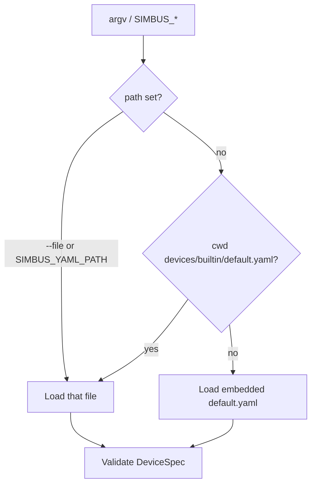
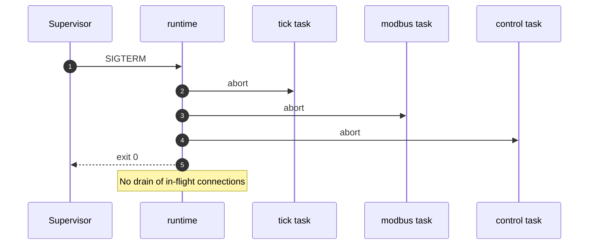

# simbus Runtime

**Status:** normative for the `simbus` process (language version 1)  
**Device language:** [spec.md](spec.md)  
**HTTP session:** [control.md](control.md)  
**Tick semantics:** [simulation.md](simulation.md)  
**Field plane:** [modbus.md](modbus.md)  
**Shape of the process:** [architecture.md](architecture.md)

This document is the contract of **the process**: one binary, one device,
boot, tasks, signals, and CLI/env. It does not redefine YAML syntax.

The crate is `crates/runtime`. The binary name is `simbus`.

---

## 1. Role

The runtime MUST:

1. Parse CLI flags and `SIMBUS_*` environment variables.
2. Load exactly one device document from a **file path**, or the official
   default template when no path is given.
3. Refuse to boot if any resolved protocol binding is unimplemented
   ([spec.md](spec.md) §4 and §9).
4. Instantiate the engine from that document.
5. Start three tasks: tick loop, Modbus TCP (when bound), HTTP control plane.
6. Leave bundled scenarios **idle**.
7. Exit on SIGINT or SIGTERM (see §6), or if a server task ends unexpectedly.

It MUST NOT select a map by type key. Official maps under `devices/builtin/`
are **templates**; the operator points `--file` at one of them.

It MUST NOT validate a second YAML dialect. It MUST NOT enlarge the register
map. It MUST NOT auto-run scenarios.

`simbus check` is the same binary without starting those tasks. `check` MUST
take an explicit path (it does not imply the default template).

---

## 2. Boot sequence

1. Parse arguments. `check` short-circuits here (no tracing subscriber, no
   servers).
2. `--tick` MUST be > 0.
3. Load the document:
   1. `--file` / `SIMBUS_YAML_PATH` if set.
   2. Else `devices/builtin/default.yaml` relative to the process cwd, if that
      file exists.
   3. Else the copy of that YAML **embedded** in the binary.
4. Apply `--name` after validation (display name only).
5. If `unimplemented_protocols()` is non-empty, exit with an error that names
   the protocols and points at spec.md.
6. Resolve Modbus listen port and unit id from inferred/explicit `modbus-tcp`
   bindings, then `--port` if present.
7. `Device::new(spec, seed, tick)`. `set_running(true)`.
8. Spawn tick, Modbus, API.
9. Log `simbus started`. Block until shutdown (§6) or a task failure (§5).

CLI/env overrides do not rewrite the file. The YAML field `type:` is identity
inside the document, not a CLI selector.



> [!IMPORTANT]
> `simbus check` requires an explicit path. It does not fall back to the
> default template.

---

## 3. Commands

```text
simbus [OPTIONS]
simbus check <FILE>
```

| Invocation | Effect |
| --- | --- |
| `simbus` | Boot the default template (cwd file, else embedded). |
| `simbus --file devices/builtin/generic-ups.yaml` | Boot that template. |
| `simbus check path.yaml` | Parse, validate, print summary, exit 0/1. No servers. |

`check` MUST accept unimplemented protocol bindings (valid syntax). Boot MUST
NOT.

---

## 4. Flags and environment

All settings use the `SIMBUS_` prefix when set via the environment.

| Flag | Env | Default | Meaning |
| --- | --- | --- | --- |
| `--file` / `-f` | `SIMBUS_YAML_PATH` | default template | Device YAML path |
| `--port` / `-p` | `SIMBUS_MODBUS_PORT` | YAML | Override Modbus TCP listen port |
| `--name` / `-n` | `SIMBUS_DEVICE_NAME` | YAML `name` | Display name only |
| `--api-port` | `SIMBUS_API_PORT` | `8000` | HTTP listen port |
| `--host` | `SIMBUS_API_HOST` | `0.0.0.0` | HTTP bind address |
| `--tick` | `SIMBUS_TICK_INTERVAL` | `1.0` | Tick period (seconds). MUST be > 0. Not a YAML field |
| `--seed` | `SIMBUS_SEED` | random | RNG seed; mixed with device identity |
| `--api-key` | `SIMBUS_API_KEY` | — | If set, write endpoints require `x-api-key` or `Bearer` |
| `--cors-origins` | `SIMBUS_CORS_ORIGINS` | `*` | Comma-separated origins |

Modbus TCP binds `0.0.0.0` on the resolved port ([modbus.md](modbus.md)).
There is no `SIMBUS_MODBUS_HOST` in this version.

There is no `--type` / `SIMBUS_DEVICE_TYPE`.

Tick interval is a **process** setting. Live changes go through
`PATCH /simulation` ([control.md](control.md)), not a second YAML.

---

## 5. Tasks

| Task | Crate | Failure |
| --- | --- | --- |
| Tick | `engine` (`Device::tick`) | If the task ends, the process MUST exit non-zero |
| Modbus TCP | `modbus::serve` | Same |
| HTTP | `control::serve` | Same |

`tick_interval` (seconds) is both the wait between ticks and `dt` passed to
the engine, so wall clock and simulation time are 1:1. The tick loop reads
`tick_interval` every iteration so a PATCH takes effect on the next wait.
Missed ticks use tokio `Delay` (catch up without bursting a backlog of ticks).
After each `tick(dt)` the runtime MUST publish the snapshot on the control
plane `watch` channel (`GET /registers/stream`).

This version does **not** drain in-flight Modbus or HTTP connections on
shutdown. Tasks are aborted. That is acceptable for a lab simulator; it MUST
be documented here. A future graceful drain MUST be specified in this file
before it is implemented.

---

## 6. Signals and shutdown

On Unix the process MUST treat **SIGINT** and **SIGTERM** as shutdown. Docker
`stop` sends SIGTERM; a SIGINT-only binary hangs until the kill timeout.

On non-Unix platforms, SIGINT (`ctrl_c`) is sufficient.

Shutdown log: `simbus stopping`. Exit code 0.

If Modbus or the API task ends without a shutdown signal, the process MUST
exit non-zero so the supervisor (Compose, systemd) can restart it. Logging
the error and leaving the tick running is not enough: `/readyz` would lie
and SCADA would see a half-dead device.



---

## 7. Docker

The image `WORKDIR` is `/app`. Templates are at `/app/devices`.
`ENTRYPOINT` is `/usr/local/bin/simbus`.

With no `SIMBUS_YAML_PATH`, the process loads
`/app/devices/builtin/default.yaml` (cwd hit). API `8000`, tick `1.0`.
Compose maps host ports and **MUST** set `SIMBUS_YAML_PATH` to the template
for that service. Inside the container Modbus is the YAML port (default
`502` for most templates, `512` for Papouch).

Healthcheck: `GET /healthz` on `SIMBUS_API_PORT`.

Every Compose service has a profile. Bare `docker compose up` starts
nothing; use `--profile all` (7 builtin + 4 Papouch) or name services.

---

## 8. Change process

1. Update this document.
2. Change `crates/runtime` (CLI, boot, signals, task join).
3. Keep clap parse tests for flags; do not boot the full process in unit tests.
4. Edit `devices/builtin/default.yaml` in place. The embedded fallback is
   `include_str!` of that same file — one source in git.

Language changes still start in [spec.md](spec.md). HTTP verbs still start in
[control.md](control.md).
