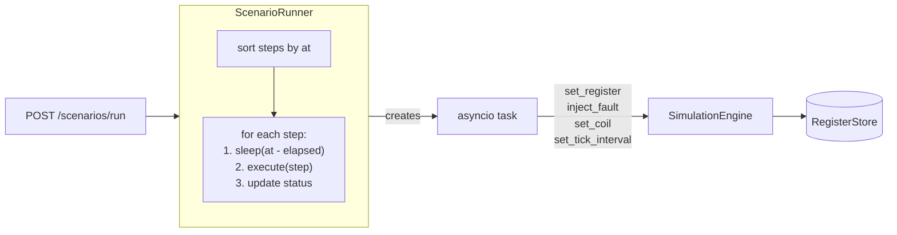
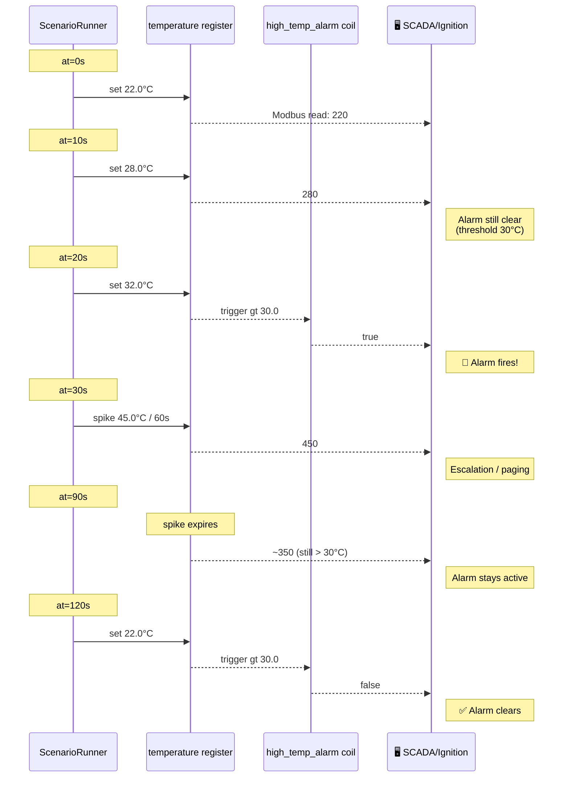

# Scenario Engine — Reference Guide

This document covers the scenario engine in full: how to write scenario YAML files,
what each step type does, how the runner executes them, and practical recipes for
alarm pipeline testing and operator training.

---

## Table of Contents

- [What is a Scenario?](#what-is-a-scenario)
- [Writing a Scenario YAML](#writing-a-scenario-yaml)
- [Step Types](#step-types)
  - [set_register](#set_register)
  - [inject_fault](#inject_fault)
  - [set_coil](#set_coil)
  - [set_tick_interval](#set_tick_interval)
- [How the Runner Works](#how-the-runner-works)
- [API Endpoints](#api-endpoints)
- [Practical Recipes](#practical-recipes)

---

## What is a Scenario?

A **scenario** is a timed sequence of simulation events stored in a YAML file.
Instead of calling the REST API manually at the right moment, you define the entire
sequence once and replay it on demand via `POST /scenarios/{name}/run`.

Scenarios are ideal for:

- **Alarm pipeline testing** — verify that SCADA correctly detects, displays, and
  notifies on a sequence of abnormal conditions.
- **Operator training** — create realistic events (power outage, thermal runaway,
  sensor failure) that trainees must respond to.
- **CI / automated testing** — reproducible event sequences that can be triggered
  from a test script or CI pipeline.
- **Demos** — show a client how the BMS/SCADA responds to a full event chain without
  touching real hardware.

The runner executes steps in a **separate asyncio task** — the main simulation tick
loop is never blocked. A step with `at: 60` simply sleeps until 60 real seconds have
elapsed from the start of the scenario.

---

## Writing a Scenario YAML

Scenarios live in the `scenarios/` directory (at repo root) or in a `scenarios/`
folder next to the executable. Files must end in `.yaml`.

```yaml
name: "Power Outage Sequence"
description: >
  Simulates a mains power loss and UPS switchover.
  Tests on-battery and low-battery alarm firing.
steps:
  - at: 0
    action: set_register
    register_name: input_voltage
    value: 0.0

  - at: 2
    action: set_coil
    coil: on_battery_alarm
    value: true

  - at: 5
    action: set_register
    register_name: battery_soc
    value: 40.0

  - at: 120
    action: inject_fault
    fault_type: alarm
    register_name: low_battery_alarm
    duration_s: 30
```

### Top-level fields

| Field | Type | Required | Description |
|---|---|---|---|
| `name` | string | yes | Human-readable name |
| `description` | string | no | What the scenario tests or demonstrates |
| `steps` | list | yes | At least one step. Order does not matter — runner sorts by `at` |

### Common step fields

Every step must declare:

| Field | Type | Description |
|---|---|---|
| `action` | string | Step discriminator: `set_register`, `inject_fault`, `set_coil`, `set_tick_interval` |
| `at` | float ≥ 0 | Seconds from scenario start when this step executes |

---

## Step Types

---

### set_register

Writes a real-world value to a holding or input register. The runner looks up the
register by **name** (not address), converts the real-world value using the register's
`scale`, and writes the raw integer to the store. It also calls `engine.update_base()`
so the simulation continues from the new operating point.

```yaml
- at: 0
  action: set_register
  register_name: temperature
  value: 35.0
  register_type: holding   # default; can also be "input"
```

| Field | Type | Required | Description |
|---|---|---|---|
| `register_name` | string | yes | Name of the target register (must exist on the device) |
| `value` | float | yes | Real-world value (before scale) |
| `register_type` | string | no | `holding` (default) or `input` |

If the register name is not found, the step is skipped with a warning log.

---

### inject_fault

Injects a fault with automatic expiry, exactly like `POST /faults` via the REST API.

```yaml
- at: 10
  action: inject_fault
  fault_type: spike
  register_name: temperature
  value: 45.0
  duration_s: 60
```

| Field | Type | Required | Description |
|---|---|---|---|
| `fault_type` | string | yes | `spike`, `freeze`, `dropout`, `noise_amplify`, `alarm` |
| `register_name` | string \| null | no | Target register or coil name. `null` for device-wide dropout |
| `value` | float \| null | no | Fault parameter (spike target, noise multiplier, etc.) |
| `duration_s` | float > 0 | yes | Seconds until the fault expires |

See [docs/simulation.md](docs/simulation.md) — Fault Injection section for the full
behavior of each fault type.

---

### set_coil

Forces a coil or discrete input to `true` or `false`. The runner looks up the coil
by name in both the `coils` and `discrete` registers and writes the value to the
correct store.

```yaml
- at: 5
  action: set_coil
  coil: high_temp_alarm
  value: true
```

| Field | Type | Required | Description |
|---|---|---|---|
| `coil` | string | yes | Name of the coil or discrete input |
| `value` | bool | yes | Target boolean state |

If the coil name is not found, the step is skipped with a warning log.

---

### set_tick_interval

Changes the simulation tick interval mid-scenario. Use this to speed up slow
sections or slow down critical moments so observers can watch alarms fire in real time.

```yaml
- at: 0
  action: set_tick_interval
  tick_interval: 0.1     # 10 ticks per second — fast-forward

- at: 60
  action: set_tick_interval
  tick_interval: 1.0     # back to normal speed
```

| Field | Type | Required | Description |
|---|---|---|---|
| `tick_interval` | float > 0 | yes | New tick interval in seconds |

---

## How the Runner Works

```mermaid
sequenceDiagram
    participant API as REST API
    participant Runner as ScenarioRunner
    participant Loop as asyncio loop
    participant Engine as SimulationEngine

    API->>Runner: POST /scenarios/{name}/run
    Runner->>Runner: sort steps by `at`
    Runner->>Loop: create_task(_run_loop)
    activate Loop

    Note over Loop: Step 1: at=0s
    Loop->>Engine: execute(step)
    Engine-->>Loop: ack
    Loop->>Runner: update_status(step_index=1)

    Note over Loop: Step 2: at=2s
    Loop->>Loop: sleep(2.0)
    Loop->>Engine: execute(step)
    Engine-->>Loop: ack
    Loop->>Runner: update_status(step_index=2)

    Note over Loop: ...

    Note over Loop: Last step completed
    Loop->>Runner: state = "completed"
    deactivate Loop
```



### Key behaviors

- **Sorting:** Steps are sorted by `at` before execution. Defining them out of order
  in the YAML is perfectly valid.
- **Sleep precision:** The runner uses `asyncio.get_event_loop().time()` for wall-clock
  timing, not `elapsed_s` from the simulation engine. A step with `at: 60` fires
  approximately 60 real seconds after the scenario starts.
- **Cancellation:** Calling `POST /scenarios/stop` (or `runner.stop()`) cancels the
  internal task immediately. The scenario does not resume — it transitions to
  `state: "stopped"`.
- **One at a time:** Starting a new scenario while another is running cancels the old
  one first. There is never more than one active scenario per device.
- **No persistence:** Scenarios do not survive a process restart. If you need a
  scenario to start automatically at boot, use a startup script or systemd timer
  that calls `POST /scenarios/{name}/run` after the container health check passes.

---

## API Endpoints

Interactive docs at `http://localhost:8000/docs` (Swagger UI).

### List scenarios

```bash
curl http://localhost:8000/scenarios
```

Returns a list of available scenario files discovered in `./scenarios/` (repo root)
and the built-in scenarios folder.

```json
[
  {"name": "heat-wave", "description": "Gradual temperature rise with spike"}
]
```

### Start a scenario

```bash
curl -X POST http://localhost:8000/scenarios/heat-wave/run
```

```json
{"status": "started", "scenario": "heat-wave", "steps": 7}
```

If the scenario file does not exist, returns `404`.

### Get active scenario status

```bash
curl http://localhost:8000/scenarios/active
```

```json
{
  "state": "running",
  "scenario_name": "heat-wave",
  "step_index": 3,
  "total_steps": 7,
  "elapsed_s": 5.234
}
```

States: `idle`, `running`, `completed`, `stopped`.

### Stop a scenario

```bash
curl -X POST http://localhost:8000/scenarios/stop
```

Returns `204 No Content`. Safe to call even when no scenario is running.

---

## Practical Recipes

### Recipe 1 — Test a complete thermal runaway event

```yaml
name: "Thermal Runaway"
description: "Temperature climbs, alarms fire, SCADA must respond."
steps:
  - at: 0
    action: set_register
    register_name: temperature
    value: 22.0

  - at: 10
    action: set_register
    register_name: temperature
    value: 28.0       # approaching threshold

  - at: 20
    action: set_register
    register_name: temperature
    value: 32.0       # crosses 30.0°C threshold → high_temp_alarm fires

  - at: 30
    action: inject_fault
    fault_type: spike
    register_name: temperature
    value: 45.0
    duration_s: 60    # extreme spike for 60 seconds

  - at: 40
    action: set_register
    register_name: temperature
    value: 35.0       # remains above threshold after spike expires

  - at: 120
    action: set_register
    register_name: temperature
    value: 22.0       # recovery
```



Use this to verify that your SCADA:

1. Detects the alarm at 20 seconds.
2. Escalates or pages when the spike hits at 30 seconds.
3. Does not clear the alarm prematurely when the spike expires (temperature is still > 30°C).
4. Clears the alarm only after the recovery step at 120 seconds.

---

### Recipe 2 — Simulate UPS power failure sequence

```yaml
name: "UPS Power Failure"
description: "Mains drops, UPS switches to battery, then drains."
steps:
  - at: 0
    action: set_register
    register_name: input_voltage
    value: 0.0

  - at: 2
    action: set_coil
    coil: on_battery_alarm
    value: true

  - at: 5
    action: set_register
    register_name: battery_soc
    value: 80.0

  - at: 60
    action: set_register
    register_name: battery_soc
    value: 50.0

  - at: 120
    action: set_register
    register_name: battery_soc
    value: 20.0       # crosses low-battery threshold

  - at: 125
    action: set_coil
    coil: low_battery_alarm
    value: true

  - at: 180
    action: set_register
    register_name: battery_soc
    value: 5.0

  - at: 200
    action: set_coil
    coil: on_battery_alarm
    value: false

  - at: 200
    action: set_coil
    coil: low_battery_alarm
    value: false
```

---

### Recipe 3 — Fast alarm debounce test

Speed up the simulation so the entire event chain completes in 10 real seconds
instead of 200. Useful for CI pipelines that can't wait minutes.

```yaml
name: "Fast Alarm Test"
description: "Accelerated thermal event for CI."
steps:
  - at: 0
    action: set_tick_interval
    tick_interval: 0.1     # 10× speed

  - at: 0.5
    action: set_register
    register_name: temperature
    value: 35.0            # fires alarm immediately

  - at: 2.0
    action: set_register
    register_name: temperature
    value: 22.0            # clears alarm

  - at: 2.5
    action: set_tick_interval
    tick_interval: 1.0     # restore normal speed
```

This scenario completes in ~3 real seconds.

---

### Recipe 4 — Sensor freeze during a load test

Freeze the temperature sensor while load increases, simulating a stuck sensor
that fails to report the real thermal condition.

```yaml
name: "Stuck Sensor"
description: "Temperature sensor freezes while room actually heats up."
steps:
  - at: 0
    action: set_register
    register_name: temperature
    value: 22.0

  - at: 5
    action: inject_fault
    fault_type: freeze
    register_name: temperature
    duration_s: 60

  - at: 10
    action: set_register
    register_name: supply_temp    # another register showing real heat
    value: 40.0
```

Verify that SCADA raises a "stale data" or "sensor fault" alarm when the
frozen value does not change while other thermal indicators rise.

---

### Recipe 5 — Communication loss recovery test

Drop the entire device, then restore it, verifying that the SCADA reconnects
and resumes polling without manual intervention.

```yaml
name: "Comm Loss"
description: "Simulate 15 seconds of device-wide communication loss."
steps:
  - at: 0
    action: inject_fault
    fault_type: dropout
    register_name: null        # device-wide
    duration_s: 15
```

No other steps needed — the dropout fault sets all holding registers to `0`
for 15 seconds and then automatically clears.
