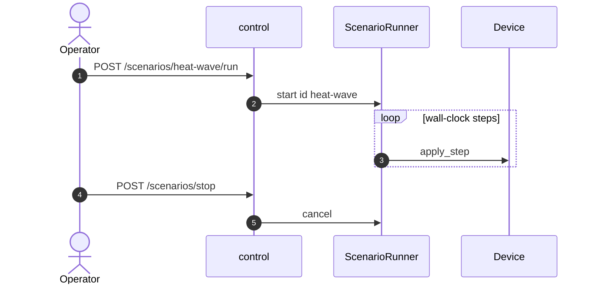
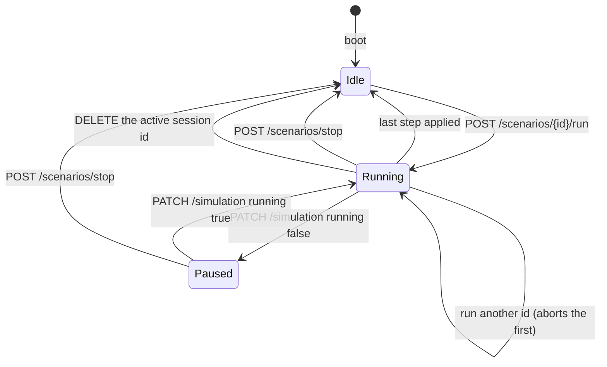

# Scenarios

Timed event sequences are part of the **device contract**. Syntax, ids, and
validation rules live in [spec.md](spec.md) §7. How to start and stop them
on a running process lives in [control.md](control.md).

This page is a short operator guide.

Syntax: [spec.md](spec.md) §7. HTTP: [control.md](control.md). Process shape:
[architecture.md](architecture.md).

---

## Where they live

Inside the device YAML, under `scenarios:`. Example: `heat-wave` on
`devices/builtin/generic-tnh-sensor.yaml`, `power-outage` on
`devices/builtin/generic-ups.yaml`, `demo-spike` on
`devices/builtin/default.yaml`.

They are **not** loaded from a global `scenarios/` folder. That catalog does
not exist in this repository. `default.yaml` ships `demo-spike`.

A running process can also take a **session copy** (`POST /scenarios`, JSON
with the same fields). It is RAM-only, validated against the loaded map, and
gone when the process exits. Prefer putting recipes in the device YAML so
`simbus check` sees them.

`simbus check` validates every step against this device's points (language 2)
or registers and coils (language 1).
A scenario that names `on_battery_alarm` on a UPS whose coil is `on_battery`
MUST fail check — it MUST NOT fail silently at run time.

`heat-wave`, bundled on `devices/builtin/generic-tnh-sensor.yaml`, is the
one to read first. Each bar is how long the value written by that step is
what a poller sees:


```mermaid
gantt
    title heat-wave (generic T&H) on the simulation clock
    dateFormat X
    axisFormat %Ss
    tickInterval 5second
    section temperature
    22.0 C                          :0, 2
    25.0 C                          :2, 5
    30.0 C (high_temp_alarm fires)  :active, 5, 10
    35.0 C (held after the run)     :active, 10, 50
    section faults
    spike 42.0 C, duration_s 30     :crit, 12, 42
    section clock
    tick_interval 0.5 s             :done, 15, 45
```

Three things that plot makes concrete. The `spike` fault is the only step
with a **length** (`duration_s: 30`): it ends at 42 s on its own, and the
temperature underneath it is still 35 °C when it does. `high_temp_alarm` is
never written by the scenario — it has a `trigger:` at 30 °C and fires by
itself. And the last `set_point` is not an ending: 35 °C stays after the
runner is done, so a test that expects the device to return to normal must
either say so in a final step or `POST /simulation/reset`.

The `tick_interval` bar is wall-clock plumbing, not physics: it makes the
sampling finer for the spike window without changing the trajectory
([simulation.md](simulation.md) §2).


```mermaid
sequenceDiagram
    autonumber
    actor Op as Operator
    participant HTTP as control
    participant Run as ScenarioRunner
    participant Dev as Device
    Op->>HTTP: POST /scenarios/heat-wave/run
    HTTP->>Run: start id heat-wave
    loop wall-clock steps
        Run->>Dev: apply_step
    end
    Op->>HTTP: POST /scenarios/stop
    HTTP->>Run: cancel
```

---

## Run

The process starts idle. Then:

```bash
curl -X POST http://localhost:8000/scenarios/heat-wave/run
curl http://localhost:8000/scenarios/active
curl -X POST http://localhost:8000/scenarios/stop
# pause the clock (scenario wall waits freeze too)
curl -X PATCH http://localhost:8000/simulation -d '{"running": false}'
curl -X PATCH http://localhost:8000/simulation -d '{"running": true}'
```

The runner sorts steps by `at` (simulation seconds) and sleeps
`at / time_scale` of wall clock without blocking the tick loop. Default
scale is 1 (1:1). Step types: `set_point`, `inject_fault`,
`set_tick_interval`, plus the address-oriented `set_register` / `set_coil`
that language-1 documents used — see spec.md.

There is **one** runner per process, so every way of leaving `Running` ends
in the same place:


```mermaid
stateDiagram-v2
    [*] --> Idle: boot
    Idle --> Running: POST /scenarios/{id}/run
    Running --> Running: run another id (aborts the first)
    Running --> Paused: PATCH /simulation running false
    Paused --> Running: PATCH /simulation running true
    Running --> Idle: last step applied
    Running --> Idle: POST /scenarios/stop
    Running --> Idle: DELETE the active session id
    Paused --> Idle: POST /scenarios/stop
```

Two consequences that surprise people. Starting a second scenario does not
queue it — it cancels the first mid-flight, and whatever the first had
already written stays written. And `Paused` freezes the scenario's wall
waits along with the tick, so a paused device does not silently burn through
the rest of the timeline; `at:` stops advancing until you resume.

Leaving `Running` never rewinds the device. Values written by the steps that
already ran stay as they are: `POST /simulation/reset` is the only way back
to boot state ([simulation.md](simulation.md) §6).

---

## Writing a new one

1. Add a block with a kebab-case `id` to the device YAML.
2. Drive the map with `set_point` and `inject_fault` (`point:`), naming ids
   that exist on **that** document.
3. Run `simbus check path/to/device.yaml`.
4. Boot the device and `POST /scenarios/{id}/run`.

Do not add a Rust test per scenario. Check is the compiler. Session upload
(`POST /scenarios`) is for a live process, not a substitute for the YAML.
