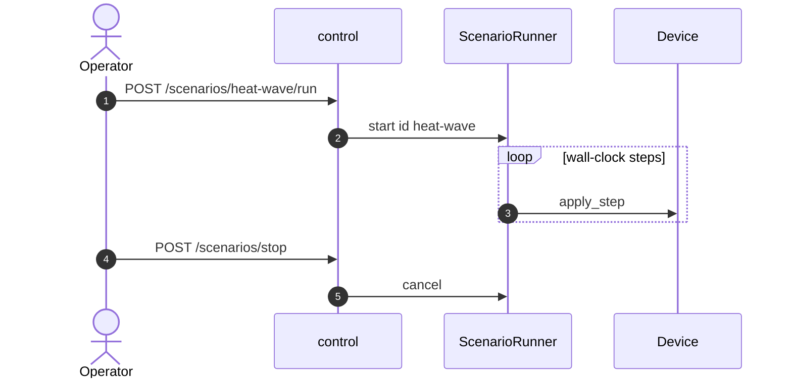

# Scenarios

Timed event sequences are part of the **device contract**. Syntax, ids, and
validation rules live in [spec.md](spec.md) §7. How to start and stop them
on a running process lives in [control.md](control.md).

This page is a short operator guide.

Syntax: [spec.md](spec.md) §7. HTTP: [control.md](control.md). Process shape:
[architecture.md](architecture.md).

---

## Where they live

Inside the device YAML, under `scenarios:`. Example: `heat-wave` on
`devices/builtin/generic-tnh-sensor.yaml`, `power-outage` on
`devices/builtin/generic-ups.yaml`, `demo-spike` on
`devices/builtin/default.yaml`.

They are **not** loaded from a global `scenarios/` folder. That catalog does
not exist in this repository. `default.yaml` ships `demo-spike`.

A running process can also take a **session copy** (`POST /scenarios`, JSON
with the same fields). It is RAM-only, validated against the loaded map, and
gone when the process exits. Prefer putting recipes in the device YAML so
`simbus check` sees them.

`simbus check` validates every step against this device's registers and coils.
A scenario that names `on_battery_alarm` on a UPS whose coil is `on_battery`
MUST fail check — it MUST NOT fail silently at run time.


```mermaid
sequenceDiagram
    autonumber
    actor Op as Operator
    participant HTTP as control
    participant Run as ScenarioRunner
    participant Dev as Device
    Op->>HTTP: POST /scenarios/heat-wave/run
    HTTP->>Run: start id heat-wave
    loop wall-clock steps
        Run->>Dev: apply_step
    end
    Op->>HTTP: POST /scenarios/stop
    HTTP->>Run: cancel
```

---

## Run

The process starts idle. Then:

```bash
curl -X POST http://localhost:8000/scenarios/heat-wave/run
curl http://localhost:8000/scenarios/active
curl -X POST http://localhost:8000/scenarios/stop
# pause the clock (scenario wall waits freeze too)
curl -X PATCH http://localhost:8000/simulation -d '{"running": false}'
curl -X PATCH http://localhost:8000/simulation -d '{"running": true}'
```

The runner sorts steps by `at` (simulation seconds) and sleeps
`at / time_scale` of wall clock without blocking the tick loop. Default
scale is 1 (1:1). Step types: `set_register`, `inject_fault`,
`set_coil`, `set_tick_interval` — see spec.md.

---

## Writing a new one

1. Add a block with a kebab-case `id` to the device YAML.
2. Point every `register_name` / `coil` at names that exist on **that** map.
3. Run `simbus check path/to/device.yaml`.
4. Boot the device and `POST /scenarios/{id}/run`.

Do not add a Rust test per scenario. Check is the compiler. Session upload
(`POST /scenarios`) is for a live process, not a substitute for the YAML.
