# Simulation Engine

**Status:** normative for `crates/engine` (language versions 1 and 2)  
**Device language:** [spec.md](spec.md)  
**Process:** [runtime.md](runtime.md)  
**HTTP session:** [control.md](control.md)  
**Field plane:** [modbus.md](modbus.md) · [opcua.md](opcua.md) · [bacnet.md](bacnet.md)  
**Shape of the process:** [architecture.md](architecture.md)

This document is the contract of **the tick**: time, `state.base`, behaviors,
triggers, faults, encode, and reset. It does not define YAML syntax or HTTP
verbs.

The crate MUST NOT open sockets, publish SSE, or emit process health logs.
`Device::tick(dt)` returns a `Snapshot`. The runtime publishes that snapshot
on a `watch` channel; the control plane streams it ([control.md](control.md)).

---

## 1. Role

The engine owns one in-memory register bank for one loaded document.

On every **tick** with `dt > 0` it MUST:

1. Decrement fault timers by `dt` and drop faults with `remaining_s <= 0`.
2. Advance `elapsed_s` by `dt` for every holding and input register.
3. For each holding and input register that has a `simulation:` block:
   compute a real-world value from `state.base`, apply any matching fault,
   encode, write the cell.
4. Evaluate coil and discrete triggers against current real values.
5. Return a snapshot of the bank.

`dt <= 0` MUST be a no-op (same snapshot, no time, no expiry).
`is_running == false` (pause) MUST be the same no-op even when `dt > 0`.
Resume continues from the frozen `elapsed_s` and fault `remaining_s`.

Registers without `simulation:` are static: they keep `default` or whatever
was last written. The engine MUST NOT overwrite them on tick.

Pause is set from the control plane ([control.md](control.md)). The engine
MUST consult `is_running` inside `tick`. The runtime MUST NOT publish an
SSE tick frame for a skipped (paused) wait.

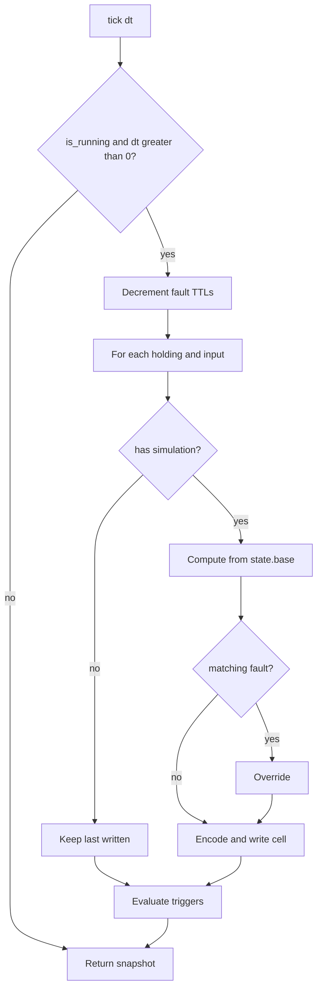

---

## 2. Time

`dt` is **simulation seconds**. The runtime sleeps `tick_interval` (wall
seconds) and passes `dt = tick_interval × time_scale`
([runtime.md](runtime.md) §4). Default `time_scale` is `1` (1:1).

`--tick` / `PATCH /simulation` is the sample period. A 12-hour sine still
takes 12 simulation hours. With `--time-scale 60` those 12 simulation hours
elapse in 12 wall minutes. The engine MUST NOT store a second clock;
only the `dt` the caller passes matters.

Periodic behaviors (`sinusoidal`, `square`, `sawtooth`, `triangle`,
`cycle`, `step`) and fault TTLs use elapsed simulation time. Drift uses
**engineering units per simulation second**, applied as `rate × dt`.
Changing `--tick` MUST NOT change the physical trajectory, only how often
it is sampled. Changing `--time-scale` MUST (same trajectory, faster or
slower wall time).

---

## 3. Operating point — `state.base`

Every numeric register has `state.base`, initialized from YAML `default`
(then jittered — §6).

Behaviors that **use** `state.base` as center or drift state: `constant`,
`gaussian_noise`, `sinusoidal`, `square`, `drift`. A PATCH shifts the
operating point and the next tick follows it.

Behaviors that **own** the live value (YAML range, list, or schedule):
`sawtooth`, `triangle`, `uniform`, `cycle`, `step`. `PATCH` / FC6 still
call `update_base`; the value is visible until the next tick, then
overwritten from the waveform, draw, or schedule (§5).

`PATCH /registers/…`, `PATCH /points/{id}`, and Modbus FC6/FC16 MUST call `update_base` for **each**
cell whose words changed: decode `raw / scale` (or the provided `real_value`)
into `state.base`. For behaviors that use `state.base`, the next tick runs
from that point. It MUST NOT snap back to YAML `default`. FC16 of two
adjacent `uint16` cells MUST update both bases. FC6 of one word of a
`float32`/`uint32` pair splices that word into the cell, then updates that
one base ([modbus.md](modbus.md) §3.2).

---

## 4. Tick interval live update

The engine stores `tick_interval`. `set_tick_interval` MUST take effect on
the next wait in the runtime loop. `tick(dt)` uses the `dt` the caller
passes, not a cached copy from construction.

---

## 5. Behaviors

Syntax: [spec.md](spec.md) §6. Computation below. `t` is
`elapsed_s + phase_s` (§6).

Each behavior below carries a plot of its own formula, so an integrator can
see the shape before booting anything. The parameters are the ones a shipped
map under `devices/` actually uses where one exists. Plots of the
deterministic behaviors (`sinusoidal`, `square`, `drift`, `sawtooth`,
`triangle`, `step`, `cycle`) are exact: the formula evaluated at evenly
spaced samples, with `phase_s = 0`. Plots of the two random behaviors
(`gaussian_noise`, `uniform`) show one draw of the right **distribution** —
the engine's RNG stream is seeded per device (§6), so your values differ.

### constant

`value = state.base`

Flat. It is not "no simulation": the cell is rewritten every tick, so a
`PATCH` or an FC6 that moves `state.base` moves the line, and a fault still
overrides it. A register with no `simulation:` block at all is the static
case (§1).

### gaussian_noise

If a drift modifier is present and `enabled`, apply it first (§5.1).
Then sample Normal(`state.base`, `std_dev`).

Generic T&H `temperature`: `state.base` 22.5 °C, `std_dev` 0.3, sampled
every second. The flat line is `state.base` itself — the noise straddles it
and never walks away from it, which is what separates this from `drift`.

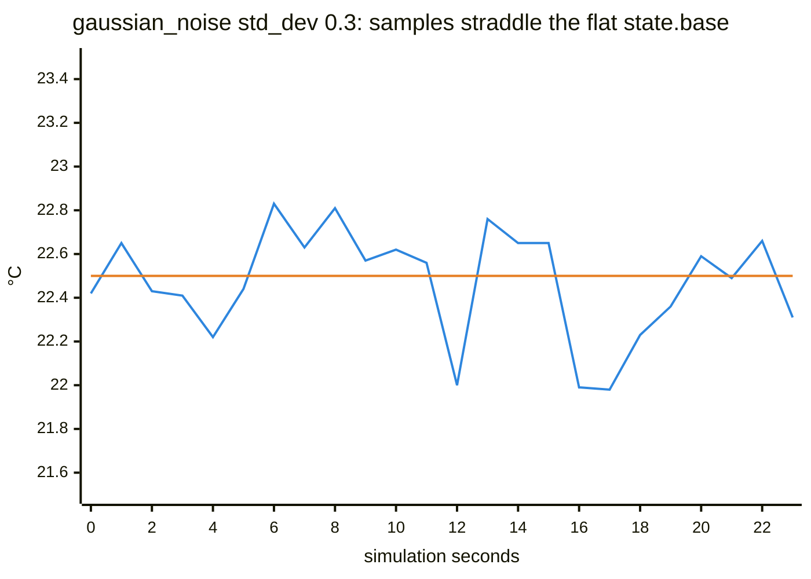

### sinusoidal

```text
value = state.base + amplitude × sin(2π × t / (period_hours × 3600))
```

Generic T&H `humidity`: base 45 %RH, `amplitude` 5, `period_hours` 12. Two
full periods in a day — this is the behavior for a daily or shift cycle, not
for lab-scale toggling.

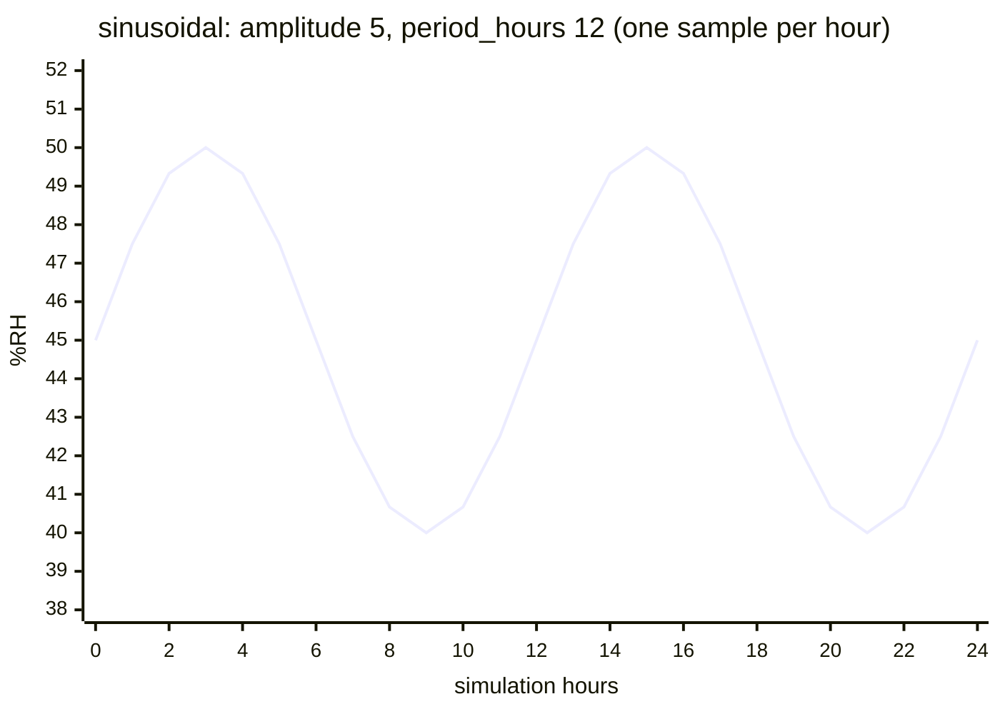

### square

50% duty, analog high then low around `state.base`:

```text
u = (t mod period_seconds) / period_seconds
value = state.base + amplitude     if u < 0.5
value = state.base − amplitude     otherwise
```

`period_seconds` is the full high+low cycle (lab-scale, unlike
`sinusoidal`'s `period_hours`).

Base 45, `amplitude` 5, `period_seconds` 60: the value only ever sits at
`base + amplitude` or `base − amplitude`, never in between. That is what
makes it the deadband / alarm-hysteresis behavior — every tick is on one
side of a trigger threshold placed between the two levels.

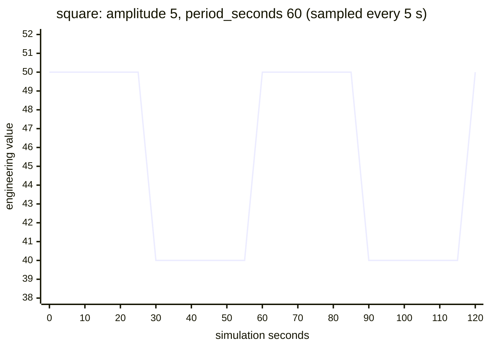

### drift

```text
state.base = clamp(state.base + rate × dt, bounds)
value = state.base
```

`rate` is engineering units **per simulation second**. At the default
`tick_interval=1.0` this matches maps written against “per tick”. It does
not bounce at a bound.

Generic T&H `temperature` drift modifier: base 22.5 °C, `rate` 0.01 °C/s,
`bounds` `[18.0, 35.0]`. It reaches the upper bound at t ≈ 1250 s and then
**stays** there — a drift channel is a one-way ramp that ends parked on a
bound, not a triangle. Two consequences worth planning for: a counter (kWh,
run hours) needs `bounds` wide enough for the whole test, and the same
`bounds` span sets the boot jitter (§6), so a counter with an enormous span
starts far from its `default`.

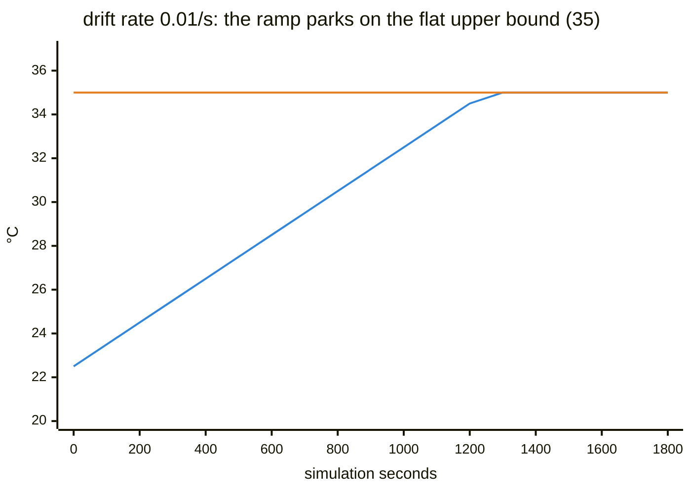

### sawtooth

```text
value = min + (max − min) × (t mod period_seconds) / period_seconds
```

Rising ramp only. Resets to `min` at each period. Does not use
`state.base`.

### triangle

Symmetric ramp `min → max → min` in one `period_seconds`:

```text
u = (t mod period_seconds) / period_seconds
value = min + (max − min) × (2u)           if u < 0.5
value = max − (max − min) × (2u − 1)       otherwise
```

Does not use `state.base`. At `u = 0` the value is `min`; at `u = 0.5` it
is `max`.

Both plotted with `min` 0, `max` 100, `period_seconds` 60. They share a
period and a range and differ only in the return path: `sawtooth` snaps from
`max` back to `min` in a single tick (the vertical edge at 60 s and 120 s),
`triangle` walks back down. Pick `sawtooth` when the discontinuity is the
point — a rollover, a reset — and `triangle` when the ramp has to be
continuous in both directions.

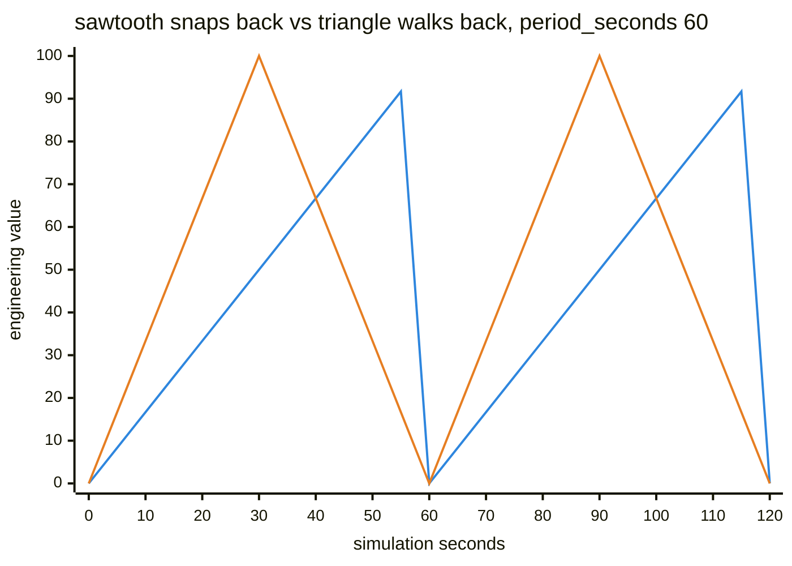

### uniform

Each tick, sample Uniform(`min`, `max`) inclusive. Independent of
`state.base`. Distinct from `gaussian_noise` (Normal around the operating
point).

One draw per tick, `min` 0, `max` 100. There is no center and no memory:
consecutive ticks are independent, so the series has no trajectory to
follow. Bars rather than a line, because joining the samples would suggest a
path between them that the behavior does not have.

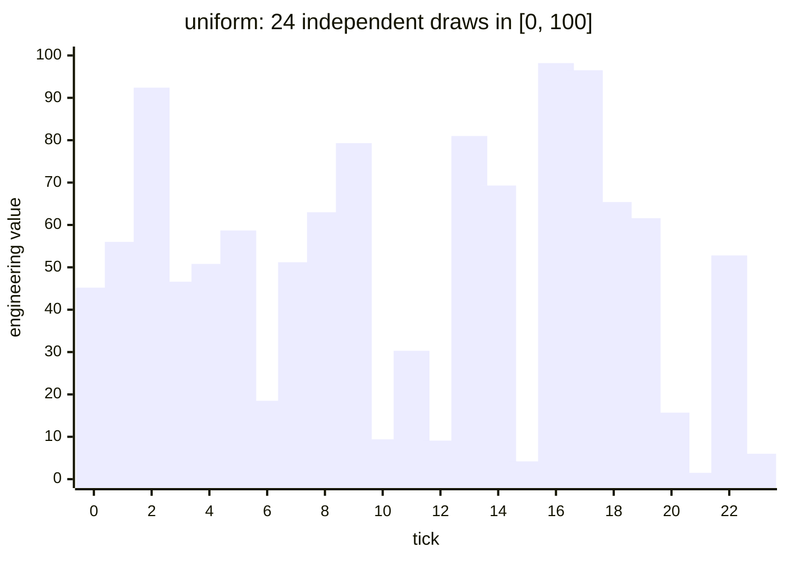

### step

Hold YAML `default` until the first `at`, then the last step with
`at <= t`. Equal `at` values: last in the list wins. The last step is held
indefinitely. PATCH does not change the schedule.

`default` 0 with `steps` at 60 → 30, 180 → 75, 300 → 40. The schedule is
absolute on `elapsed_s` and it **ends**: after the last `at` the value is
held forever, so this is the behavior for a commissioning profile that must
finish somewhere, not for anything that should repeat.

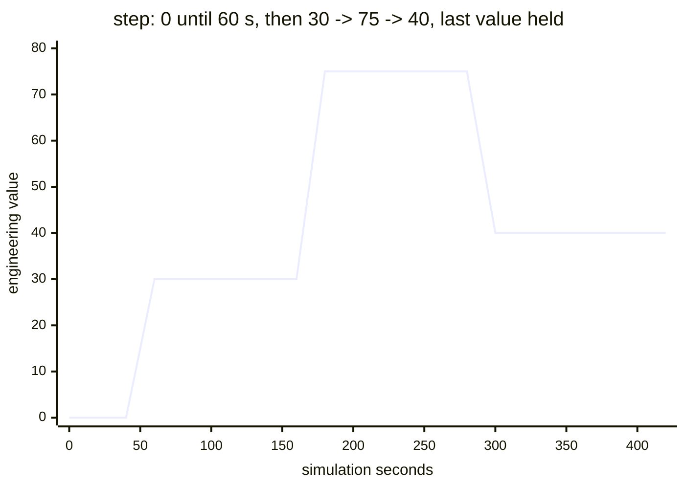

### cycle

Walk YAML `values` in order, one index every `dwell_seconds` of simulation
time, then repeat from the first:

```text
i = floor(t / dwell_seconds) mod len(values)
value = values[i]
```

Does not use `state.base`. Empty `values` is invalid (spec §6). Unlike
`step`, there is no absolute `at` and the walk does not stop at the last
entry.

Generic door contact `open_seconds`: `dwell_seconds` 60, `values`
`[0, 0, 0, 8, 0, 0, 14, 0]`. Repeating `0` in the list is how you buy idle
time — the door opens for one dwell at index 3, again at index 6, and the
whole 8-minute walk then repeats. Compare with the `step` plot above: same
staircase look, but this one comes back around.

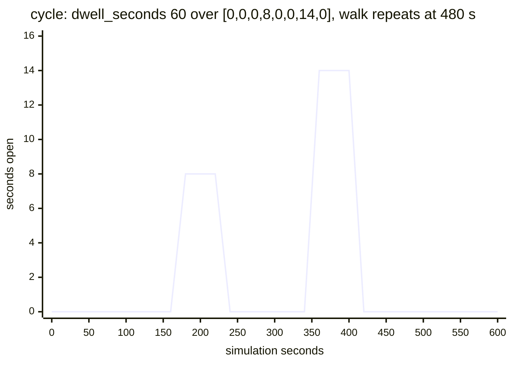

### 5.1 Drift modifier

Allowed only on `gaussian_noise` and `sinusoidal`. Runs **before** the
behavior:

```text
state.base = clamp(state.base + rate × dt, bounds)
```

`enabled: false` MUST skip the modifier.

---

## 6. Fleet diversity

Two processes MUST NOT replay the same curve just because they share a
numeric `--seed`.

At `Device::new`:

- Mix `--seed` with `name`, `type`, and `identity` (`vendor`, `product`,
  `revision`) via FNV-1a. Unseeded devices use OS entropy.
- `sinusoidal` / `square` / `sawtooth` / `triangle` / `cycle` / `step` get
  a random `phase_s` inside one period (`square`/`sawtooth`/`triangle`:
  `0..period_seconds`; `cycle`: one full walk `0..(dwell_seconds ×
  len(values))`; `step`: `0..60` s).
- `gaussian_noise` jitters `state.base` by one sample of `std_dev`.
- `drift` jitters `state.base` by ~2% of the bound span, then clamps.

The bank still shows YAML defaults until the **first** tick. After that,
values come from the jittered operating point.

Two processes booted from the **same** `--seed` and the same T&H map, with
different `name` / `identity`, on the 12-hour `humidity` sine. Same period,
same amplitude, same operating point — different `phase_s`, so a poller that
sweeps a rack of them sees a spread of values at any instant instead of one
value repeated. Give two devices the same seed **and** the same identity and
they do line up; that is the reproducible-lab case.

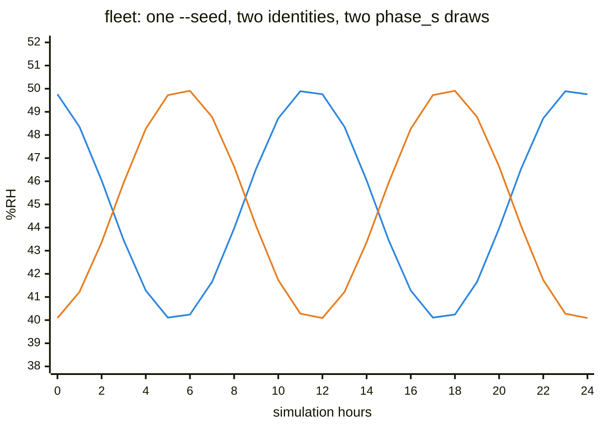

`POST /simulation/reset` MUST restore each register’s **boot** `RegState`
(jittered base, original `phase_s`, `elapsed_s = 0`), rewind the bank to
YAML defaults, restore the RNG stream to its post-init state, and clear
faults. It MUST NOT re-roll from the OS. A seeded device MUST replay the
same post-reset trace as after `new`. `tick_interval` is unchanged.

---

## 7. Triggers

After numeric writes, every coil and discrete with `trigger:` is evaluated
from the source register’s **real** value (`raw / scale`).

| condition | meaning |
| --- | --- |
| `gt` / `lt` / `gte` / `lte` | ordinary comparison |
| `eq` | `|value − threshold| ≤ 0.5 / scale` (half a raw LSB) |

`eq` is quantized on purpose: two encodings of the same cell MUST match.

Coils without a trigger stay at `default` unless written (Modbus or API) or
forced by an `alarm` fault. A triggered coil MAY be written, but the next
tick overwrites it.

Top-level `alarms:` is metadata. It MUST NOT change bank values.

---

## 8. Faults

Faults are TTL overrides. Key = register or coil `name`, or `_device` when
`register_name` is omitted. A second inject for the same key replaces the
first.

`duration_s` is simulation seconds. `remaining_s` decreases by `dt`.

Lookup on a numeric register: named fault, else `_device`.

| type | effect |
| --- | --- |
| `spike` | If `value` is set, force that real. Missing `value` is a no-op. Holding **and** input. |
| `freeze` | Latch the cell’s real value **at inject**. Later PATCH/FC6 change `state.base` but the frozen output stays until expiry. Holding and input. |
| `dropout` | Force `0`. Named: one register. `_device`: every holding **and** input cell. |
| `noise_amplify` | After the behavior, add Extra Normal noise with `std_dev × value` (default factor `10`). On non-gaussian behaviors the `std_dev` fallback is `0.5`. |
| `alarm` | Force the **coil** of that name to `true`, skip trigger. Does not change registers. Unknown name: stored, no effect. Discrete is not a target. |

The four numeric types plotted on the same window: T&H `temperature`
(`gaussian_noise` around 22.5 °C), one fault injected at t = 30 s with
`duration_s: 60`, so every fault expires at t = 90 s and the trace returns
to the untouched line without a further request.

`spike` replaces the value with the one you sent. `freeze` latches whatever
the cell held **at inject** — here 23.07 °C, a value nobody chose, which is
why a frozen channel is the honest way to simulate a stalled sensor rather
than a wrong one.

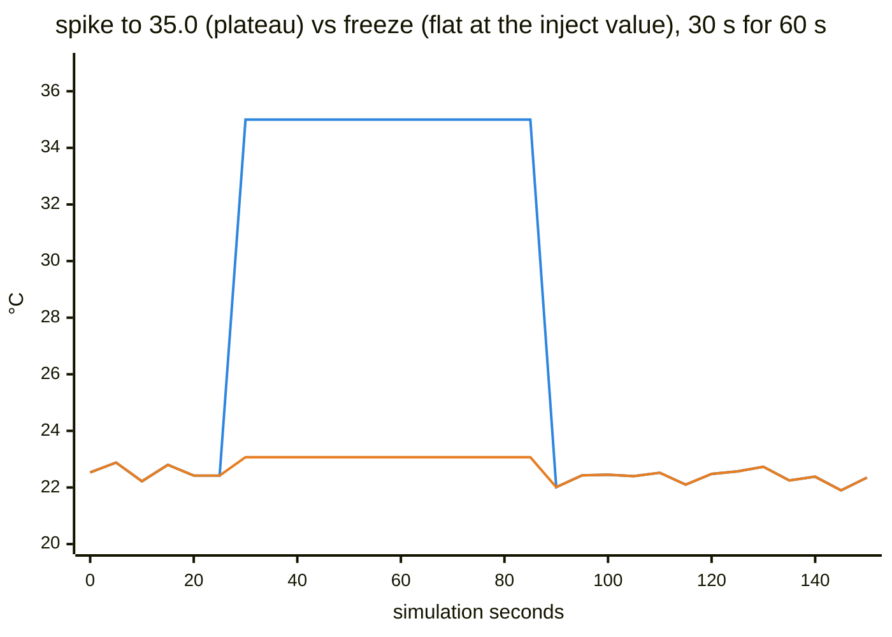

`dropout` forces `0`, which on a scaled `uint16` is a legal reading and not
an error — that is the point of the fault, and it is why a client that
treats 0 °C as "no data" has a bug worth finding. `noise_amplify` keeps the
mean and multiplies the spread (`std_dev × value`, default factor 10): the
channel stays plausible on average while every individual sample becomes
unusable.

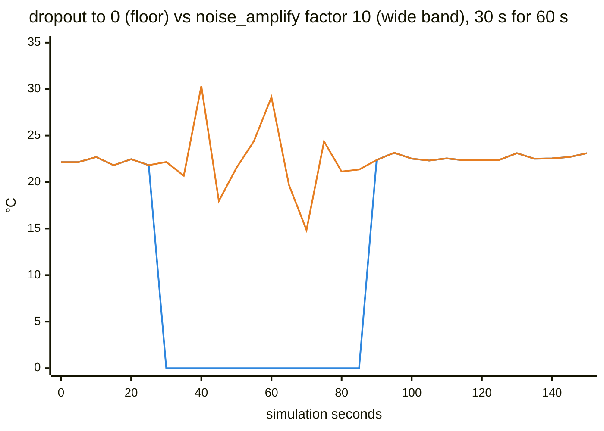

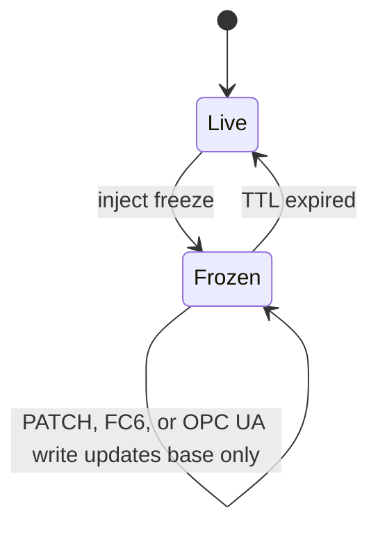

When a fault expires, the next tick uses normal behavior / triggers.

---

## 9. Encode

`raw ≈ round(real × scale)`, then clamp to the type range:

| type | clamp |
| --- | --- |
| `uint16` | `[0, 65535]` |
| `int16` | `[i16::MIN, i16::MAX]` |
| `uint32` | `[0, u32::MAX]` |
| `float32` | finite `f32` range |

The engine MUST NOT wrap `uint16` (a spiked temperature MUST NOT become a
small unsigned value). Multi-word cells use document `endianness`.

---

## 10. Scenarios

`Device::apply_step` mutates this device immediately. The runner in this
crate only tracks generation / progress; sleeps live in the HTTP layer
([control.md](control.md)).

Unknown register or coil names in a step MUST be skipped (warn), not panic.

---

## 11. Change process

1. Update this document.
2. Change `crates/engine` (tick, behaviors, encode, faults, reset).
3. Cover the new rule in `crates/engine/tests/engine.rs` or a unit test
   next to the function.
4. YAML catalog files stay validated by `simbus check`, not by enumerating
   them here.

Language syntax still starts in [spec.md](spec.md). HTTP verbs still start
in [control.md](control.md).

---

## 12. Recipes (session)

These assume a running process. They do not extend the tick contract.

**High-temp alarm (generic T&H):**

```bash
curl -X POST http://localhost:8000/faults \
  -d '{"fault_type":"spike","register_name":"temperature","value":35.0,"duration_s":60}'
```

**Dropout the whole map:**

```bash
curl -X POST http://localhost:8000/faults \
  -d '{"fault_type":"dropout","register_name":null,"value":null,"duration_s":30}'
```

**Rewind to boot (same seeded trace):**

```bash
curl -X POST http://localhost:8000/simulation/reset
```

**Watch the bank** (control samples; not a tick callback):

```bash
curl -N http://localhost:8000/registers/stream
```
