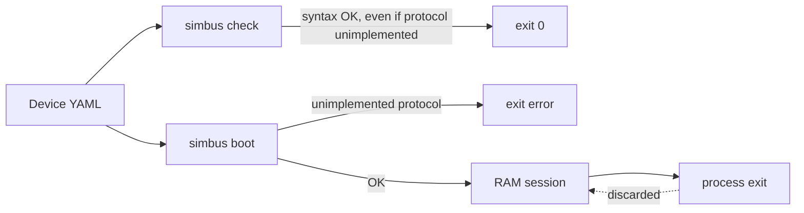

# simbus Device Spec

**Status:** normative for language version **2** (current). Language **1** still loads.  
**Audience:** device authors, contributors, and anyone implementing a simbus runtime  
**Related:** [architecture](architecture.md) · [simulation semantics](simulation.md) · [control plane](control.md) · [runtime process](runtime.md) · [Modbus field plane](modbus.md)

This document is the **syntax of a simbus device**. A device YAML file is the
complete boot contract: identity, protocol bindings, canonical points (or a
language-1 register map that is lifted to points), behaviors, alarms, and
bundled scenarios. The Rust types in `crates/spec` are the machine
readable form of the same language. When they disagree, this document and the
validator (`simbus check`) win — change them together.

New features (BACnet, SNMP, a new step type, a new behavior) **enter this
language first**. A field MAY be specified before any runtime serves it. The
current binary MUST refuse to boot a document that asks for an unimplemented
protocol. `simbus check` MUST still accept that document as valid syntax and
report the gap.

---

## 1. Conformance

The keywords **MUST**, **MUST NOT**, **SHOULD**, **MAY** are used as in RFC 2119.

| Actor | Obligation |
| --- | --- |
| **Author** | A device document MUST pass `simbus check` before it is merged or shipped. |
| **Validator** (`simbus check`) | MUST load, parse, and validate the document. MUST print a summary. MUST exit `0` for a valid document, including those that declare unimplemented protocols. MUST exit `1` for schema or cross-reference errors. |
| **Runtime** | MUST load the entire document at process start. MUST NOT start if any resolved binding is unimplemented. MUST NOT add or remove registers, coils, or alarms after boot. MAY change live *values* (bases, coils without a trigger, faults, tick interval, pause) through the control plane. MUST expose bundled scenarios for on-demand run; MAY accept a session copy (`POST /scenarios`) that is not written back to this file. MUST NOT auto-run scenarios at boot. |
| **Control plane** | Session state (values, faults, pause, in-flight scenario, session-installed scenarios) is RAM-only. `POST /simulation/reset` MUST restore YAML defaults and clear faults; it MUST NOT drop session scenarios or change pause. |

Two layers, one source of truth:

| Layer | Contents | Lifetime |
| --- | --- | --- |
| **Boot contract** | This YAML | The file. Community PR. `simbus check`. |
| **Session** | Current values, faults, tick, pause, scenario playback, session-installed scenarios | Process memory. Dies with the process. |

The register map (language 1) and the point list (language 2) are **immutable**
in this version. Changing `temperature` is a PATCH. Creating a point that was
not in the YAML is out of scope.



> [!NOTE]
> `check` and boot share one language. Boot is stricter about **serving**
> unimplemented bindings. See [runtime.md](runtime.md) §2.

---

## 2. Document model

One file describes **one device**. One process loads one file.

```yaml
name: "Example Device"
spec_version: 2
version: "1.0"
type: example
description: >
  Canonical points plus explicit protocol export.

identity:
  vendor: Obsidia
  product: Example Device
  revision: "1.0"

points:
  - id: analog_a
    kind: analog
    class: value
    unit: units
    default: 50.0
    simulation:
      behavior: constant

bindings:
  - protocol: modbus-tcp
    port: 502
    unit_id: 1
    endianness: big
    export:
      analog_a:
        space: holding
        address: 0
        scale: 10
        data_type: uint16

alarms: []
scenarios: []
```

Language **1** documents use top-level `modbus:` and `registers:` instead of
`points:` / `export`. The loader lifts them to the same in-memory points.
Do not mix `points:` and `registers:` in one file.

`--file` / `SIMBUS_YAML_PATH` loads an explicit path. With no path, the runtime
boots `devices/builtin/default.yaml` (or the copy embedded in the binary).
There is no CLI `--type` selector. The YAML field `type:` remains identity
inside the document (`tnh_sensor`, `ups`, `example`).

Maps live next to the binary contract, not in crate folders:

| Path | Who | What belongs |
| --- | --- | --- |
| `devices/builtin/default.yaml` | Obsidia | Zero-arg default: example channels, not a product |
| `devices/builtin/` | Obsidia | Product-shaped templates (T&H, UPS, PDU, CRAC, …) |
| `devices/community/` | Contributors (PR) | Named products, real register maps, lab-specific YAML |

Point the process at a file:

```bash
simbus --file devices/builtin/generic-ups.yaml
simbus --file devices/community/papouch-th2e.yaml
simbus check devices/community/my-device.yaml
```

A community map is a YAML plus a pull request. Do not add a Rust test per
file; CI already runs `simbus check` on `devices/**/*.yaml`. Agent playbook:
`.agents/skills/simbus-device/SKILL.md`.

---

## 3. Top-level fields

| Field | Type | Required | Default | Meaning |
| --- | --- | --- | --- | --- |
| `name` | string | yes | — | Display name (`GET /status`). |
| `spec_version` | integer | no | `1` | **Language** version. Current language is **2**. Omitted or `1` still loads (register map). Distinct from `version`. |
| `version` | string | yes | — | Map / product version (`"1.0"`, `"1.2"`). |
| `type` | string | yes | — | Device class identity (`example`, `tnh_sensor`, `ups`). Not a CLI flag. |
| `description` | string | no | `""` | Human text. |
| `identity` | object | no | empty | Vendor / product / revision (reserved for FC43, OPC UA BuildInfo). |
| `modbus` | object | language 1 | — | Default Modbus listen settings. Language 2 takes port / unit / endianness from the Modbus binding. |
| `points` | list | language 2 | — | Canonical analog/binary points. Required and non-empty when `spec_version` is 2. |
| `registers` | object | language 1 | empty map | Holding, input, coils, discrete. Lifted to points at load. |
| `alarms` | list | no | `[]` | Metadata bound to binary point / coil names. |
| `bindings` | list | language 2 yes | `[]` | Protocol listeners. Language 1: empty infers Modbus TCP. Language 2: empty means HTTP-only (no infer). |
| `scenarios` | list | no | `[]` | Bundled timed sequences. Loaded at boot; started via API. |

### 3.1 `spec_version`

`spec_version` versions **this language**, not a particular UPS map.

| Value | Meaning |
| --- | --- |
| omitted or `1` | Language 1: `registers:` + optional `modbus:`. Lifted to points at load. |
| `2` | Language 2: `points:` + explicit `export` on each served binding. |

This runtime MUST reject any other integer. When the language gains a breaking
change, increment `SPEC_VERSION` in `crates/spec` and this document in the
same change.

New official maps SHOULD use language 2. Community maps MAY stay on 1.

### 3.2 `identity`

| Field | Type | Default |
| --- | --- | --- |
| `vendor` | string | `""` |
| `product` | string | `""` |
| `revision` | string | `""` |

Identity does not affect Modbus TCP in this version. It is mixed into the RNG
seed together with `name` and `type` so two devices with the same numeric
`--seed` do not replay the same noise.

### 3.3 `modbus`

| Field | Type | Required | Default | Constraint |
| --- | --- | --- | --- | --- |
| `default_port` | uint16 | yes | — | MUST be ≥ 1 |
| `unit_id` | uint8 | no | `1` | MUST be 1–247 (serial slave address / identity). On Modbus TCP the MBAP unit id is not used to select this process ([modbus.md](modbus.md) §2, V1.0b). |
| `endianness` | enum | no | `big` | `big` · `little` · `big_swap` · `little_swap` |

Endianness applies to multi-word values (`uint32`, `float32`):

| Value | Layout |
| --- | --- |
| `big` | ABCD |
| `little` | DCBA |
| `big_swap` | BADC |
| `little_swap` | CDAB |

### 3.4 Canonical points (language 2)

The engine stores **engineering `f64`** (analog) and **`bool`** (binary).
Integer encoding and `scale` exist only on Modbus export. There is no decimal
crate.

| Field | Type | Required | Constraint |
| --- | --- | --- | --- |
| `id` | string | yes | Unique in the document (`analog_a`, `temperature`). |
| `kind` | enum | yes | `analog` · `binary` |
| `class` | enum | yes | `input` · `value` · `output` (ASHRAE I/V/O: who owns the live value) |
| `description` | string | no | |
| `unit` | string | no | Analog engineering unit. Ignored for binary. |
| `default` | number or bool | yes | Number if analog, boolean if binary. |
| `simulation` | object | no | Analog only. Same behaviors as language 1. |
| `trigger` | object | no | Binary only. Source MUST be an analog **point id**. |

`class` is **not** a Modbus table. A measured analog MAY export to `holding`.
`input` means the tick (or a trigger) owns the value; `value` / `output` are
writable from the field plane when that protocol allows writes.

**Trigger** (language 2):

| Field | Type | Values |
| --- | --- | --- |
| `source` | string | Analog point id. YAML alias: `source_register` |
| `condition` | enum | `gt` · `lt` · `eq` · `gte` · `lte` |
| `threshold` | float | Engineering units |

Alarms still name a **binary** point id (the materialized coil/discrete name
is the same string).

---

## 4. Protocol bindings

Each binding is tagged with `protocol`.

Language **1**: an empty `bindings` list **MUST** be treated as:

```yaml
bindings:
  - protocol: modbus-tcp
    port: <modbus.default_port>
    unit_id: <modbus.unit_id>
```

Language **2**: an empty `bindings` list MUST NOT infer Modbus. The process
MAY boot HTTP-only. Every served `modbus-tcp`, `modbus-tls`, `opcua`, and
`bacnet-ip` binding MUST include a **non-empty `export`** map. Omitting
`export` does **not** publish every point.

### 4.1 Implementation status (language version 2)

| `protocol` | Syntax | Served by this runtime |
| --- | --- | --- |
| `modbus-tcp` | yes | **yes** |
| `modbus-rtu` | yes | no |
| `modbus-tls` | yes | **yes** |
| `snmp-v2c` | yes | no |
| `opcua` | yes | **yes** |
| `mqtt-sparkplug` | yes | no |
| `bacnet-ip` | yes | no |

`simbus check` MUST list unimplemented protocols as `specified, not implemented`.
The process MUST NOT boot if any **resolved** binding is unimplemented.

To add a protocol: extend this section and `BindingSpec` first, keep
`ProtocolId::is_implemented` false, then implement the server and flip the flag.

### 4.2 Binding fields

**`modbus-tcp`**

| Field | Type | Default |
| --- | --- | --- |
| `port` | uint16? | language 1: `modbus.default_port` when inferred |
| `unit_id` | uint8? | language 1: `modbus.unit_id` when inferred |
| `endianness` | enum | `big` (language 2; language 1 uses top-level `modbus`) |
| `export` | map | language 2: required, non-empty. Keys are point ids. |

Each Modbus export row:

| Field | Type | Notes |
| --- | --- | --- |
| `space` | enum | `holding` · `input` · `coil` · `discrete` |
| `address` | uint16 | Zero-based. Analog `float32`/`uint32` occupy two words. |
| `scale` | uint32 | Analog only; default `1`; MUST be ≥ 1. `raw ≈ eng × scale`. |
| `data_type` | enum | Analog only; default `uint16`. Same set as language-1 registers. |

Analog points MUST use `holding` or `input`. Binary points MUST use `coil` or
`discrete`. `class` does not imply `space`.

**`modbus-rtu`** — specified, not implemented: `device` (path), `baudrate` (default 9600).

**`modbus-tls`** — served (same PDU as `modbus-tcp`, TLS wrap, IANA **802**):

| Field | Type | Default |
| --- | --- | --- |
| `port` | uint16? | `802` |
| `certfile` | string | required at **boot** (PEM). `simbus check` does not open the file |
| `keyfile` | string | required at **boot** (PEM). Same as `certfile` |
| `cafile` | string? | omitted: server authenticates, client cert not required. Set to a PEM CA to require mTLS |
| `export` | map | language 2: required, same shape as `modbus-tcp` |

CLI/env may override `certfile` / `keyfile` / `cafile` / `port` ([runtime.md](runtime.md)). They do not rewrite the YAML. Missing or unreadable PEM at boot MUST fail the process (do not start a half-ready listener). Official maps under `devices/builtin/` MUST NOT declare this binding (Compose would need mounted PEM). Dual-bind: list `modbus-tcp` **and** `modbus-tls` in the same document.

**`snmp-v2c`** — specified, not implemented: `port` (default 161), `community` (default `public`), `map` (optional OID file).

**`opcua`** — served (same YAML map, OPC UA variables, IANA **4840**):

| Field | Type | Default |
| --- | --- | --- |
| `port` | uint16? | `4840` |
| `export` | map | language 2: required, non-empty. Keys are point ids. Value is `{}` in this version. |

Language 1 NodeIds stay `holding/{name}` (see [opcua.md](opcua.md)). Language 2
uses `ns=N;s={id}` and folders `Input` / `Value` / `Output` from `class`.
Writable when `class` is `value` or `output`.

CLI `--opcua-port` / `SIMBUS_OPCUA_PORT` may override the port ([runtime.md](runtime.md)). It does not rewrite the YAML and MUST NOT enable OPC UA unless the document already has this binding. Official maps under `devices/builtin/` MUST NOT declare this binding (Compose does not publish 4840). Dual-bind: list `modbus-tcp` (and/or `modbus-tls`) **and** `opcua`. Address space, data types, and the lab endpoint (None / Anonymous) are [opcua.md](opcua.md). This version does not take PEM files.

**`mqtt-sparkplug`** — specified, not implemented: `broker`, `group_id`, `edge_node_id`.

**`bacnet-ip`** — specified, not implemented: `port` (default 47808),
`device_instance`. Language 2 MUST also set `export` (non-empty). Each row
has `object` (`analog-input` · `analog-value` · `analog-output` ·
`binary-input` · `binary-value` · `binary-output`) and `instance` (uint32).
Object type SHOULD match `kind` × `class`; `simbus check` MAY warn when it
does not. Object maps were not in language 1.

---

## 5. Register map (language 1)

Language 2 authors do not write this section: the loader materializes it from
the first non-empty Modbus `export` so the engine and Modbus crate can keep an
address bank. Language 1 authors write four spaces with Modbus names:

| YAML key | Modbus | Client access |
| --- | --- | --- |
| `registers.holding` | FC3 / FC6 / FC16 | read-write on the wire |
| `registers.input` | FC4 | read-only on the wire; writable via control API |
| `registers.coils` | FC1 / FC5 / FC15 | bits, optional triggers |
| `registers.discrete` | FC2 | bits, read-only on the wire |

Wire exceptions, quantity limits, and address validation follow
[modbus.md](modbus.md) (V1.1b3 / V1.0b). A `float32`/`uint32` occupies two
PDU addresses; each is a 16-bit register on the wire.

### 5.1 Holding and input registers

| Field | Type | Required | Default | Constraint |
| --- | --- | --- | --- | --- |
| `address` | uint16 | yes | — | First word. `float32`/`uint32` occupy `address` and `address+1`. |
| `name` | string | yes | — | Unique across **holding ∪ input**. |
| `description` | string | no | `""` | |
| `unit` | string | no | `""` | Engineering unit (`°C`, `%RH`). |
| `default` | float | yes | — | Real-world power-on value. |
| `scale` | uint32 | no | `1` | MUST be ≥ 1. `raw ≈ real × scale`. |
| `data_type` | enum | no | `uint16` | `uint16` · `int16` · `uint32` · `float32` |
| `simulation` | object | no | none | Behavior. Omitted means the register stays at `default` until written. |

Word occupancy MUST NOT overlap inside a space. A `float32` at address `0`
MUST NOT share address `1` with another register.

`int16` is two's complement on the wire. `uint32` and `float32` (IEEE-754) use
two consecutive words and `endianness`.

### 5.2 Coils and discrete inputs

| Field | Type | Required | Default |
| --- | --- | --- | --- |
| `address` | uint16 | yes | — |
| `name` | string | yes | Unique across **coils ∪ discrete**. |
| `description` | string | no | `""` |
| `default` | bool | no | `false` |
| `trigger` | object | no | none |

**Trigger** (evaluated every tick from the source register's **real** value):

| Field | Type | Values |
| --- | --- | --- |
| `source_register` | string | MUST name a holding or input register. Language 2 alias: `source` (point id). |
| `condition` | enum | `gt` · `lt` · `eq` · `gte` · `lte` |
| `threshold` | float | Real-world units |

A coil with a trigger is owned by the engine. A control-plane write is allowed
but the next tick overwrites it from the trigger.

### 5.3 Alarms

Alarms are metadata for UIs and `/config`. They do not occupy Modbus addresses.

| Field | Type | Required |
| --- | --- | --- |
| `name` | string | yes |
| `severity` | enum | `info` · `warning` · `critical` |
| `trigger` | string | MUST name a coil or discrete |

---

## 6. Behaviors

`simulation.behavior` selects the live function. Semantics (tick, `state.base`,
faults) are defined in [simulation.md](simulation.md). This section is syntax.

| `behavior` | Required fields | Optional |
| --- | --- | --- |
| `constant` | — | — |
| `gaussian_noise` | `std_dev` > 0 | `drift` |
| `sinusoidal` | `period_hours` > 0, `amplitude` > 0 | `drift` |
| `square` | `period_seconds` > 0, `amplitude` > 0 | — |
| `drift` | `rate`, `bounds: [min, max]` with min < max | — |
| `sawtooth` | `period_seconds` > 0, `min` < `max` | — |
| `triangle` | `period_seconds` > 0, `min` < `max` | — |
| `uniform` | `min` < `max` | — |
| `step` | `steps: [{at ≥ 0, value}]` non-empty | — |
| `cycle` | `dwell_seconds` > 0, `values` non-empty | — |

**Drift modifier** (on `gaussian_noise` and `sinusoidal` only):

```yaml
drift:
  enabled: true          # default true when the object is present
  rate: 0.01             # engineering units per simulation second
  bounds: [18.0, 35.0]   # min MUST be < max
```

Example:

```yaml
simulation:
  behavior: gaussian_noise
  std_dev: 0.3
  drift:
    enabled: true
    rate: 0.01
    bounds: [18.0, 35.0]
```

`square` is analog all/nothing around `state.base` (deadband / alarm tests).
`triangle` is a symmetric ramp `min ↔ max` (`sawtooth` only rises, then jumps
to `min`). `uniform` draws Uniform(`min`, `max`) each tick — not
`gaussian_noise` (Normal around `state.base`). `cycle` walks `values` in
order, one entry every `dwell_seconds` of simulation time, then repeats.
It is not `step` (`step` is an absolute `elapsed_s` schedule that holds the
last entry).

---

## 7. Scenarios

A scenario is a timed sequence **bundled in the same document**. It is part of
the contract: `simbus check` validates every step against this device's names.

Scenarios are **not** loaded from a global `scenarios/` directory. There is
no such folder in this repository.

```yaml
scenarios:
  - id: heat-wave
    name: Heat Wave Event
    description: Gradual rise, then a spike.
    steps:
      - at: 0
        action: set_register
        register_name: temperature
        value: 22.0
      - at: 12
        action: inject_fault
        fault_type: spike
        register_name: temperature
        value: 42.0
        duration_s: 30
```

| Field | Type | Required | Constraint |
| --- | --- | --- | --- |
| `id` | string | yes (embedded) | Lowercase kebab-case: `[a-z][a-z0-9-]*`. Unique in the document. Used as `POST /scenarios/{id}/run`. |
| `name` | string | yes | Display name. |
| `description` | string | no | |
| `steps` | list | yes | At least one. Order does not matter; the runner sorts by `at`. |

Every step MUST have `action` and `at` (seconds from scenario start, ≥ 0).

Language 2 documents SHOULD use `set_point`. Language 1 `set_register` /
`set_coil` remain valid against materialized names.

### 7.1 `set_point`

Writes a canonical point (engineering number or boolean) and shifts
`state.base` when the point is analog.

| Field | Type | Required | Constraint |
| --- | --- | --- | --- |
| `point` | string | yes | MUST be a point id |
| `value` | number or bool | yes | Number if analog; boolean if binary |

### 7.2 `set_register`

Writes a real-world value and shifts `state.base`.

| Field | Type | Required | Default | Constraint |
| --- | --- | --- | --- | --- |
| `register_name` | string | yes | — | MUST exist in the named space |
| `value` | float | yes | — | Real-world units |
| `register_type` | string | no | `holding` | `holding` or `input` |

### 7.3 `inject_fault`

| Field | Type | Required | Default | Constraint |
| --- | --- | --- | --- | --- |
| `fault_type` | enum | yes | — | `spike` · `freeze` · `dropout` · `alarm` · `noise_amplify` |
| `register_name` | string | yes | — | Register or point id. YAML alias: `point`. Analog for spike/freeze/dropout/noise_amplify; binary for `alarm` |
| `value` | float | no | — | Spike target or noise factor |
| `duration_s` | float | no | `30` | MUST be > 0 |

### 7.4 `set_coil`

| Field | Type | Required |
| --- | --- | --- |
| `coil` | string | Coil, discrete, or binary point `name` |
| `value` | bool | Target state |

### 7.5 `set_tick_interval`

| Field | Type | Constraint |
| --- | --- | --- |
| `tick_interval` | float | MUST be > 0 (seconds) |

Playback is started from the control plane. Boot MUST leave scenarios idle.
The control plane MAY install an extra copy for this process only
(`POST /scenarios`, JSON, same fields). That copy MUST NOT be written back
to the device file. `simbus check` does not see session copies.

---

## 8. Validation (`simbus check`)

```bash
simbus check devices/community/my-device.yaml
cargo run -p simbus -- check devices/builtin/generic-tnh-sensor.yaml
```

The validator MUST reject a document when any of the following hold:

- YAML does not match this schema
- `spec_version` is not `1` or `2` (omitted counts as `1`)
- language 2: missing `points`, mixed `registers:`, empty `export` on a served binding, unknown export key
- `modbus.unit_id` not in 1–247, or `default_port` = 0
- duplicate holding/input names, or duplicate coil/discrete names, or duplicate point ids
- `scale` < 1
- overlapping words in a space
- trigger `source` / `source_register` unknown
- alarm `trigger` not a binary point / coil / discrete
- behavior numeric constraints fail
- embedded scenario missing/`id` not kebab-case/duplicate
- scenario step names a point, register, coil, or space that does not exist
- `inject_fault` missing `register_name` / `point`

It MUST NOT reject unimplemented protocol bindings. It SHOULD print them.

A valid document prints `OK`, identity, bindings, counts, each register,
alarms, and bundled scenario ids. That report is the human form of the contract.

---

## 9. Runtime boot

After a successful parse:

1. Resolve bindings (language 1: infer Modbus TCP if the list is empty; language 2: do not infer).
2. If any resolved protocol is unimplemented, **exit** with an error that names
   the protocol and points here.
3. Instantiate the register bank from materialized defaults (language 2: first
   Modbus `export`; language 1: `registers:`).
4. Start the tick loop, field listeners (if bound), and the HTTP control plane.
5. Leave scenarios idle until `POST /scenarios/{id}/run`.

CLI overrides (`--port`, `--modbus-tls-port`, `--modbus-cert` / `--modbus-key`
/ `--modbus-ca`, `--name`, `--tick`, `--seed`) apply after load. They do not
rewrite the file. `--port` overrides **TCP** only. Process lifecycle, signals,
and flags: [runtime.md](runtime.md).

---

## 10. Change process

1. Update this document and `crates/spec` (types, `validate`, tests, `simbus check` report).
2. Add or adjust a fixture in `crates/spec/tests/catalog.rs` (schema, not every catalog file).
3. Implement engine / control / protocol crates.
4. Point `ProtocolId::is_implemented` at the new protocol only when it is served.

Do not add a Rust test per device YAML. CI runs `simbus check` on `devices/**/*.yaml`.
