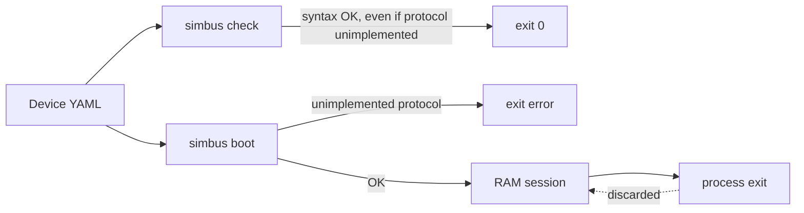

# simbus Device Spec

**Status:** normative for language version **1**  
**Audience:** device authors, contributors, and anyone implementing a simbus runtime  
**Related:** [architecture](architecture.md) · [simulation semantics](simulation.md) · [control plane](control.md) · [runtime process](runtime.md) · [Modbus field plane](modbus.md)

This document is the **syntax of a simbus device**. A device YAML file is the
complete boot contract: identity, protocol bindings, register map, behaviors,
alarms, and bundled scenarios. The Rust types in `crates/spec` are the machine
readable form of the same language. When they disagree, this document and the
validator (`simbus check`) win — change them together.

New features (BACnet, SNMP, a new step type, a new behavior) **enter this
language first**. A field MAY be specified before any runtime serves it. The
current binary MUST refuse to boot a document that asks for an unimplemented
protocol. `simbus check` MUST still accept that document as valid syntax and
report the gap.

---

## 1. Conformance

The keywords **MUST**, **MUST NOT**, **SHOULD**, **MAY** are used as in RFC 2119.

| Actor | Obligation |
| --- | --- |
| **Author** | A device document MUST pass `simbus check` before it is merged or shipped. |
| **Validator** (`simbus check`) | MUST load, parse, and validate the document. MUST print a summary. MUST exit `0` for a valid document, including those that declare unimplemented protocols. MUST exit `1` for schema or cross-reference errors. |
| **Runtime** | MUST load the entire document at process start. MUST NOT start if any resolved binding is unimplemented. MUST NOT add or remove registers, coils, or alarms after boot. MAY change live *values* (bases, coils without a trigger, faults, tick interval) through the control plane. MUST expose bundled scenarios for on-demand run; MUST NOT auto-run them at boot. |
| **Control plane** | Session state (values, faults, an in-flight scenario) is RAM-only. `POST /simulation/reset` MUST restore YAML defaults and clear faults. |

Two layers, one source of truth:

| Layer | Contents | Lifetime |
| --- | --- | --- |
| **Boot contract** | This YAML | The file. Community PR. `simbus check`. |
| **Session** | Current values, faults, tick, scenario playback | Process memory. Dies with the process. |

The register map is **immutable** in this version. Changing `temperature` is a
PATCH. Creating a register that was not in the YAML is out of scope.



> [!NOTE]
> `check` and boot share one language. Boot is stricter about **serving**
> unimplemented bindings. See [runtime.md](runtime.md) §2.

---

## 2. Document model

One file describes **one device**. One process loads one file.

```yaml
name: "Generic T&H Sensor"
spec_version: 1
version: "1.0"
type: tnh_sensor
description: >
  Generic temperature and humidity sensor.

identity:
  vendor: Obsidia
  product: Generic T&H
  revision: "1.0"

modbus:
  default_port: 502
  unit_id: 1
  endianness: big

# bindings:            # optional; empty infers Modbus TCP from `modbus`
#   - protocol: modbus-tcp
#     port: 502
#     unit_id: 1

registers:
  holding: []
  input: []
  coils: []
  discrete: []

alarms: []

scenarios: []
```

`--file` / `SIMBUS_YAML_PATH` loads an explicit path. With no path, the runtime
boots `devices/builtin/default.yaml` (or the copy embedded in the binary).
There is no CLI `--type` selector. The YAML field `type:` remains identity
inside the document (`tnh_sensor`, `ups`, `example`).

Official templates live in `devices/builtin/` (including `default.yaml`).
Named products belong in `devices/community/` and are accepted by pull request.
Point the process at a template:

```bash
simbus --file devices/builtin/generic-ups.yaml
simbus --file devices/community/papouch-th2e.yaml
```

---

## 3. Top-level fields

| Field | Type | Required | Default | Meaning |
| --- | --- | --- | --- | --- |
| `name` | string | yes | — | Display name (`GET /status`). |
| `spec_version` | integer | no | `1` | **Language** version. MUST be `1`. Distinct from `version`. |
| `version` | string | yes | — | Map / product version (`"1.0"`, `"1.2"`). |
| `type` | string | yes | — | Device class identity (`example`, `tnh_sensor`, `ups`). Not a CLI flag. |
| `description` | string | no | `""` | Human text. |
| `identity` | object | no | empty | Vendor / product / revision (reserved for FC43, OPC UA BuildInfo). |
| `modbus` | object | yes | — | Default Modbus listen settings (v1 files). |
| `registers` | object | no | empty map | Holding, input, coils, discrete. |
| `alarms` | list | no | `[]` | Metadata bound to coil/discrete names. |
| `bindings` | list | no | `[]` | Protocol listeners. Empty infers Modbus TCP from `modbus`. |
| `scenarios` | list | no | `[]` | Bundled timed sequences. Loaded at boot; started via API. |

### 3.1 `spec_version`

`spec_version` versions **this language**, not a particular UPS map. A runtime
that understands only version 1 MUST reject any other value.

When the language gains a breaking change, increment `SPEC_VERSION` in
`crates/spec` and this document in the same change.

### 3.2 `identity`

| Field | Type | Default |
| --- | --- | --- |
| `vendor` | string | `""` |
| `product` | string | `""` |
| `revision` | string | `""` |

Identity does not affect Modbus TCP in this version. It is mixed into the RNG
seed together with `name` and `type` so two devices with the same numeric
`--seed` do not replay the same noise.

### 3.3 `modbus`

| Field | Type | Required | Default | Constraint |
| --- | --- | --- | --- | --- |
| `default_port` | uint16 | yes | — | MUST be ≥ 1 |
| `unit_id` | uint8 | no | `1` | MUST be 1–247 (serial slave address / identity). On Modbus TCP the MBAP unit id is not used to select this process ([modbus.md](modbus.md) §2, V1.0b). |
| `endianness` | enum | no | `big` | `big` · `little` · `big_swap` · `little_swap` |

Endianness applies to multi-word values (`uint32`, `float32`):

| Value | Layout |
| --- | --- |
| `big` | ABCD |
| `little` | DCBA |
| `big_swap` | BADC |
| `little_swap` | CDAB |

---

## 4. Protocol bindings

Each binding is tagged with `protocol`. An empty `bindings` list **MUST** be
treated as:

```yaml
bindings:
  - protocol: modbus-tcp
    port: <modbus.default_port>
    unit_id: <modbus.unit_id>
```

### 4.1 Implementation status (language version 1)

| `protocol` | Syntax | Served by this runtime |
| --- | --- | --- |
| `modbus-tcp` | yes | **yes** |
| `modbus-rtu` | yes | no |
| `modbus-tls` | yes | no |
| `snmp-v2c` | yes | no |
| `opcua` | yes | no |
| `mqtt-sparkplug` | yes | no |
| `bacnet-ip` | yes | no |

`simbus check` MUST list unimplemented protocols as `specified, not implemented`.
The process MUST NOT boot if any **resolved** binding is unimplemented.

To add a protocol: extend this section and `BindingSpec` first, keep
`ProtocolId::is_implemented` false, then implement the server and flip the flag.

### 4.2 Binding fields

**`modbus-tcp`**

| Field | Type | Default |
| --- | --- | --- |
| `port` | uint16? | `modbus.default_port` when inferred |
| `unit_id` | uint8? | `modbus.unit_id` when inferred |

**`modbus-rtu`** — specified, not implemented: `device` (path), `baudrate` (default 9600).

**`modbus-tls`** — specified, not implemented: `port`, `certfile`, `keyfile`.

**`snmp-v2c`** — specified, not implemented: `port` (default 161), `community` (default `public`), `map` (optional OID file).

**`opcua`** — specified, not implemented: `port` (default 4840).

**`mqtt-sparkplug`** — specified, not implemented: `broker`, `group_id`, `edge_node_id`.

**`bacnet-ip`** — specified, not implemented: `port` (default 47808), `device_instance`. Object maps are not in language version 1; they MUST be designed here before a BACnet runtime is written.

---

## 5. Register map

Four spaces, Modbus names:

| YAML key | Modbus | Client access |
| --- | --- | --- |
| `registers.holding` | FC3 / FC6 / FC16 | read-write on the wire |
| `registers.input` | FC4 | read-only on the wire; writable via control API |
| `registers.coils` | FC1 / FC5 / FC15 | bits, optional triggers |
| `registers.discrete` | FC2 | bits, read-only on the wire |

Wire exceptions, quantity limits, and address validation follow
[modbus.md](modbus.md) (V1.1b3 / V1.0b). A `float32`/`uint32` occupies two
PDU addresses; each is a 16-bit register on the wire.

### 5.1 Holding and input registers

| Field | Type | Required | Default | Constraint |
| --- | --- | --- | --- | --- |
| `address` | uint16 | yes | — | First word. `float32`/`uint32` occupy `address` and `address+1`. |
| `name` | string | yes | — | Unique across **holding ∪ input**. |
| `description` | string | no | `""` | |
| `unit` | string | no | `""` | Engineering unit (`°C`, `%RH`). |
| `default` | float | yes | — | Real-world power-on value. |
| `scale` | uint32 | no | `1` | MUST be ≥ 1. `raw ≈ real × scale`. |
| `data_type` | enum | no | `uint16` | `uint16` · `int16` · `uint32` · `float32` |
| `simulation` | object | no | none | Behavior. Omitted means the register stays at `default` until written. |

Word occupancy MUST NOT overlap inside a space. A `float32` at address `0`
MUST NOT share address `1` with another register.

`int16` is two's complement on the wire. `uint32` and `float32` (IEEE-754) use
two consecutive words and `endianness`.

### 5.2 Coils and discrete inputs

| Field | Type | Required | Default |
| --- | --- | --- | --- |
| `address` | uint16 | yes | — |
| `name` | string | yes | Unique across **coils ∪ discrete**. |
| `description` | string | no | `""` |
| `default` | bool | no | `false` |
| `trigger` | object | no | none |

**Trigger** (evaluated every tick from the source register's **real** value):

| Field | Type | Values |
| --- | --- | --- |
| `source_register` | string | MUST name a holding or input register |
| `condition` | enum | `gt` · `lt` · `eq` · `gte` · `lte` |
| `threshold` | float | Real-world units |

A coil with a trigger is owned by the engine. A control-plane write is allowed
but the next tick overwrites it from the trigger.

### 5.3 Alarms

Alarms are metadata for UIs and `/config`. They do not occupy Modbus addresses.

| Field | Type | Required |
| --- | --- | --- |
| `name` | string | yes |
| `severity` | enum | `info` · `warning` · `critical` |
| `trigger` | string | MUST name a coil or discrete |

---

## 6. Behaviors

`simulation.behavior` selects the live function. Semantics (tick, `state.base`,
faults) are defined in [simulation.md](simulation.md). This section is syntax.

| `behavior` | Required fields | Optional |
| --- | --- | --- |
| `constant` | — | — |
| `gaussian_noise` | `std_dev` > 0 | `drift` |
| `sinusoidal` | `period_hours` > 0, `amplitude` > 0 | `drift` |
| `drift` | `rate`, `bounds: [min, max]` with min < max | — |
| `sawtooth` | `period_seconds` > 0, `min` < `max` | — |
| `step` | `steps: [{at ≥ 0, value}]` non-empty | — |

**Drift modifier** (on `gaussian_noise` and `sinusoidal` only):

```yaml
drift:
  enabled: true          # default true when the object is present
  rate: 0.01             # engineering units per simulation second
  bounds: [18.0, 35.0]   # min MUST be < max
```

Example:

```yaml
simulation:
  behavior: gaussian_noise
  std_dev: 0.3
  drift:
    enabled: true
    rate: 0.01
    bounds: [18.0, 35.0]
```

---

## 7. Scenarios

A scenario is a timed sequence **bundled in the same document**. It is part of
the contract: `simbus check` validates every step against this device's names.

Scenarios are **not** loaded from a global `scenarios/` directory. There is
no such folder in this repository.

```yaml
scenarios:
  - id: heat-wave
    name: Heat Wave Event
    description: Gradual rise, then a spike.
    steps:
      - at: 0
        action: set_register
        register_name: temperature
        value: 22.0
      - at: 12
        action: inject_fault
        fault_type: spike
        register_name: temperature
        value: 42.0
        duration_s: 30
```

| Field | Type | Required | Constraint |
| --- | --- | --- | --- |
| `id` | string | yes (embedded) | Lowercase kebab-case: `[a-z][a-z0-9-]*`. Unique in the document. Used as `POST /scenarios/{id}/run`. |
| `name` | string | yes | Display name. |
| `description` | string | no | |
| `steps` | list | yes | At least one. Order does not matter; the runner sorts by `at`. |

Every step MUST have `action` and `at` (seconds from scenario start, ≥ 0).

### 7.1 `set_register`

Writes a real-world value and shifts `state.base`.

| Field | Type | Required | Default | Constraint |
| --- | --- | --- | --- | --- |
| `register_name` | string | yes | — | MUST exist in the named space |
| `value` | float | yes | — | Real-world units |
| `register_type` | string | no | `holding` | `holding` or `input` |

### 7.2 `inject_fault`

| Field | Type | Required | Default | Constraint |
| --- | --- | --- | --- | --- |
| `fault_type` | enum | yes | — | `spike` · `freeze` · `dropout` · `alarm` · `noise_amplify` |
| `register_name` | string | yes | — | Register for spike/freeze/dropout/noise_amplify; coil/discrete for `alarm` |
| `value` | float | no | — | Spike target or noise factor |
| `duration_s` | float | no | `30` | MUST be > 0 |

### 7.3 `set_coil`

| Field | Type | Required |
| --- | --- | --- |
| `coil` | string | Coil or discrete `name` |
| `value` | bool | Target state |

### 7.4 `set_tick_interval`

| Field | Type | Constraint |
| --- | --- | --- |
| `tick_interval` | float | MUST be > 0 (seconds) |

Playback is started from the control plane. Boot MUST leave scenarios idle.

---

## 8. Validation (`simbus check`)

```bash
simbus check devices/community/my-device.yaml
cargo run -p runtime -- check devices/builtin/generic-tnh-sensor.yaml
```

The validator MUST reject a document when any of the following hold:

- YAML does not match this schema
- `spec_version` ≠ 1
- `modbus.unit_id` not in 1–247, or `default_port` = 0
- duplicate holding/input names, or duplicate coil/discrete names
- `scale` < 1
- overlapping words in a space
- trigger `source_register` unknown
- alarm `trigger` not a coil/discrete
- behavior numeric constraints fail
- embedded scenario missing/`id` not kebab-case/duplicate
- scenario step names a register, coil, or space that does not exist
- `inject_fault` missing `register_name`

It MUST NOT reject unimplemented protocol bindings. It SHOULD print them.

A valid document prints `OK`, identity, bindings, counts, each register,
alarms, and bundled scenario ids. That report is the human form of the contract.

---

## 9. Runtime boot

After a successful parse:

1. Resolve bindings (infer Modbus TCP if the list is empty).
2. If any resolved protocol is unimplemented, **exit** with an error that names
   the protocol and points here.
3. Instantiate the register bank from `default` values.
4. Start the tick loop, Modbus TCP (if bound), and the HTTP control plane.
5. Leave scenarios idle until `POST /scenarios/{id}/run`.

CLI overrides (`--port`, `--name`, `--tick`, `--seed`) apply after load. They
do not rewrite the file. Process lifecycle, signals, and flags:
[runtime.md](runtime.md).

---

## 10. Change process

1. Update this document and `crates/spec` (types, `validate`, tests, `simbus check` report).
2. Add or adjust a fixture in `crates/spec/tests/catalog.rs` (schema, not every catalog file).
3. Implement engine / control / protocol crates.
4. Point `ProtocolId::is_implemented` at the new protocol only when it is served.

Do not add a Rust test per device YAML. CI runs `simbus check` on `devices/**/*.yaml`.
